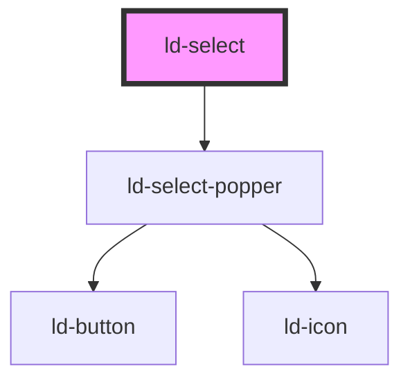

---
eleventyNavigation:
  key: Select
  parent: Components
layout: layout.njk
title: Select
permalink: components/ld-select/
tags:
  - select
  - dropdown
---

<link rel="stylesheet" href="{{ env.base }}/{{ buildstamp }}css_components/ld-select.css">
<link rel="stylesheet" href="{{ env.base }}/{{ buildstamp }}css_components/ld-icon.css">
<link rel="stylesheet" href="{{ env.base }}/{{ buildstamp }}css_components/ld-input-message.css">
<link rel="stylesheet" href="{{ env.base }}/{{ buildstamp }}css_components/ld-label.css">

# ld-select

The `ld-select` component represents a control that provides a menu of options. This control can be used in forms to accept a selection of these options from the user.

The feature set of the `ld-select` Web Component differs from its CSS Component counterpart. While the first offers more display and input modes, the latter is a lightweight alternative, which only styles the native HTML select element.

<ld-notice headline="Note" mode="warning">
  If your application is mounted to a different element than the <code>body</code> element, or you have <em>z-order</em> related issues, you may need to configure the <code>bodyElement</code> option using the <code>tetherOptions</code> property. For more details check out the <a href="guides/troubleshooting/#popped-out-element-is-rendered-in-wrong-container">related troubleshooting section</a>.
</ld-notice>

## Examples

### Single select mode


<ld-select placeholder="Pick a fruit" name="fruit">
  <ld-option value="apple">Apple</ld-option>
  <ld-option value="banana">Banana</ld-option>
  <ld-option value="papaya">Papaya</ld-option>
  <ld-option value="watermelon" disabled>Watermelon</ld-option>
  <ld-option value="honeymelon">Honeymelon</ld-option>
  <ld-option value="rasberry">Rasberry</ld-option>
  <ld-option value="cherry">Cherry</ld-option>
  <ld-option value="blueberry">Blueberry</ld-option>
  <ld-option value="peach">Peach</ld-option>
  <ld-option value="grape">Grape</ld-option>
  <ld-option value="fuyu persimmon">Fuyu Persimmon</ld-option>
  <ld-option value="monstera deliciosa">Monstera Deliciosa</ld-option>
  <ld-option value="pear">Pear</ld-option>
  <ld-option value="pineapple">Pineapple</ld-option>
  <ld-option value="plum">Plum</ld-option>
</ld-select>

<!-- React component -->

<LdSelect placeholder="Pick a fruit" name="fruit">
  <LdOption value="apple">Apple</LdOption>
  <LdOption value="banana">Banana</LdOption>
  <LdOption value="papaya">Papaya</LdOption>
  <LdOption value="watermelon" disabled>Watermelon</LdOption>
  <LdOption value="honeymelon">Honeymelon</LdOption>
  <LdOption value="rasberry">Rasberry</LdOption>
  <LdOption value="cherry">Cherry</LdOption>
  <LdOption value="blueberry">Blueberry</LdOption>
  <LdOption value="peach">Peach</LdOption>
  <LdOption value="grape">Grape</LdOption>
  <LdOption value="fuyu persimmon">Fuyu Persimmon</LdOption>
  <LdOption value="monstera deliciosa">Monstera Deliciosa</LdOption>
  <LdOption value="pear">Pear</LdOption>
  <LdOption value="pineapple">Pineapple</LdOption>
  <LdOption value="plum">Plum</LdOption>
</LdSelect>

<!-- CSS component -->

  <select name="fruits">
    <option value="">Pick a fruit</option>
    <option value="apple">Apple</option>
    <option value="banana">Banana</option>
    <option value="papaya">Papaya</option>
    <option value="watermelon" disabled>Watermelon</option>
    <option value="honeymelon">Honeymelon</option>
    <option value="rasberry">Rasberry</option>
    <option value="cherry">Cherry</option>
    <option value="blueberry">Blueberry</option>
    <option value="peach">Peach</option>
    <option value="grape">Grape</option>
    <option value="fuyu persimmon">Fuyu Persimmon</option>
    <option value="monstera deliciosa">Monstera Deliciosa</option>
    <option value="pear">Pear</option>
    <option value="pineapple">Pineapple</option>
    <option value="plum">Plum</option>
  </select>
  <svg
    role="presentation"
    class="ld-select__icon"
    viewBox="0 0 16 16"
  >
    <path
      stroke="currentColor"
      stroke-linecap="round"
      stroke-linejoin="round"
      stroke-width="3"
      d="M3 6l5 4 5-4"
    />
  </svg>



#### Prevent deselection

You can prevent a state with no options selected after initial selection in single select mode.


<ld-select placeholder="Pick a fruit" name="fruit" prevent-deselection>
  <ld-option value="apple">Apple</ld-option>
  <ld-option value="banana">Banana</ld-option>
  <ld-option value="papaya">Papaya</ld-option>
  <ld-option value="watermelon" disabled>Watermelon</ld-option>
  <ld-option value="honeymelon">Honeymelon</ld-option>
  <ld-option value="rasberry">Rasberry</ld-option>
  <ld-option value="cherry">Cherry</ld-option>
  <ld-option value="blueberry">Blueberry</ld-option>
  <ld-option value="peach">Peach</ld-option>
  <ld-option value="grape">Grape</ld-option>
  <ld-option value="fuyu persimmon">Fuyu Persimmon</ld-option>
  <ld-option value="monstera deliciosa">Monstera Deliciosa</ld-option>
  <ld-option value="pear">Pear</ld-option>
  <ld-option value="pineapple">Pineapple</ld-option>
  <ld-option value="plum">Plum</ld-option>
</ld-select>

<!-- React component -->

<LdSelect placeholder="Pick a fruit" name="fruit" preventDeselection>
  <LdOption value="apple">Apple</LdOption>
  <LdOption value="banana">Banana</LdOption>
  <LdOption value="papaya">Papaya</LdOption>
  <LdOption value="watermelon" disabled>Watermelon</LdOption>
  <LdOption value="honeymelon">Honeymelon</LdOption>
  <LdOption value="rasberry">Rasberry</LdOption>
  <LdOption value="cherry">Cherry</LdOption>
  <LdOption value="blueberry">Blueberry</LdOption>
  <LdOption value="peach">Peach</LdOption>
  <LdOption value="grape">Grape</LdOption>
  <LdOption value="fuyu persimmon">Fuyu Persimmon</LdOption>
  <LdOption value="monstera deliciosa">Monstera Deliciosa</LdOption>
  <LdOption value="pear">Pear</LdOption>
  <LdOption value="pineapple">Pineapple</LdOption>
  <LdOption value="plum">Plum</LdOption>
</LdSelect>


### Multiple select mode


<ld-select placeholder="Pick some fruits" name="fruits" multiple>
  <ld-option value="apple">Apple</ld-option>
  <ld-option value="banana">Banana</ld-option>
  <ld-option value="papaya">Papaya</ld-option>
  <ld-option value="watermelon" disabled>Watermelon</ld-option>
  <ld-option value="honeymelon">Honeymelon</ld-option>
  <ld-option value="rasberry">Rasberry</ld-option>
  <ld-option value="cherry">Cherry</ld-option>
  <ld-option value="blueberry">Blueberry</ld-option>
  <ld-option value="peach">Peach</ld-option>
  <ld-option value="grape">Grape</ld-option>
  <ld-option value="fuyu persimmon">Fuyu Persimmon</ld-option>
  <ld-option value="monstera deliciosa">Monstera Deliciosa</ld-option>
  <ld-option value="pear">Pear</ld-option>
  <ld-option value="pineapple">Pineapple</ld-option>
  <ld-option value="plum">Plum</ld-option>
</ld-select>

<!-- React component -->

<LdSelect placeholder="Pick some fruits" name="fruits" multiple>
  <LdOption value="apple">Apple</LdOption>
  <LdOption value="banana">Banana</LdOption>
  <LdOption value="papaya">Papaya</LdOption>
  <LdOption value="watermelon" disabled>Watermelon</LdOption>
  <LdOption value="honeymelon">Honeymelon</LdOption>
  <LdOption value="rasberry">Rasberry</LdOption>
  <LdOption value="cherry">Cherry</LdOption>
  <LdOption value="blueberry">Blueberry</LdOption>
  <LdOption value="peach">Peach</LdOption>
  <LdOption value="grape">Grape</LdOption>
  <LdOption value="fuyu persimmon">Fuyu Persimmon</LdOption>
  <LdOption value="monstera deliciosa">Monstera Deliciosa</LdOption>
  <LdOption value="pear">Pear</LdOption>
  <LdOption value="pineapple">Pineapple</LdOption>
  <LdOption value="plum">Plum</LdOption>
</LdSelect>

<!-- CSS component -->

  <select name="fruits" multiple>
    <option value="apple">Apple</option>
    <option value="banana">Banana</option>
    <option value="papaya">Papaya</option>
    <option value="watermelon" disabled>Watermelon</option>
    <option value="honeymelon">Honeymelon</option>
    <option value="rasberry">Rasberry</option>
    <option value="cherry">Cherry</option>
    <option value="blueberry">Blueberry</option>
    <option value="peach">Peach</option>
    <option value="grape">Grape</option>
    <option value="fuyu persimmon">Fuyu Persimmon</option>
    <option value="monstera deliciosa">Monstera Deliciosa</option>
    <option value="pear">Pear</option>
    <option value="pineapple">Pineapple</option>
    <option value="plum">Plum</option>
  </select>
  <svg
    role="presentation"
    class="ld-select__icon"
    viewBox="0 0 16 16"
  >
    <path
      stroke="currentColor"
      stroke-linecap="round"
      stroke-linejoin="round"
      stroke-width="3"
      d="M3 6l5 4 5-4"
    />
  </svg>



#### Width

You may have noticed, that in multiple mode the component grows horizontally with the number of selected options. You can prevent this behaviour by either applying a `width` or a `max-width` style on the `ld-select` element:


<ld-select placeholder="Pick some fruits" name="fruits" multiple style="width: 14rem">
  <ld-option value="apple">Apple</ld-option>
  <ld-option value="banana" selected>Banana</ld-option>
  <ld-option value="papaya" selected>Papaya</ld-option>
  <ld-option value="watermelon" disabled>Watermelon</ld-option>
  <ld-option value="honeymelon">Honeymelon</ld-option>
  <ld-option value="rasberry">Rasberry</ld-option>
  <ld-option value="cherry" selected>Cherry</ld-option>
  <ld-option value="blueberry">Blueberry</ld-option>
  <ld-option value="peach" selected>Peach</ld-option>
  <ld-option value="grape" selected>Grape</ld-option>
  <ld-option value="fuyu persimmon" selected>Fuyu Persimmon</ld-option>
  <ld-option value="monstera deliciosa">Monstera Deliciosa</ld-option>
  <ld-option value="pear" selected>Pear</ld-option>
  <ld-option value="pineapple" selected>Pineapple</ld-option>
  <ld-option value="plum" selected>Plum</ld-option>
</ld-select>

<ld-select class="my-select-max-width" placeholder="Pick some fruits" name="fruits" multiple style="max-width: 24rem">
  <ld-option value="apple">Apple</ld-option>
  <ld-option value="banana" selected>Banana</ld-option>
  <ld-option value="papaya" selected>Papaya</ld-option>
  <ld-option value="watermelon" disabled>Watermelon</ld-option>
  <ld-option value="honeymelon">Honeymelon</ld-option>
  <ld-option value="rasberry">Rasberry</ld-option>
  <ld-option value="cherry" selected>Cherry</ld-option>
  <ld-option value="blueberry">Blueberry</ld-option>
  <ld-option value="peach" selected>Peach</ld-option>
  <ld-option value="grape" selected>Grape</ld-option>
  <ld-option value="fuyu persimmon" selected>Fuyu Persimmon</ld-option>
  <ld-option value="monstera deliciosa">Monstera Deliciosa</ld-option>
  <ld-option value="pear" selected>Pear</ld-option>
  <ld-option value="pineapple" selected>Pineapple</ld-option>
  <ld-option value="plum" selected>Plum</ld-option>
</ld-select>

<!-- React component -->

<LdSelect placeholder="Pick some fruits" name="fruits" multiple style={ { width: '14rem' } }>
  <LdOption value="apple">Apple</LdOption>
  <LdOption value="banana" selected>Banana</LdOption>
  <LdOption value="papaya" selected>Papaya</LdOption>
  <LdOption value="watermelon" disabled>Watermelon</LdOption>
  <LdOption value="honeymelon">Honeymelon</LdOption>
  <LdOption value="rasberry">Rasberry</LdOption>
  <LdOption value="cherry" selected>Cherry</LdOption>
  <LdOption value="blueberry">Blueberry</LdOption>
  <LdOption value="peach" selected>Peach</LdOption>
  <LdOption value="grape" selected>Grape</LdOption>
  <LdOption value="fuyu persimmon" selected>Fuyu Persimmon</LdOption>
  <LdOption value="monstera deliciosa">Monstera Deliciosa</LdOption>
  <LdOption value="pear" selected>Pear</LdOption>
  <LdOption value="pineapple" selected>Pineapple</LdOption>
  <LdOption value="plum" selected>Plum</LdOption>
</LdSelect>

<LdSelect placeholder="Pick some fruits" name="fruits" multiple style={ { maxWidth: '24rem' } }>
  <LdOption value="apple">Apple</LdOption>
  <LdOption value="banana" selected>Banana</LdOption>
  <LdOption value="papaya" selected>Papaya</LdOption>
  <LdOption value="watermelon" disabled>Watermelon</LdOption>
  <LdOption value="honeymelon">Honeymelon</LdOption>
  <LdOption value="rasberry">Rasberry</LdOption>
  <LdOption value="cherry" selected>Cherry</LdOption>
  <LdOption value="blueberry">Blueberry</LdOption>
  <LdOption value="peach" selected>Peach</LdOption>
  <LdOption value="grape" selected>Grape</LdOption>
  <LdOption value="fuyu persimmon" selected>Fuyu Persimmon</LdOption>
  <LdOption value="monstera deliciosa">Monstera Deliciosa</LdOption>
  <LdOption value="pear" selected>Pear</LdOption>
  <LdOption value="pineapple" selected>Pineapple</LdOption>
  <LdOption value="plum" selected>Plum</LdOption>
</LdSelect>


#### Max rows

If you have limited vertical space (this may especially be the case on mobile devices), you can define a maximum of available rows of the select trigger element, which displays the current selection. 


<ld-select placeholder="Pick some fruits" name="fruits" multiple max-rows="1" style="width: 14rem">
  <ld-option value="apple">Apple</ld-option>
  <ld-option value="banana" selected>Banana</ld-option>
  <ld-option value="papaya" selected>Papaya</ld-option>
  <ld-option value="watermelon" disabled>Watermelon</ld-option>
  <ld-option value="honeymelon">Honeymelon</ld-option>
  <ld-option value="rasberry">Rasberry</ld-option>
  <ld-option value="cherry" selected>Cherry</ld-option>
  <ld-option value="blueberry">Blueberry</ld-option>
  <ld-option value="peach" selected>Peach</ld-option>
  <ld-option value="grape" selected>Grape</ld-option>
  <ld-option value="fuyu persimmon" selected>Fuyu Persimmon</ld-option>
  <ld-option value="monstera deliciosa">Monstera Deliciosa</ld-option>
  <ld-option value="pear" selected>Pear</ld-option>
  <ld-option value="pineapple" selected>Pineapple</ld-option>
  <ld-option value="plum" selected>Plum</ld-option>
</ld-select>

<ld-select placeholder="Pick some fruits" name="fruits" multiple max-rows="2" style="max-width: 24rem">
  <ld-option value="apple">Apple</ld-option>
  <ld-option value="banana" selected>Banana</ld-option>
  <ld-option value="papaya" selected>Papaya</ld-option>
  <ld-option value="watermelon" disabled>Watermelon</ld-option>
  <ld-option value="honeymelon">Honeymelon</ld-option>
  <ld-option value="rasberry">Rasberry</ld-option>
  <ld-option value="cherry" selected>Cherry</ld-option>
  <ld-option value="blueberry">Blueberry</ld-option>
  <ld-option value="peach" selected>Peach</ld-option>
  <ld-option value="grape" selected>Grape</ld-option>
  <ld-option value="fuyu persimmon" selected>Fuyu Persimmon</ld-option>
  <ld-option value="monstera deliciosa">Monstera Deliciosa</ld-option>
  <ld-option value="pear" selected>Pear</ld-option>
  <ld-option value="pineapple" selected>Pineapple</ld-option>
  <ld-option value="plum" selected>Plum</ld-option>
</ld-select>

<!-- React component -->

<LdSelect placeholder="Pick some fruits" name="fruits" multiple maxRows={1} style={ { width: '14rem' } }>
  <LdOption value="apple">Apple</LdOption>
  <LdOption value="banana" selected>Banana</LdOption>
  <LdOption value="papaya" selected>Papaya</LdOption>
  <LdOption value="watermelon" disabled>Watermelon</LdOption>
  <LdOption value="honeymelon">Honeymelon</LdOption>
  <LdOption value="rasberry">Rasberry</LdOption>
  <LdOption value="cherry" selected>Cherry</LdOption>
  <LdOption value="blueberry">Blueberry</LdOption>
  <LdOption value="peach" selected>Peach</LdOption>
  <LdOption value="grape" selected>Grape</LdOption>
  <LdOption value="fuyu persimmon" selected>Fuyu Persimmon</LdOption>
  <LdOption value="monstera deliciosa">Monstera Deliciosa</LdOption>
  <LdOption value="pear" selected>Pear</LdOption>
  <LdOption value="pineapple" selected>Pineapple</LdOption>
  <LdOption value="plum" selected>Plum</LdOption>
</LdSelect>

<LdSelect placeholder="Pick some fruits" name="fruits" multiple maxRows={2} style={ { maxWidth: '24rem' } }>
  <LdOption value="apple">Apple</LdOption>
  <LdOption value="banana" selected>Banana</LdOption>
  <LdOption value="papaya" selected>Papaya</LdOption>
  <LdOption value="watermelon" disabled>Watermelon</LdOption>
  <LdOption value="honeymelon">Honeymelon</LdOption>
  <LdOption value="rasberry">Rasberry</LdOption>
  <LdOption value="cherry" selected>Cherry</LdOption>
  <LdOption value="blueberry">Blueberry</LdOption>
  <LdOption value="peach" selected>Peach</LdOption>
  <LdOption value="grape" selected>Grape</LdOption>
  <LdOption value="fuyu persimmon" selected>Fuyu Persimmon</LdOption>
  <LdOption value="monstera deliciosa">Monstera Deliciosa</LdOption>
  <LdOption value="pear" selected>Pear</LdOption>
  <LdOption value="pineapple" selected>Pineapple</LdOption>
  <LdOption value="plum" selected>Plum</LdOption>
</LdSelect>


### Disabled


<ld-select placeholder="Pick a fruit" name="fruit" disabled>
  <ld-option value="apple">Apple</ld-option>
  <ld-option value="banana">Banana</ld-option>
  <ld-option value="papaya">Papaya</ld-option>
  <ld-option value="watermelon" disabled>Watermelon</ld-option>
  <ld-option value="honeymelon">Honeymelon</ld-option>
  <ld-option value="rasberry">Rasberry</ld-option>
  <ld-option value="cherry">Cherry</ld-option>
  <ld-option value="blueberry">Blueberry</ld-option>
  <ld-option value="peach">Peach</ld-option>
  <ld-option value="grape">Grape</ld-option>
  <ld-option value="fuyu persimmon">Fuyu Persimmon</ld-option>
  <ld-option value="monstera deliciosa">Monstera Deliciosa</ld-option>
  <ld-option value="pear">Pear</ld-option>
  <ld-option value="pineapple">Pineapple</ld-option>
  <ld-option value="plum">Plum</ld-option>
</ld-select>

<ld-select placeholder="Pick some fruits" name="fruits" multiple disabled>
  <ld-option value="apple">Apple</ld-option>
  <ld-option value="banana">Banana</ld-option>
  <ld-option value="papaya">Papaya</ld-option>
  <ld-option value="watermelon" disabled>Watermelon</ld-option>
  <ld-option value="honeymelon">Honeymelon</ld-option>
  <ld-option value="rasberry">Rasberry</ld-option>
  <ld-option value="cherry">Cherry</ld-option>
  <ld-option value="blueberry">Blueberry</ld-option>
  <ld-option value="peach">Peach</ld-option>
  <ld-option value="grape">Grape</ld-option>
  <ld-option value="fuyu persimmon">Fuyu Persimmon</ld-option>
  <ld-option value="monstera deliciosa">Monstera Deliciosa</ld-option>
  <ld-option value="pear">Pear</ld-option>
  <ld-option value="pineapple">Pineapple</ld-option>
  <ld-option value="plum">Plum</ld-option>
</ld-select>

<ld-select placeholder="Pick a fruit" name="fruit" disabled>
  <ld-option value="apple">Apple</ld-option>
  <ld-option value="banana" selected>Banana</ld-option>
  <ld-option value="papaya">Papaya</ld-option>
  <ld-option value="watermelon" disabled>Watermelon</ld-option>
  <ld-option value="honeymelon">Honeymelon</ld-option>
  <ld-option value="rasberry">Rasberry</ld-option>
  <ld-option value="cherry">Cherry</ld-option>
  <ld-option value="blueberry">Blueberry</ld-option>
  <ld-option value="peach">Peach</ld-option>
  <ld-option value="grape">Grape</ld-option>
  <ld-option value="fuyu persimmon">Fuyu Persimmon</ld-option>
  <ld-option value="monstera deliciosa">Monstera Deliciosa</ld-option>
  <ld-option value="pear">Pear</ld-option>
  <ld-option value="pineapple">Pineapple</ld-option>
  <ld-option value="plum">Plum</ld-option>
</ld-select>

<ld-select placeholder="Pick some fruits" name="fruits" multiple disabled>
  <ld-option value="apple">Apple</ld-option>
  <ld-option value="banana" selected>Banana</ld-option>
  <ld-option value="papaya">Papaya</ld-option>
  <ld-option value="watermelon" disabled>Watermelon</ld-option>
  <ld-option value="honeymelon">Honeymelon</ld-option>
  <ld-option value="rasberry">Rasberry</ld-option>
  <ld-option value="cherry" selected>Cherry</ld-option>
  <ld-option value="blueberry">Blueberry</ld-option>
  <ld-option value="peach">Peach</ld-option>
  <ld-option value="grape">Grape</ld-option>
  <ld-option value="fuyu persimmon" selected>Fuyu Persimmon</ld-option>
  <ld-option value="monstera deliciosa">Monstera Deliciosa</ld-option>
  <ld-option value="pear">Pear</ld-option>
  <ld-option value="pineapple">Pineapple</ld-option>
  <ld-option value="plum">Plum</ld-option>
</ld-select>

<!-- React component -->

<LdSelect placeholder="Pick a fruit" name="fruit" disabled>
  <LdOption value="apple">Apple</LdOption>
  <LdOption value="banana">Banana</LdOption>
  <LdOption value="papaya">Papaya</LdOption>
  <LdOption value="watermelon" disabled>Watermelon</LdOption>
  <LdOption value="honeymelon">Honeymelon</LdOption>
  <LdOption value="rasberry">Rasberry</LdOption>
  <LdOption value="cherry">Cherry</LdOption>
  <LdOption value="blueberry">Blueberry</LdOption>
  <LdOption value="peach">Peach</LdOption>
  <LdOption value="grape">Grape</LdOption>
  <LdOption value="fuyu persimmon">Fuyu Persimmon</LdOption>
  <LdOption value="monstera deliciosa">Monstera Deliciosa</LdOption>
  <LdOption value="pear">Pear</LdOption>
  <LdOption value="pineapple">Pineapple</LdOption>
  <LdOption value="plum">Plum</LdOption>
</LdSelect>

<LdSelect placeholder="Pick some fruits" name="fruits" multiple disabled>
  <LdOption value="apple">Apple</LdOption>
  <LdOption value="banana">Banana</LdOption>
  <LdOption value="papaya">Papaya</LdOption>
  <LdOption value="watermelon" disabled>Watermelon</LdOption>
  <LdOption value="honeymelon">Honeymelon</LdOption>
  <LdOption value="rasberry">Rasberry</LdOption>
  <LdOption value="cherry">Cherry</LdOption>
  <LdOption value="blueberry">Blueberry</LdOption>
  <LdOption value="peach">Peach</LdOption>
  <LdOption value="grape">Grape</LdOption>
  <LdOption value="fuyu persimmon">Fuyu Persimmon</LdOption>
  <LdOption value="monstera deliciosa">Monstera Deliciosa</LdOption>
  <LdOption value="pear">Pear</LdOption>
  <LdOption value="pineapple">Pineapple</LdOption>
  <LdOption value="plum">Plum</LdOption>
</LdSelect>

<LdSelect placeholder="Pick a fruit" name="fruit" disabled>
  <LdOption value="apple">Apple</LdOption>
  <LdOption value="banana" selected>Banana</LdOption>
  <LdOption value="papaya">Papaya</LdOption>
  <LdOption value="watermelon" disabled>Watermelon</LdOption>
  <LdOption value="honeymelon">Honeymelon</LdOption>
  <LdOption value="rasberry">Rasberry</LdOption>
  <LdOption value="cherry">Cherry</LdOption>
  <LdOption value="blueberry">Blueberry</LdOption>
  <LdOption value="peach">Peach</LdOption>
  <LdOption value="grape">Grape</LdOption>
  <LdOption value="fuyu persimmon">Fuyu Persimmon</LdOption>
  <LdOption value="monstera deliciosa">Monstera Deliciosa</LdOption>
  <LdOption value="pear">Pear</LdOption>
  <LdOption value="pineapple">Pineapple</LdOption>
  <LdOption value="plum">Plum</LdOption>
</LdSelect>

<LdSelect placeholder="Pick some fruits" name="fruits" multiple disabled>
  <LdOption value="apple">Apple</LdOption>
  <LdOption value="banana" selected>Banana</LdOption>
  <LdOption value="papaya">Papaya</LdOption>
  <LdOption value="watermelon" disabled>Watermelon</LdOption>
  <LdOption value="honeymelon">Honeymelon</LdOption>
  <LdOption value="rasberry">Rasberry</LdOption>
  <LdOption value="cherry" selected>Cherry</LdOption>
  <LdOption value="blueberry">Blueberry</LdOption>
  <LdOption value="peach">Peach</LdOption>
  <LdOption value="grape">Grape</LdOption>
  <LdOption value="fuyu persimmon" selected>Fuyu Persimmon</LdOption>
  <LdOption value="monstera deliciosa">Monstera Deliciosa</LdOption>
  <LdOption value="pear">Pear</LdOption>
  <LdOption value="pineapple">Pineapple</LdOption>
  <LdOption value="plum">Plum</LdOption>
</LdSelect>

<!-- CSS component -->

  <select name="fruits" disabled>
    <option value="">Pick a fruit</option>
    <option value="apple">Apple</option>
    <option value="banana">Banana</option>
    <option value="papaya">Papaya</option>
    <option value="watermelon" disabled>Watermelon</option>
    <option value="honeymelon">Honeymelon</option>
    <option value="rasberry">Rasberry</option>
    <option value="cherry">Cherry</option>
    <option value="blueberry">Blueberry</option>
    <option value="peach">Peach</option>
    <option value="grape">Grape</option>
    <option value="fuyu persimmon">Fuyu Persimmon</option>
    <option value="monstera deliciosa">Monstera Deliciosa</option>
    <option value="pear">Pear</option>
    <option value="pineapple">Pineapple</option>
    <option value="plum">Plum</option>
  </select>
  <svg
    role="presentation"
    class="ld-select__icon"
    viewBox="0 0 16 16"
  >
    <path
      stroke="currentColor"
      stroke-linecap="round"
      stroke-linejoin="round"
      stroke-width="3"
      d="M3 6l5 4 5-4"
    />
  </svg>



**If you want the select to stay focusable** even if it is disabled, use `aria-disabled` in place of `disabled`:


<ld-select placeholder="Pick a fruit" name="fruit" aria-disabled="true">
  <ld-option value="apple">Apple</ld-option>
  <ld-option value="banana">Banana</ld-option>
  <ld-option value="papaya">Papaya</ld-option>
  <ld-option value="watermelon" disabled>Watermelon</ld-option>
  <ld-option value="honeymelon">Honeymelon</ld-option>
  <ld-option value="rasberry">Rasberry</ld-option>
  <ld-option value="cherry">Cherry</ld-option>
  <ld-option value="blueberry">Blueberry</ld-option>
  <ld-option value="peach">Peach</ld-option>
  <ld-option value="grape">Grape</ld-option>
  <ld-option value="fuyu persimmon">Fuyu Persimmon</ld-option>
  <ld-option value="monstera deliciosa">Monstera Deliciosa</ld-option>
  <ld-option value="pear">Pear</ld-option>
  <ld-option value="pineapple">Pineapple</ld-option>
  <ld-option value="plum">Plum</ld-option>
</ld-select>

<ld-select placeholder="Pick some fruits" name="fruits" multiple aria-disabled="true">
  <ld-option value="apple">Apple</ld-option>
  <ld-option value="banana">Banana</ld-option>
  <ld-option value="papaya">Papaya</ld-option>
  <ld-option value="watermelon" disabled>Watermelon</ld-option>
  <ld-option value="honeymelon">Honeymelon</ld-option>
  <ld-option value="rasberry">Rasberry</ld-option>
  <ld-option value="cherry">Cherry</ld-option>
  <ld-option value="blueberry">Blueberry</ld-option>
  <ld-option value="peach">Peach</ld-option>
  <ld-option value="grape">Grape</ld-option>
  <ld-option value="fuyu persimmon">Fuyu Persimmon</ld-option>
  <ld-option value="monstera deliciosa">Monstera Deliciosa</ld-option>
  <ld-option value="pear">Pear</ld-option>
  <ld-option value="pineapple">Pineapple</ld-option>
  <ld-option value="plum">Plum</ld-option>
</ld-select>

<ld-select placeholder="Pick a fruit" name="fruit" aria-disabled="true">
  <ld-option value="apple">Apple</ld-option>
  <ld-option value="banana" selected>Banana</ld-option>
  <ld-option value="papaya">Papaya</ld-option>
  <ld-option value="watermelon" disabled>Watermelon</ld-option>
  <ld-option value="honeymelon">Honeymelon</ld-option>
  <ld-option value="rasberry">Rasberry</ld-option>
  <ld-option value="cherry">Cherry</ld-option>
  <ld-option value="blueberry">Blueberry</ld-option>
  <ld-option value="peach">Peach</ld-option>
  <ld-option value="grape">Grape</ld-option>
  <ld-option value="fuyu persimmon">Fuyu Persimmon</ld-option>
  <ld-option value="monstera deliciosa">Monstera Deliciosa</ld-option>
  <ld-option value="pear">Pear</ld-option>
  <ld-option value="pineapple">Pineapple</ld-option>
  <ld-option value="plum">Plum</ld-option>
</ld-select>

<ld-select placeholder="Pick some fruits" name="fruits" multiple aria-disabled="true">
  <ld-option value="apple">Apple</ld-option>
  <ld-option value="banana" selected>Banana</ld-option>
  <ld-option value="papaya">Papaya</ld-option>
  <ld-option value="watermelon" disabled>Watermelon</ld-option>
  <ld-option value="honeymelon">Honeymelon</ld-option>
  <ld-option value="rasberry">Rasberry</ld-option>
  <ld-option value="cherry" selected>Cherry</ld-option>
  <ld-option value="blueberry">Blueberry</ld-option>
  <ld-option value="peach">Peach</ld-option>
  <ld-option value="grape">Grape</ld-option>
  <ld-option value="fuyu persimmon" selected>Fuyu Persimmon</ld-option>
  <ld-option value="monstera deliciosa">Monstera Deliciosa</ld-option>
  <ld-option value="pear">Pear</ld-option>
  <ld-option value="pineapple">Pineapple</ld-option>
  <ld-option value="plum">Plum</ld-option>
</ld-select>

<!-- React component -->

<LdSelect placeholder="Pick a fruit" name="fruit" aria-disabled="true">
  <LdOption value="apple">Apple</LdOption>
  <LdOption value="banana">Banana</LdOption>
  <LdOption value="papaya">Papaya</LdOption>
  <LdOption value="watermelon" disabled>Watermelon</LdOption>
  <LdOption value="honeymelon">Honeymelon</LdOption>
  <LdOption value="rasberry">Rasberry</LdOption>
  <LdOption value="cherry">Cherry</LdOption>
  <LdOption value="blueberry">Blueberry</LdOption>
  <LdOption value="peach">Peach</LdOption>
  <LdOption value="grape">Grape</LdOption>
  <LdOption value="fuyu persimmon">Fuyu Persimmon</LdOption>
  <LdOption value="monstera deliciosa">Monstera Deliciosa</LdOption>
  <LdOption value="pear">Pear</LdOption>
  <LdOption value="pineapple">Pineapple</LdOption>
  <LdOption value="plum">Plum</LdOption>
</LdSelect>

<LdSelect placeholder="Pick some fruits" name="fruits" multiple aria-disabled="true">
  <LdOption value="apple">Apple</LdOption>
  <LdOption value="banana">Banana</LdOption>
  <LdOption value="papaya">Papaya</LdOption>
  <LdOption value="watermelon" disabled>Watermelon</LdOption>
  <LdOption value="honeymelon">Honeymelon</LdOption>
  <LdOption value="rasberry">Rasberry</LdOption>
  <LdOption value="cherry">Cherry</LdOption>
  <LdOption value="blueberry">Blueberry</LdOption>
  <LdOption value="peach">Peach</LdOption>
  <LdOption value="grape">Grape</LdOption>
  <LdOption value="fuyu persimmon">Fuyu Persimmon</LdOption>
  <LdOption value="monstera deliciosa">Monstera Deliciosa</LdOption>
  <LdOption value="pear">Pear</LdOption>
  <LdOption value="pineapple">Pineapple</LdOption>
  <LdOption value="plum">Plum</LdOption>
</LdSelect>

<LdSelect placeholder="Pick a fruit" name="fruit" aria-disabled="true">
  <LdOption value="apple">Apple</LdOption>
  <LdOption value="banana" selected>Banana</LdOption>
  <LdOption value="papaya">Papaya</LdOption>
  <LdOption value="watermelon" disabled>Watermelon</LdOption>
  <LdOption value="honeymelon">Honeymelon</LdOption>
  <LdOption value="rasberry">Rasberry</LdOption>
  <LdOption value="cherry">Cherry</LdOption>
  <LdOption value="blueberry">Blueberry</LdOption>
  <LdOption value="peach">Peach</LdOption>
  <LdOption value="grape">Grape</LdOption>
  <LdOption value="fuyu persimmon">Fuyu Persimmon</LdOption>
  <LdOption value="monstera deliciosa">Monstera Deliciosa</LdOption>
  <LdOption value="pear">Pear</LdOption>
  <LdOption value="pineapple">Pineapple</LdOption>
  <LdOption value="plum">Plum</LdOption>
</LdSelect>

<LdSelect placeholder="Pick some fruits" name="fruits" multiple aria-disabled="true">
  <LdOption value="apple">Apple</LdOption>
  <LdOption value="banana" selected>Banana</LdOption>
  <LdOption value="papaya">Papaya</LdOption>
  <LdOption value="watermelon" disabled>Watermelon</LdOption>
  <LdOption value="honeymelon">Honeymelon</LdOption>
  <LdOption value="rasberry">Rasberry</LdOption>
  <LdOption value="cherry" selected>Cherry</LdOption>
  <LdOption value="blueberry">Blueberry</LdOption>
  <LdOption value="peach">Peach</LdOption>
  <LdOption value="grape">Grape</LdOption>
  <LdOption value="fuyu persimmon" selected>Fuyu Persimmon</LdOption>
  <LdOption value="monstera deliciosa">Monstera Deliciosa</LdOption>
  <LdOption value="pear">Pear</LdOption>
  <LdOption value="pineapple">Pineapple</LdOption>
  <LdOption value="plum">Plum</LdOption>
</LdSelect>

<!-- CSS component -->

  <select name="fruits" aria-disabled="true">
    <option value="">Pick a fruit</option>
    <option value="apple">Apple</option>
    <option value="banana">Banana</option>
    <option value="papaya">Papaya</option>
    <option value="watermelon" disabled>Watermelon</option>
    <option value="honeymelon">Honeymelon</option>
    <option value="rasberry">Rasberry</option>
    <option value="cherry">Cherry</option>
    <option value="blueberry">Blueberry</option>
    <option value="peach">Peach</option>
    <option value="grape">Grape</option>
    <option value="fuyu persimmon">Fuyu Persimmon</option>
    <option value="monstera deliciosa">Monstera Deliciosa</option>
    <option value="pear">Pear</option>
    <option value="pineapple">Pineapple</option>
    <option value="plum">Plum</option>
  </select>
  <svg
    role="presentation"
    class="ld-select__icon"
    viewBox="0 0 16 16"
  >
    <path
      stroke="currentColor"
      stroke-linecap="round"
      stroke-linejoin="round"
      stroke-width="3"
      d="M3 6l5 4 5-4"
    />
  </svg>



<ld-notice headline="Note" mode="warning">
  When aria-disabled is applied on the Web Component, it will prevent user interaction. With the CSS Component version on the other hand, after applying aria-disabled on the select element, you will need to take care of preventing its default behaviour yourself.
</ld-notice>

### Invalid


<ld-select placeholder="Pick a fruit" name="fruit" invalid>
  <ld-option value="apple">Apple</ld-option>
  <ld-option value="banana">Banana</ld-option>
  <ld-option value="papaya">Papaya</ld-option>
  <ld-option value="watermelon" disabled>Watermelon</ld-option>
  <ld-option value="honeymelon">Honeymelon</ld-option>
  <ld-option value="rasberry">Rasberry</ld-option>
  <ld-option value="cherry">Cherry</ld-option>
  <ld-option value="blueberry">Blueberry</ld-option>
  <ld-option value="peach">Peach</ld-option>
  <ld-option value="grape">Grape</ld-option>
  <ld-option value="fuyu persimmon">Fuyu Persimmon</ld-option>
  <ld-option value="monstera deliciosa">Monstera Deliciosa</ld-option>
  <ld-option value="pear">Pear</ld-option>
  <ld-option value="pineapple">Pineapple</ld-option>
  <ld-option value="plum">Plum</ld-option>
</ld-select>

<ld-select placeholder="Pick some fruits" name="fruits" multiple invalid>
  <ld-option value="apple">Apple</ld-option>
  <ld-option value="banana" selected>Banana</ld-option>
  <ld-option value="papaya">Papaya</ld-option>
  <ld-option value="watermelon" disabled>Watermelon</ld-option>
  <ld-option value="honeymelon">Honeymelon</ld-option>
  <ld-option value="rasberry">Rasberry</ld-option>
  <ld-option value="cherry" selected>Cherry</ld-option>
  <ld-option value="blueberry">Blueberry</ld-option>
  <ld-option value="peach">Peach</ld-option>
  <ld-option value="grape">Grape</ld-option>
  <ld-option value="fuyu persimmon" selected>Fuyu Persimmon</ld-option>
  <ld-option value="monstera deliciosa">Monstera Deliciosa</ld-option>
  <ld-option value="pear">Pear</ld-option>
  <ld-option value="pineapple">Pineapple</ld-option>
  <ld-option value="plum">Plum</ld-option>
</ld-select>

<!-- React component -->

<LdSelect placeholder="Pick a fruit" name="fruit" invalid>
  <LdOption value="apple">Apple</LdOption>
  <LdOption value="banana">Banana</LdOption>
  <LdOption value="papaya">Papaya</LdOption>
  <LdOption value="watermelon" disabled>Watermelon</LdOption>
  <LdOption value="honeymelon">Honeymelon</LdOption>
  <LdOption value="rasberry">Rasberry</LdOption>
  <LdOption value="cherry">Cherry</LdOption>
  <LdOption value="blueberry">Blueberry</LdOption>
  <LdOption value="peach">Peach</LdOption>
  <LdOption value="grape">Grape</LdOption>
  <LdOption value="fuyu persimmon">Fuyu Persimmon</LdOption>
  <LdOption value="monstera deliciosa">Monstera Deliciosa</LdOption>
  <LdOption value="pear">Pear</LdOption>
  <LdOption value="pineapple">Pineapple</LdOption>
  <LdOption value="plum">Plum</LdOption>
</LdSelect>

<LdSelect placeholder="Pick some fruits" name="fruits" multiple invalid>
  <LdOption value="apple">Apple</LdOption>
  <LdOption value="banana" selected>Banana</LdOption>
  <LdOption value="papaya">Papaya</LdOption>
  <LdOption value="watermelon" disabled>Watermelon</LdOption>
  <LdOption value="honeymelon">Honeymelon</LdOption>
  <LdOption value="rasberry">Rasberry</LdOption>
  <LdOption value="cherry" selected>Cherry</LdOption>
  <LdOption value="blueberry">Blueberry</LdOption>
  <LdOption value="peach">Peach</LdOption>
  <LdOption value="grape">Grape</LdOption>
  <LdOption value="fuyu persimmon" selected>Fuyu Persimmon</LdOption>
  <LdOption value="monstera deliciosa">Monstera Deliciosa</LdOption>
  <LdOption value="pear">Pear</LdOption>
  <LdOption value="pineapple">Pineapple</LdOption>
  <LdOption value="plum">Plum</LdOption>
</LdSelect>

<!-- CSS component -->

  <select name="fruits">
    <option value="">Pick a fruit</option>
    <option value="apple">Apple</option>
    <option value="banana">Banana</option>
    <option value="papaya">Papaya</option>
    <option value="watermelon" disabled>Watermelon</option>
    <option value="honeymelon">Honeymelon</option>
    <option value="rasberry">Rasberry</option>
    <option value="cherry">Cherry</option>
    <option value="blueberry">Blueberry</option>
    <option value="peach">Peach</option>
    <option value="grape">Grape</option>
    <option value="fuyu persimmon">Fuyu Persimmon</option>
    <option value="monstera deliciosa">Monstera Deliciosa</option>
    <option value="pear">Pear</option>
    <option value="pineapple">Pineapple</option>
    <option value="plum">Plum</option>
  </select>
  <svg
    role="presentation"
    class="ld-select__icon"
    viewBox="0 0 16 16"
  >
    <path
      stroke="currentColor"
      stroke-linecap="round"
      stroke-linejoin="round"
      stroke-width="3"
      d="M3 6l5 4 5-4"
    />
  </svg>



### Detached

In detached mode the component positions the popper element with a small vertical offset, effectively rendering a small gap between trigger button and popper element.


<ld-select placeholder="Pick a fruit" name="fruit" mode="detached">
  <ld-option value="apple">Apple</ld-option>
  <ld-option value="banana">Banana</ld-option>
  <ld-option value="papaya">Papaya</ld-option>
  <ld-option value="watermelon" disabled>Watermelon</ld-option>
  <ld-option value="honeymelon">Honeymelon</ld-option>
  <ld-option value="rasberry">Rasberry</ld-option>
  <ld-option value="cherry">Cherry</ld-option>
  <ld-option value="blueberry">Blueberry</ld-option>
  <ld-option value="peach">Peach</ld-option>
  <ld-option value="grape">Grape</ld-option>
  <ld-option value="fuyu persimmon">Fuyu Persimmon</ld-option>
  <ld-option value="monstera deliciosa">Monstera Deliciosa</ld-option>
  <ld-option value="pear">Pear</ld-option>
  <ld-option value="pineapple">Pineapple</ld-option>
  <ld-option value="plum">Plum</ld-option>
</ld-select>

<!-- React component -->

<LdSelect placeholder="Pick a fruit" name="fruit" mode="detached">
  <LdOption value="apple">Apple</LdOption>
  <LdOption value="banana">Banana</LdOption>
  <LdOption value="papaya">Papaya</LdOption>
  <LdOption value="watermelon" disabled>Watermelon</LdOption>
  <LdOption value="honeymelon">Honeymelon</LdOption>
  <LdOption value="rasberry">Rasberry</LdOption>
  <LdOption value="cherry">Cherry</LdOption>
  <LdOption value="blueberry">Blueberry</LdOption>
  <LdOption value="peach">Peach</LdOption>
  <LdOption value="grape">Grape</LdOption>
  <LdOption value="fuyu persimmon">Fuyu Persimmon</LdOption>
  <LdOption value="monstera deliciosa">Monstera Deliciosa</LdOption>
  <LdOption value="pear">Pear</LdOption>
  <LdOption value="pineapple">Pineapple</LdOption>
  <LdOption value="plum">Plum</LdOption>
</LdSelect>


### Inline

In inline mode, while the popper element has a minimum width, the component's trigger button width is defined by its content. Though you can still apply a `width` or `min-width` style on the trigger button, if you need to.


<ld-select placeholder="Pick a fruit" name="fruit" mode="inline">
  <ld-option value="apple">Apple</ld-option>
  <ld-option value="banana">Banana</ld-option>
  <ld-option value="papaya">Papaya</ld-option>
  <ld-option value="watermelon" disabled>Watermelon</ld-option>
  <ld-option value="honeymelon">Honeymelon</ld-option>
  <ld-option value="rasberry">Rasberry</ld-option>
  <ld-option value="cherry">Cherry</ld-option>
  <ld-option value="blueberry">Blueberry</ld-option>
  <ld-option value="peach">Peach</ld-option>
  <ld-option value="grape">Grape</ld-option>
  <ld-option value="fuyu persimmon">Fuyu Persimmon</ld-option>
  <ld-option value="monstera deliciosa">Monstera Deliciosa</ld-option>
  <ld-option value="pear">Pear</ld-option>
  <ld-option value="pineapple">Pineapple</ld-option>
  <ld-option value="plum">Plum</ld-option>
</ld-select>

<ld-select placeholder="Pick some fruits" name="fruits" multiple mode="inline">
  <ld-option value="apple">Apple</ld-option>
  <ld-option value="banana">Banana</ld-option>
  <ld-option value="papaya">Papaya</ld-option>
  <ld-option value="watermelon" disabled>Watermelon</ld-option>
  <ld-option value="honeymelon">Honeymelon</ld-option>
  <ld-option value="rasberry">Rasberry</ld-option>
  <ld-option value="cherry">Cherry</ld-option>
  <ld-option value="blueberry">Blueberry</ld-option>
  <ld-option value="peach">Peach</ld-option>
  <ld-option value="grape">Grape</ld-option>
  <ld-option value="fuyu persimmon">Fuyu Persimmon</ld-option>
  <ld-option value="monstera deliciosa">Monstera Deliciosa</ld-option>
  <ld-option value="pear">Pear</ld-option>
  <ld-option value="pineapple">Pineapple</ld-option>
  <ld-option value="plum">Plum</ld-option>
</ld-select>

<ld-select placeholder="Pick some fruits" name="fruits" multiple mode="inline" style="width: 6.9375rem" max-rows="1">
  <ld-option value="apple">Apple</ld-option>
  <ld-option value="banana">Banana</ld-option>
  <ld-option value="papaya">Papaya</ld-option>
  <ld-option value="watermelon" disabled>Watermelon</ld-option>
  <ld-option value="honeymelon">Honeymelon</ld-option>
  <ld-option value="rasberry">Rasberry</ld-option>
  <ld-option value="cherry">Cherry</ld-option>
  <ld-option value="blueberry">Blueberry</ld-option>
  <ld-option value="peach">Peach</ld-option>
  <ld-option value="grape">Grape</ld-option>
  <ld-option value="fuyu persimmon">Fuyu Persimmon</ld-option>
  <ld-option value="monstera deliciosa">Monstera Deliciosa</ld-option>
  <ld-option value="pear">Pear</ld-option>
  <ld-option value="pineapple">Pineapple</ld-option>
  <ld-option value="plum">Plum</ld-option>
</ld-select>

<!-- React component -->

<LdSelect placeholder="Pick a fruit" name="fruit" mode="inline">
  <LdOption value="apple">Apple</LdOption>
  <LdOption value="banana">Banana</LdOption>
  <LdOption value="papaya">Papaya</LdOption>
  <LdOption value="watermelon" disabled>Watermelon</LdOption>
  <LdOption value="honeymelon">Honeymelon</LdOption>
  <LdOption value="rasberry">Rasberry</LdOption>
  <LdOption value="cherry">Cherry</LdOption>
  <LdOption value="blueberry">Blueberry</LdOption>
  <LdOption value="peach">Peach</LdOption>
  <LdOption value="grape">Grape</LdOption>
  <LdOption value="fuyu persimmon">Fuyu Persimmon</LdOption>
  <LdOption value="monstera deliciosa">Monstera Deliciosa</LdOption>
  <LdOption value="pear">Pear</LdOption>
  <LdOption value="pineapple">Pineapple</LdOption>
  <LdOption value="plum">Plum</LdOption>
</LdSelect>

<LdSelect placeholder="Pick some fruits" name="fruits" multiple mode="inline">
  <LdOption value="apple">Apple</LdOption>
  <LdOption value="banana">Banana</LdOption>
  <LdOption value="papaya">Papaya</LdOption>
  <LdOption value="watermelon" disabled>Watermelon</LdOption>
  <LdOption value="honeymelon">Honeymelon</LdOption>
  <LdOption value="rasberry">Rasberry</LdOption>
  <LdOption value="cherry">Cherry</LdOption>
  <LdOption value="blueberry">Blueberry</LdOption>
  <LdOption value="peach">Peach</LdOption>
  <LdOption value="grape">Grape</LdOption>
  <LdOption value="fuyu persimmon">Fuyu Persimmon</LdOption>
  <LdOption value="monstera deliciosa">Monstera Deliciosa</LdOption>
  <LdOption value="pear">Pear</LdOption>
  <LdOption value="pineapple">Pineapple</LdOption>
  <LdOption value="plum">Plum</LdOption>
</LdSelect>

<LdSelect placeholder="Pick some fruits" name="fruits" multiple mode="inline" style={ { width: '6.9375rem' } } maxRows={1}>
  <LdOption value="apple">Apple</LdOption>
  <LdOption value="banana">Banana</LdOption>
  <LdOption value="papaya">Papaya</LdOption>
  <LdOption value="watermelon" disabled>Watermelon</LdOption>
  <LdOption value="honeymelon">Honeymelon</LdOption>
  <LdOption value="rasberry">Rasberry</LdOption>
  <LdOption value="cherry">Cherry</LdOption>
  <LdOption value="blueberry">Blueberry</LdOption>
  <LdOption value="peach">Peach</LdOption>
  <LdOption value="grape">Grape</LdOption>
  <LdOption value="fuyu persimmon">Fuyu Persimmon</LdOption>
  <LdOption value="monstera deliciosa">Monstera Deliciosa</LdOption>
  <LdOption value="pear">Pear</LdOption>
  <LdOption value="pineapple">Pineapple</LdOption>
  <LdOption value="plum">Plum</LdOption>
</LdSelect>


### Ghost

In ghost mode the component works the same way as it does in inline mode while additionally rendering the background of the trigger button transparently. This mode is **not** combinable with the multiple select mode, because otherwise too many elements would potentially "loosely fly around" without any container establishing a connection between the elements.


<ld-select placeholder="Pick a fruit" name="fruit" mode="ghost">
  <ld-option value="apple">Apple</ld-option>
  <ld-option value="banana">Banana</ld-option>
  <ld-option value="papaya">Papaya</ld-option>
  <ld-option value="watermelon" disabled>Watermelon</ld-option>
  <ld-option value="honeymelon">Honeymelon</ld-option>
  <ld-option value="rasberry">Rasberry</ld-option>
  <ld-option value="cherry">Cherry</ld-option>
  <ld-option value="blueberry">Blueberry</ld-option>
  <ld-option value="peach">Peach</ld-option>
  <ld-option value="grape">Grape</ld-option>
  <ld-option value="fuyu persimmon">Fuyu Persimmon</ld-option>
  <ld-option value="monstera deliciosa">Monstera Deliciosa</ld-option>
  <ld-option value="pear">Pear</ld-option>
  <ld-option value="pineapple">Pineapple</ld-option>
  <ld-option value="plum">Plum</ld-option>
</ld-select>

<!-- React component -->

<LdSelect placeholder="Pick a fruit" name="fruit" mode="ghost">
  <LdOption value="apple">Apple</LdOption>
  <LdOption value="banana">Banana</LdOption>
  <LdOption value="papaya">Papaya</LdOption>
  <LdOption value="watermelon" disabled>Watermelon</LdOption>
  <LdOption value="honeymelon">Honeymelon</LdOption>
  <LdOption value="rasberry">Rasberry</LdOption>
  <LdOption value="cherry">Cherry</LdOption>
  <LdOption value="blueberry">Blueberry</LdOption>
  <LdOption value="peach">Peach</LdOption>
  <LdOption value="grape">Grape</LdOption>
  <LdOption value="fuyu persimmon">Fuyu Persimmon</LdOption>
  <LdOption value="monstera deliciosa">Monstera Deliciosa</LdOption>
  <LdOption value="pear">Pear</LdOption>
  <LdOption value="pineapple">Pineapple</LdOption>
  <LdOption value="plum">Plum</LdOption>
</LdSelect>


### Size


<ld-select placeholder="Pick a fruit" name="fruit" size="sm">
  <ld-option value="apple">Apple</ld-option>
  <ld-option value="banana">Banana</ld-option>
  <ld-option value="papaya">Papaya</ld-option>
  <ld-option value="watermelon" disabled>Watermelon</ld-option>
  <ld-option value="honeymelon">Honeymelon</ld-option>
  <ld-option value="rasberry">Rasberry</ld-option>
  <ld-option value="cherry">Cherry</ld-option>
  <ld-option value="blueberry">Blueberry</ld-option>
  <ld-option value="peach">Peach</ld-option>
  <ld-option value="grape">Grape</ld-option>
  <ld-option value="fuyu persimmon">Fuyu Persimmon</ld-option>
  <ld-option value="monstera deliciosa">Monstera Deliciosa</ld-option>
  <ld-option value="pear">Pear</ld-option>
  <ld-option value="pineapple">Pineapple</ld-option>
  <ld-option value="plum">Plum</ld-option>
</ld-select>

<ld-select placeholder="Pick a fruit" name="fruit">
  <ld-option value="apple">Apple</ld-option>
  <ld-option value="banana">Banana</ld-option>
  <ld-option value="papaya">Papaya</ld-option>
  <ld-option value="watermelon" disabled>Watermelon</ld-option>
  <ld-option value="honeymelon">Honeymelon</ld-option>
  <ld-option value="rasberry">Rasberry</ld-option>
  <ld-option value="cherry">Cherry</ld-option>
  <ld-option value="blueberry">Blueberry</ld-option>
  <ld-option value="peach">Peach</ld-option>
  <ld-option value="grape">Grape</ld-option>
  <ld-option value="fuyu persimmon">Fuyu Persimmon</ld-option>
  <ld-option value="monstera deliciosa">Monstera Deliciosa</ld-option>
  <ld-option value="pear">Pear</ld-option>
  <ld-option value="pineapple">Pineapple</ld-option>
  <ld-option value="plum">Plum</ld-option>
</ld-select>

<ld-select placeholder="Pick a fruit" name="fruit" size="lg">
  <ld-option value="apple">Apple</ld-option>
  <ld-option value="banana">Banana</ld-option>
  <ld-option value="papaya">Papaya</ld-option>
  <ld-option value="watermelon" disabled>Watermelon</ld-option>
  <ld-option value="honeymelon">Honeymelon</ld-option>
  <ld-option value="rasberry">Rasberry</ld-option>
  <ld-option value="cherry">Cherry</ld-option>
  <ld-option value="blueberry">Blueberry</ld-option>
  <ld-option value="peach">Peach</ld-option>
  <ld-option value="grape">Grape</ld-option>
  <ld-option value="fuyu persimmon">Fuyu Persimmon</ld-option>
  <ld-option value="monstera deliciosa">Monstera Deliciosa</ld-option>
  <ld-option value="pear">Pear</ld-option>
  <ld-option value="pineapple">Pineapple</ld-option>
  <ld-option value="plum">Plum</ld-option>
</ld-select>

<ld-select placeholder="Pick some fruits" name="fruits" multiple size="sm">
  <ld-option value="apple">Apple</ld-option>
  <ld-option value="banana">Banana</ld-option>
  <ld-option value="papaya">Papaya</ld-option>
  <ld-option value="watermelon" disabled>Watermelon</ld-option>
  <ld-option value="honeymelon">Honeymelon</ld-option>
  <ld-option value="rasberry">Rasberry</ld-option>
  <ld-option value="cherry">Cherry</ld-option>
  <ld-option value="blueberry">Blueberry</ld-option>
  <ld-option value="peach">Peach</ld-option>
  <ld-option value="grape">Grape</ld-option>
  <ld-option value="fuyu persimmon">Fuyu Persimmon</ld-option>
  <ld-option value="monstera deliciosa">Monstera Deliciosa</ld-option>
  <ld-option value="pear">Pear</ld-option>
  <ld-option value="pineapple">Pineapple</ld-option>
  <ld-option value="plum">Plum</ld-option>
</ld-select>

<ld-select placeholder="Pick some fruits" name="fruits" multiple>
  <ld-option value="apple">Apple</ld-option>
  <ld-option value="banana">Banana</ld-option>
  <ld-option value="papaya">Papaya</ld-option>
  <ld-option value="watermelon" disabled>Watermelon</ld-option>
  <ld-option value="honeymelon">Honeymelon</ld-option>
  <ld-option value="rasberry">Rasberry</ld-option>
  <ld-option value="cherry">Cherry</ld-option>
  <ld-option value="blueberry">Blueberry</ld-option>
  <ld-option value="peach">Peach</ld-option>
  <ld-option value="grape">Grape</ld-option>
  <ld-option value="fuyu persimmon">Fuyu Persimmon</ld-option>
  <ld-option value="monstera deliciosa">Monstera Deliciosa</ld-option>
  <ld-option value="pear">Pear</ld-option>
  <ld-option value="pineapple">Pineapple</ld-option>
  <ld-option value="plum">Plum</ld-option>
</ld-select>

<ld-select placeholder="Pick some fruits" name="fruits" multiple size="lg">
  <ld-option value="apple">Apple</ld-option>
  <ld-option value="banana">Banana</ld-option>
  <ld-option value="papaya">Papaya</ld-option>
  <ld-option value="watermelon" disabled>Watermelon</ld-option>
  <ld-option value="honeymelon">Honeymelon</ld-option>
  <ld-option value="rasberry">Rasberry</ld-option>
  <ld-option value="cherry">Cherry</ld-option>
  <ld-option value="blueberry">Blueberry</ld-option>
  <ld-option value="peach">Peach</ld-option>
  <ld-option value="grape">Grape</ld-option>
  <ld-option value="fuyu persimmon">Fuyu Persimmon</ld-option>
  <ld-option value="monstera deliciosa">Monstera Deliciosa</ld-option>
  <ld-option value="pear">Pear</ld-option>
  <ld-option value="pineapple">Pineapple</ld-option>
  <ld-option value="plum">Plum</ld-option>
</ld-select>

<!-- React component -->

<LdSelect placeholder="Pick a fruit" name="fruit" size="sm">
  <LdOption value="apple">Apple</LdOption>
  <LdOption value="banana">Banana</LdOption>
  <LdOption value="papaya">Papaya</LdOption>
  <LdOption value="watermelon" disabled>Watermelon</LdOption>
  <LdOption value="honeymelon">Honeymelon</LdOption>
  <LdOption value="rasberry">Rasberry</LdOption>
  <LdOption value="cherry">Cherry</LdOption>
  <LdOption value="blueberry">Blueberry</LdOption>
  <LdOption value="peach">Peach</LdOption>
  <LdOption value="grape">Grape</LdOption>
  <LdOption value="fuyu persimmon">Fuyu Persimmon</LdOption>
  <LdOption value="monstera deliciosa">Monstera Deliciosa</LdOption>
  <LdOption value="pear">Pear</LdOption>
  <LdOption value="pineapple">Pineapple</LdOption>
  <LdOption value="plum">Plum</LdOption>
</LdSelect>

<LdSelect placeholder="Pick a fruit" name="fruit">
  <LdOption value="apple">Apple</LdOption>
  <LdOption value="banana">Banana</LdOption>
  <LdOption value="papaya">Papaya</LdOption>
  <LdOption value="watermelon" disabled>Watermelon</LdOption>
  <LdOption value="honeymelon">Honeymelon</LdOption>
  <LdOption value="rasberry">Rasberry</LdOption>
  <LdOption value="cherry">Cherry</LdOption>
  <LdOption value="blueberry">Blueberry</LdOption>
  <LdOption value="peach">Peach</LdOption>
  <LdOption value="grape">Grape</LdOption>
  <LdOption value="fuyu persimmon">Fuyu Persimmon</LdOption>
  <LdOption value="monstera deliciosa">Monstera Deliciosa</LdOption>
  <LdOption value="pear">Pear</LdOption>
  <LdOption value="pineapple">Pineapple</LdOption>
  <LdOption value="plum">Plum</LdOption>
</LdSelect>

<LdSelect placeholder="Pick a fruit" name="fruit" size="lg">
  <LdOption value="apple">Apple</LdOption>
  <LdOption value="banana">Banana</LdOption>
  <LdOption value="papaya">Papaya</LdOption>
  <LdOption value="watermelon" disabled>Watermelon</LdOption>
  <LdOption value="honeymelon">Honeymelon</LdOption>
  <LdOption value="rasberry">Rasberry</LdOption>
  <LdOption value="cherry">Cherry</LdOption>
  <LdOption value="blueberry">Blueberry</LdOption>
  <LdOption value="peach">Peach</LdOption>
  <LdOption value="grape">Grape</LdOption>
  <LdOption value="fuyu persimmon">Fuyu Persimmon</LdOption>
  <LdOption value="monstera deliciosa">Monstera Deliciosa</LdOption>
  <LdOption value="pear">Pear</LdOption>
  <LdOption value="pineapple">Pineapple</LdOption>
  <LdOption value="plum">Plum</LdOption>
</LdSelect>

<LdSelect placeholder="Pick some fruits" name="fruits" multiple size="sm">
  <LdOption value="apple">Apple</LdOption>
  <LdOption value="banana">Banana</LdOption>
  <LdOption value="papaya">Papaya</LdOption>
  <LdOption value="watermelon" disabled>Watermelon</LdOption>
  <LdOption value="honeymelon">Honeymelon</LdOption>
  <LdOption value="rasberry">Rasberry</LdOption>
  <LdOption value="cherry">Cherry</LdOption>
  <LdOption value="blueberry">Blueberry</LdOption>
  <LdOption value="peach">Peach</LdOption>
  <LdOption value="grape">Grape</LdOption>
  <LdOption value="fuyu persimmon">Fuyu Persimmon</LdOption>
  <LdOption value="monstera deliciosa">Monstera Deliciosa</LdOption>
  <LdOption value="pear">Pear</LdOption>
  <LdOption value="pineapple">Pineapple</LdOption>
  <LdOption value="plum">Plum</LdOption>
</LdSelect>

<LdSelect placeholder="Pick some fruits" name="fruits" multiple>
  <LdOption value="apple">Apple</LdOption>
  <LdOption value="banana">Banana</LdOption>
  <LdOption value="papaya">Papaya</LdOption>
  <LdOption value="watermelon" disabled>Watermelon</LdOption>
  <LdOption value="honeymelon">Honeymelon</LdOption>
  <LdOption value="rasberry">Rasberry</LdOption>
  <LdOption value="cherry">Cherry</LdOption>
  <LdOption value="blueberry">Blueberry</LdOption>
  <LdOption value="peach">Peach</LdOption>
  <LdOption value="grape">Grape</LdOption>
  <LdOption value="fuyu persimmon">Fuyu Persimmon</LdOption>
  <LdOption value="monstera deliciosa">Monstera Deliciosa</LdOption>
  <LdOption value="pear">Pear</LdOption>
  <LdOption value="pineapple">Pineapple</LdOption>
  <LdOption value="plum">Plum</LdOption>
</LdSelect>

<LdSelect placeholder="Pick some fruits" name="fruits" multiple size="lg">
  <LdOption value="apple">Apple</LdOption>
  <LdOption value="banana">Banana</LdOption>
  <LdOption value="papaya">Papaya</LdOption>
  <LdOption value="watermelon" disabled>Watermelon</LdOption>
  <LdOption value="honeymelon">Honeymelon</LdOption>
  <LdOption value="rasberry">Rasberry</LdOption>
  <LdOption value="cherry">Cherry</LdOption>
  <LdOption value="blueberry">Blueberry</LdOption>
  <LdOption value="peach">Peach</LdOption>
  <LdOption value="grape">Grape</LdOption>
  <LdOption value="fuyu persimmon">Fuyu Persimmon</LdOption>
  <LdOption value="monstera deliciosa">Monstera Deliciosa</LdOption>
  <LdOption value="pear">Pear</LdOption>
  <LdOption value="pineapple">Pineapple</LdOption>
  <LdOption value="plum">Plum</LdOption>
</LdSelect>

<!-- CSS component -->

  <select name="fruits">
    <option value="">Pick a fruit</option>
    <option value="apple">Apple</option>
    <option value="banana">Banana</option>
    <option value="papaya">Papaya</option>
    <option value="watermelon" disabled>Watermelon</option>
    <option value="honeymelon">Honeymelon</option>
    <option value="rasberry">Rasberry</option>
    <option value="cherry">Cherry</option>
    <option value="blueberry">Blueberry</option>
    <option value="peach">Peach</option>
    <option value="grape">Grape</option>
    <option value="fuyu persimmon">Fuyu Persimmon</option>
    <option value="monstera deliciosa">Monstera Deliciosa</option>
    <option value="pear">Pear</option>
    <option value="pineapple">Pineapple</option>
    <option value="plum">Plum</option>
  </select>
  <svg
    role="presentation"
    class="ld-select__icon"
    viewBox="0 0 16 16"
  >
    <path
      stroke="currentColor"
      stroke-linecap="round"
      stroke-linejoin="round"
      stroke-width="3"
      d="M3 6l5 4 5-4"
    />
  </svg>

  <select name="fruits">
    <option value="">Pick a fruit</option>
    <option value="apple">Apple</option>
    <option value="banana">Banana</option>
    <option value="papaya">Papaya</option>
    <option value="watermelon" disabled>Watermelon</option>
    <option value="honeymelon">Honeymelon</option>
    <option value="rasberry">Rasberry</option>
    <option value="cherry">Cherry</option>
    <option value="blueberry">Blueberry</option>
    <option value="peach">Peach</option>
    <option value="grape">Grape</option>
    <option value="fuyu persimmon">Fuyu Persimmon</option>
    <option value="monstera deliciosa">Monstera Deliciosa</option>
    <option value="pear">Pear</option>
    <option value="pineapple">Pineapple</option>
    <option value="plum">Plum</option>
  </select>
  <svg
    role="presentation"
    class="ld-select__icon"
    viewBox="0 0 16 16"
  >
    <path
      stroke="currentColor"
      stroke-linecap="round"
      stroke-linejoin="round"
      stroke-width="3"
      d="M3 6l5 4 5-4"
    />
  </svg>

  <select name="fruits">
    <option value="">Pick a fruit</option>
    <option value="apple">Apple</option>
    <option value="banana">Banana</option>
    <option value="papaya">Papaya</option>
    <option value="watermelon" disabled>Watermelon</option>
    <option value="honeymelon">Honeymelon</option>
    <option value="rasberry">Rasberry</option>
    <option value="cherry">Cherry</option>
    <option value="blueberry">Blueberry</option>
    <option value="peach">Peach</option>
    <option value="grape">Grape</option>
    <option value="fuyu persimmon">Fuyu Persimmon</option>
    <option value="monstera deliciosa">Monstera Deliciosa</option>
    <option value="pear">Pear</option>
    <option value="pineapple">Pineapple</option>
    <option value="plum">Plum</option>
  </select>
  <svg
    role="presentation"
    class="ld-select__icon"
    viewBox="0 0 16 16"
  >
    <path
      stroke="currentColor"
      stroke-linecap="round"
      stroke-linejoin="round"
      stroke-width="3"
      d="M3 6l5 4 5-4"
    />
  </svg>



### With custom trigger button icon

For both, the ld-select Web Component and the CSS Component, you can use a custom trigger button icon in place of the default caret. If you want to apply theme colors, with the icon reacting to pseudo classes such as `:hover`, `:active` and `:focus`, use [`currentColor`](https://developer.mozilla.org/en-US/docs/Web/CSS/color_value#currentcolor_keyword) on your icon.


<ld-select placeholder="Pick a fruit" name="fruit" size="sm">
  <ld-option value="apple">Apple</ld-option>
  <ld-option value="banana">Banana</ld-option>
  <ld-option value="papaya">Papaya</ld-option>
  <ld-option value="watermelon" disabled>Watermelon</ld-option>
  <ld-option value="honeymelon">Honeymelon</ld-option>
  <ld-option value="rasberry">Rasberry</ld-option>
  <ld-option value="cherry">Cherry</ld-option>
  <ld-option value="blueberry">Blueberry</ld-option>
  <ld-option value="peach">Peach</ld-option>
  <ld-option value="grape">Grape</ld-option>
  <ld-option value="fuyu persimmon">Fuyu Persimmon</ld-option>
  <ld-option value="monstera deliciosa">Monstera Deliciosa</ld-option>
  <ld-option value="pear">Pear</ld-option>
  <ld-option value="pineapple">Pineapple</ld-option>
  <ld-option value="plum">Plum</ld-option>
  <ld-icon slot="icon" name="placeholder"></ld-icon>
</ld-select>

<ld-select placeholder="Pick a fruit" name="fruit">
  <ld-option value="apple">Apple</ld-option>
  <ld-option value="banana">Banana</ld-option>
  <ld-option value="papaya">Papaya</ld-option>
  <ld-option value="watermelon" disabled>Watermelon</ld-option>
  <ld-option value="honeymelon">Honeymelon</ld-option>
  <ld-option value="rasberry">Rasberry</ld-option>
  <ld-option value="cherry">Cherry</ld-option>
  <ld-option value="blueberry">Blueberry</ld-option>
  <ld-option value="peach">Peach</ld-option>
  <ld-option value="grape">Grape</ld-option>
  <ld-option value="fuyu persimmon">Fuyu Persimmon</ld-option>
  <ld-option value="monstera deliciosa">Monstera Deliciosa</ld-option>
  <ld-option value="pear">Pear</ld-option>
  <ld-option value="pineapple">Pineapple</ld-option>
  <ld-option value="plum">Plum</ld-option>
  <ld-icon slot="icon" name="placeholder"></ld-icon>
</ld-select>

<ld-select placeholder="Pick a fruit" name="fruit" size="lg">
  <ld-option value="apple">Apple</ld-option>
  <ld-option value="banana">Banana</ld-option>
  <ld-option value="papaya">Papaya</ld-option>
  <ld-option value="watermelon" disabled>Watermelon</ld-option>
  <ld-option value="honeymelon">Honeymelon</ld-option>
  <ld-option value="rasberry">Rasberry</ld-option>
  <ld-option value="cherry">Cherry</ld-option>
  <ld-option value="blueberry">Blueberry</ld-option>
  <ld-option value="peach">Peach</ld-option>
  <ld-option value="grape">Grape</ld-option>
  <ld-option value="fuyu persimmon">Fuyu Persimmon</ld-option>
  <ld-option value="monstera deliciosa">Monstera Deliciosa</ld-option>
  <ld-option value="pear">Pear</ld-option>
  <ld-option value="pineapple">Pineapple</ld-option>
  <ld-option value="plum">Plum</ld-option>
  <ld-icon slot="icon" name="placeholder"></ld-icon>
</ld-select>

<!-- React component -->

<LdSelect placeholder="Pick a fruit" name="fruit" size="sm">
  <LdOption value="apple">Apple</LdOption>
  <LdOption value="banana">Banana</LdOption>
  <LdOption value="papaya">Papaya</LdOption>
  <LdOption value="watermelon" disabled>Watermelon</LdOption>
  <LdOption value="honeymelon">Honeymelon</LdOption>
  <LdOption value="rasberry">Rasberry</LdOption>
  <LdOption value="cherry">Cherry</LdOption>
  <LdOption value="blueberry">Blueberry</LdOption>
  <LdOption value="peach">Peach</LdOption>
  <LdOption value="grape">Grape</LdOption>
  <LdOption value="fuyu persimmon">Fuyu Persimmon</LdOption>
  <LdOption value="monstera deliciosa">Monstera Deliciosa</LdOption>
  <LdOption value="pear">Pear</LdOption>
  <LdOption value="pineapple">Pineapple</LdOption>
  <LdOption value="plum">Plum</LdOption>
  <LdIcon slot="icon" name="placeholder" />
</LdSelect>

<LdSelect placeholder="Pick a fruit" name="fruit">
  <LdOption value="apple">Apple</LdOption>
  <LdOption value="banana">Banana</LdOption>
  <LdOption value="papaya">Papaya</LdOption>
  <LdOption value="watermelon" disabled>Watermelon</LdOption>
  <LdOption value="honeymelon">Honeymelon</LdOption>
  <LdOption value="rasberry">Rasberry</LdOption>
  <LdOption value="cherry">Cherry</LdOption>
  <LdOption value="blueberry">Blueberry</LdOption>
  <LdOption value="peach">Peach</LdOption>
  <LdOption value="grape">Grape</LdOption>
  <LdOption value="fuyu persimmon">Fuyu Persimmon</LdOption>
  <LdOption value="monstera deliciosa">Monstera Deliciosa</LdOption>
  <LdOption value="pear">Pear</LdOption>
  <LdOption value="pineapple">Pineapple</LdOption>
  <LdOption value="plum">Plum</LdOption>
  <LdIcon slot="icon" name="placeholder" />
</LdSelect>

<LdSelect placeholder="Pick a fruit" name="fruit" size="lg">
  <LdOption value="apple">Apple</LdOption>
  <LdOption value="banana">Banana</LdOption>
  <LdOption value="papaya">Papaya</LdOption>
  <LdOption value="watermelon" disabled>Watermelon</LdOption>
  <LdOption value="honeymelon">Honeymelon</LdOption>
  <LdOption value="rasberry">Rasberry</LdOption>
  <LdOption value="cherry">Cherry</LdOption>
  <LdOption value="blueberry">Blueberry</LdOption>
  <LdOption value="peach">Peach</LdOption>
  <LdOption value="grape">Grape</LdOption>
  <LdOption value="fuyu persimmon">Fuyu Persimmon</LdOption>
  <LdOption value="monstera deliciosa">Monstera Deliciosa</LdOption>
  <LdOption value="pear">Pear</LdOption>
  <LdOption value="pineapple">Pineapple</LdOption>
  <LdOption value="plum">Plum</LdOption>
  <LdIcon slot="icon" name="placeholder" />
</LdSelect>

<!-- CSS component -->

  <select name="fruits">
    <option value="">Pick a fruit</option>
    <option value="apple">Apple</option>
    <option value="banana">Banana</option>
    <option value="papaya">Papaya</option>
    <option value="watermelon" disabled>Watermelon</option>
    <option value="honeymelon">Honeymelon</option>
    <option value="rasberry">Rasberry</option>
    <option value="cherry">Cherry</option>
    <option value="blueberry">Blueberry</option>
    <option value="peach">Peach</option>
    <option value="grape">Grape</option>
    <option value="fuyu persimmon">Fuyu Persimmon</option>
    <option value="monstera deliciosa">Monstera Deliciosa</option>
    <option value="pear">Pear</option>
    <option value="pineapple">Pineapple</option>
    <option value="plum">Plum</option>
  </select>
  <svg class="ld-icon" role="presentation" viewBox="0 0 24 24" fill="none">
    <rect x="1.5" y="1.5" width="21" height="21" rx="4.5" stroke="currentColor" stroke-width="3"></rect>
    <circle cx="12" cy="12" r="4.5" stroke="currentColor" stroke-width="3"></circle>
  </svg>

  <select name="fruits">
    <option value="">Pick a fruit</option>
    <option value="apple">Apple</option>
    <option value="banana">Banana</option>
    <option value="papaya">Papaya</option>
    <option value="watermelon" disabled>Watermelon</option>
    <option value="honeymelon">Honeymelon</option>
    <option value="rasberry">Rasberry</option>
    <option value="cherry">Cherry</option>
    <option value="blueberry">Blueberry</option>
    <option value="peach">Peach</option>
    <option value="grape">Grape</option>
    <option value="fuyu persimmon">Fuyu Persimmon</option>
    <option value="monstera deliciosa">Monstera Deliciosa</option>
    <option value="pear">Pear</option>
    <option value="pineapple">Pineapple</option>
    <option value="plum">Plum</option>
  </select>
  <svg class="ld-icon" role="presentation" viewBox="0 0 24 24" fill="none">
    <rect x="1.5" y="1.5" width="21" height="21" rx="4.5" stroke="currentColor" stroke-width="3"></rect>
    <circle cx="12" cy="12" r="4.5" stroke="currentColor" stroke-width="3"></circle>
  </svg>

  <select name="fruits">
    <option value="">Pick a fruit</option>
    <option value="apple">Apple</option>
    <option value="banana">Banana</option>
    <option value="papaya">Papaya</option>
    <option value="watermelon" disabled>Watermelon</option>
    <option value="honeymelon">Honeymelon</option>
    <option value="rasberry">Rasberry</option>
    <option value="cherry">Cherry</option>
    <option value="blueberry">Blueberry</option>
    <option value="peach">Peach</option>
    <option value="grape">Grape</option>
    <option value="fuyu persimmon">Fuyu Persimmon</option>
    <option value="monstera deliciosa">Monstera Deliciosa</option>
    <option value="pear">Pear</option>
    <option value="pineapple">Pineapple</option>
    <option value="plum">Plum</option>
  </select>
  <svg class="ld-icon" role="presentation" viewBox="0 0 24 24" fill="none">
    <rect x="1.5" y="1.5" width="21" height="21" rx="4.5" stroke="currentColor" stroke-width="3"></rect>
    <circle cx="12" cy="12" r="4.5" stroke="currentColor" stroke-width="3"></circle>
  </svg>



### With filter


<ld-select filter placeholder="Pick a fruit" name="fruit">
  <ld-option value="apple">Apple</ld-option>
  <ld-option value="banana">Banana</ld-option>
  <ld-option value="papaya">Papaya</ld-option>
  <ld-option value="watermelon" disabled>Watermelon</ld-option>
  <ld-option value="honeymelon">Honeymelon</ld-option>
  <ld-option value="rasberry">Rasberry</ld-option>
  <ld-option value="cherry">Cherry</ld-option>
  <ld-option value="blueberry">Blueberry</ld-option>
  <ld-option value="peach">Peach</ld-option>
  <ld-option value="grape">Grape</ld-option>
  <ld-option value="fuyu persimmon">Fuyu Persimmon</ld-option>
  <ld-option value="monstera deliciosa">Monstera Deliciosa</ld-option>
  <ld-option value="pear">Pear</ld-option>
  <ld-option value="pineapple">Pineapple</ld-option>
  <ld-option value="plum">Plum</ld-option>
</ld-select>

<ld-select filter placeholder="Pick some fruits" name="fruits" multiple max-rows="2" style="max-width: 17rem">
  <ld-option value="apple">Apple</ld-option>
  <ld-option value="banana" selected>Banana</ld-option>
  <ld-option value="papaya">Papaya</ld-option>
  <ld-option value="watermelon" disabled>Watermelon</ld-option>
  <ld-option value="honeymelon">Honeymelon</ld-option>
  <ld-option value="rasberry">Rasberry</ld-option>
  <ld-option value="cherry" selected>Cherry</ld-option>
  <ld-option value="blueberry">Blueberry</ld-option>
  <ld-option value="peach">Peach</ld-option>
  <ld-option value="grape">Grape</ld-option>
  <ld-option value="fuyu persimmon" selected>Fuyu Persimmon</ld-option>
  <ld-option value="monstera deliciosa">Monstera Deliciosa</ld-option>
  <ld-option value="pear">Pear</ld-option>
  <ld-option value="pineapple">Pineapple</ld-option>
  <ld-option value="plum">Plum</ld-option>
</ld-select>

<!-- React component -->

<LdSelect filter placeholder="Pick a fruit" name="fruit">
  <LdOption value="apple">Apple</LdOption>
  <LdOption value="banana">Banana</LdOption>
  <LdOption value="papaya">Papaya</LdOption>
  <LdOption value="watermelon" disabled>Watermelon</LdOption>
  <LdOption value="honeymelon">Honeymelon</LdOption>
  <LdOption value="rasberry">Rasberry</LdOption>
  <LdOption value="cherry">Cherry</LdOption>
  <LdOption value="blueberry">Blueberry</LdOption>
  <LdOption value="peach">Peach</LdOption>
  <LdOption value="grape">Grape</LdOption>
  <LdOption value="fuyu persimmon">Fuyu Persimmon</LdOption>
  <LdOption value="monstera deliciosa">Monstera Deliciosa</LdOption>
  <LdOption value="pear">Pear</LdOption>
  <LdOption value="pineapple">Pineapple</LdOption>
  <LdOption value="plum">Plum</LdOption>
</LdSelect>

<LdSelect filter placeholder="Pick some fruits" name="fruits" multiple maxRows={2} style={ { maxWidth: '17rem' } }>
  <LdOption value="apple">Apple</LdOption>
  <LdOption value="banana" selected>Banana</LdOption>
  <LdOption value="papaya">Papaya</LdOption>
  <LdOption value="watermelon" disabled>Watermelon</LdOption>
  <LdOption value="honeymelon">Honeymelon</LdOption>
  <LdOption value="rasberry">Rasberry</LdOption>
  <LdOption value="cherry" selected>Cherry</LdOption>
  <LdOption value="blueberry">Blueberry</LdOption>
  <LdOption value="peach">Peach</LdOption>
  <LdOption value="grape">Grape</LdOption>
  <LdOption value="fuyu persimmon" selected>Fuyu Persimmon</LdOption>
  <LdOption value="monstera deliciosa">Monstera Deliciosa</LdOption>
  <LdOption value="pear">Pear</LdOption>
  <LdOption value="pineapple">Pineapple</LdOption>
  <LdOption value="plum">Plum</LdOption>
</LdSelect>


#### Creatable

Creatable mode can be enabled when the `filter` prop is set to `true`.
This mode allows the user to create new options using the filter input field.


<ld-select
  filter
  creatable
  placeholder="Pick a fruit"
  name="fruit"
>
  <ld-option value="apple">Apple</ld-option>
  <ld-option value="banana">Banana</ld-option>
  <ld-option value="papaya">Papaya</ld-option>
</ld-select>

<!-- React component -->

const [options, setOptions] = useState([
  { value: 'apple', title: 'Apple', selected: false },
  { value: 'banana', title: 'Banana', selected: false },
  { value: 'papaya', title: 'Papaya', selected: false },
])

return (
  <>
    <LdSelect
      filter
      creatable
      placeholder="Pick a fruit"
      name="fruit"
      onLdoptioncreate={(ev) => {
        const value = ev.detail
        setOptions([
          {
            value: value.toLowerCase(),
            title: value,
            selected: true,
          },
          ...options.map((option) => ({
            ...option,
            selected: false,
          })),
        ])
      }}
      onLdchange={(ev) => {
        const values = ev.detail
        setOptions([
          ...options.map((option) => ({
            ...option,
            selected: values.includes(option.value),
          })),
        ])
      }}
    >
      {options.map((option) => (
        <LdOption
          value={option.value}
          selected={option.selected}
          key={option.value}
        >
          {option.title}
        </LdOption>
      ))}
    </LdSelect>
  </>
)


The `creatable` prop does also work with the multiple select mode.


<ld-select
  filter
  creatable
  multiple
  placeholder="Pick some fruits"
  name="fruits"
  max-rows="2"
  style="max-width: 17rem"
>
  <ld-option value="apple">Apple</ld-option>
  <ld-option value="banana" selected>Banana</ld-option>
  <ld-option value="papaya">Papaya</ld-option>
</ld-select>

<!-- React component -->

const [options, setOptions] = useState([
  { value: 'apple', title: 'Apple', selected: false },
  { value: 'banana', title: 'Banana', selected: false },
  { value: 'papaya', title: 'Papaya', selected: false },
])

return (
  <>
    <LdSelect
      filter
      creatable
      multiple
      placeholder="Pick a fruit"
      name="fruit"
      onLdoptioncreate={(ev) => {
        const value = ev.detail
        setOptions([
          {
            value: value.toLowerCase(),
            title: value,
            selected: true,
          },
          ...options,
        ])
      }}
      onLdchange={(ev) => {
        const values = ev.detail
        setOptions([
          ...options.map((option) => ({
            ...option,
            selected: values.includes(option.value),
          })),
        ])
      }}
    >
      {options.map((option) => (
        <LdOption
          value={option.value}
          selected={option.selected}
          key={option.value}
        >
          {option.title}
        </LdOption>
      ))}
    </LdSelect>
  </>
)


You can hide created options in the popper element by simply adding the `hidden` attribute to the newly created option.


<ld-select filter creatable placeholder="Pick some fruits" name="fruits" multiple max-rows="2" style="max-width: 17rem">
  <ld-option value="apple">Apple</ld-option>
  <ld-option value="banana" selected>Banana</ld-option>
  <ld-option value="papaya">Papaya</ld-option>
</ld-select>

<!-- React component -->

const [options, setOptions] = useState([
  { value: 'apple', title: 'Apple', selected: false, hidden: false },
  { value: 'banana', title: 'Banana', selected: false, hidden: false },
  { value: 'papaya', title: 'Papaya', selected: false, hidden: false },
])

return (
  <>
    <LdSelect
      filter
      creatable
      multiple
      placeholder="Pick a fruit"
      name="fruit"
      onLdoptioncreate={(ev) => {
        const value = ev.detail
        setOptions([
          {
            value: value.toLowerCase(),
            title: value,
            selected: true,
            hidden: true,
          },
          ...options,
        ])
      }}
      onLdchange={(ev) => {
        const values = ev.detail
        setOptions([
          ...options.map((option) => ({
            ...option,
            selected: values.includes(option.value),
          })),
        ])
      }}
    >
      {options.map((option) => (
        <LdOption
          value={option.value}
          selected={option.selected}
          hidden={option.hidden}
          key={option.value}
        >
          {option.title}
        </LdOption>
      ))}
    </LdSelect>
  </>
)


### With option groups


<ld-select
  filter
  placeholder="Pick a fruit or vegetable"
  name="fruit-vegetable"
>
  <ld-optgroup label="Fruits">
    <ld-option value="apple">Apple</ld-option>
    <ld-option value="banana">Banana</ld-option>
    <ld-option value="papaya">Papaya</ld-option>
  </ld-optgroup>
  <ld-optgroup label="Vegetables">
    <ld-option value="potato">Potato</ld-option>
    <ld-option value="cucumber">Cucumber</ld-option>
    <ld-option value="tomato">Tomato</ld-option>
  </ld-optgroup>
  <ld-optgroup label="Nuts" disabled>
    <ld-option value="walnut">Walnut</ld-option>
    <ld-option value="chestnut">Chestnut</ld-option>
    <ld-option value="strawberry">Strawberry</ld-option>
  </ld-optgroup>
</ld-select>

<ld-select
  filter
  placeholder="Pick some fruits or vegetables"
  name="fruits-vegetables"
  multiple
  max-rows="2"
  style="width: 17rem"
>
  <ld-optgroup label="Fruits">
    <ld-option value="apple">Apple</ld-option>
    <ld-option value="banana">Banana</ld-option>
    <ld-option value="papaya">Papaya</ld-option>
  </ld-optgroup>
  <ld-optgroup label="Vegetables">
    <ld-option value="potato">Potato</ld-option>
    <ld-option value="cucumber">Cucumber</ld-option>
    <ld-option value="tomato">Tomato</ld-option>
  </ld-optgroup>
  <ld-optgroup label="Nuts" disabled>
    <ld-option value="walnut">Walnut</ld-option>
    <ld-option value="chestnut">Chestnut</ld-option>
    <ld-option value="strawberry">Strawberry</ld-option>
  </ld-optgroup>
</ld-select>

<!-- React component -->

<LdSelect
  filter
  placeholder="Pick a fruit or vegetable"
  name="fruit-vegetable"
>
  <LdOptgroup label="Fruits">
    <LdOption value="apple">Apple</LdOption>
    <LdOption value="banana">Banana</LdOption>
    <LdOption value="papaya">Papaya</LdOption>
  </LdOptgroup>
  <LdOptgroup label="Vegetables">
    <LdOption value="potato">Potato</LdOption>
    <LdOption value="cucumber">Cucumber</LdOption>
    <LdOption value="tomato">Tomato</LdOption>
  </LdOptgroup>
  <LdOptgroup label="Nuts" disabled>
    <LdOption value="walnut">Walnut</LdOption>
    <LdOption value="chestnut">Chestnut</LdOption>
    <LdOption value="strawberry">Strawberry</LdOption>
  </LdOptgroup>
</LdSelect>

<LdSelect
  filter
  placeholder="Pick some fruits or vegetables"
  name="fruits-vegetables"
  multiple
  maxRows="2"
  style={ { width: '17rem' } }
>
  <LdOptgroup label="Fruits">
    <LdOption value="apple">Apple</LdOption>
    <LdOption value="banana">Banana</LdOption>
    <LdOption value="papaya">Papaya</LdOption>
  </LdOptgroup>
  <LdOptgroup label="Vegetables">
    <LdOption value="potato">Potato</LdOption>
    <LdOption value="cucumber">Cucumber</LdOption>
    <LdOption value="tomato">Tomato</LdOption>
  </LdOptgroup>
  <LdOptgroup label="Nuts" disabled>
    <LdOption value="walnut">Walnut</LdOption>
    <LdOption value="chestnut">Chestnut</LdOption>
    <LdOption value="strawberry">Strawberry</LdOption>
  </LdOptgroup>
</LdSelect>

<!-- CSS component -->

  <select name="fruits-vegetables">
    <option value="">Pick a fruit or vegetable</option>
    <optgroup label="Fruits">
      <option value="apple">Apple</option>
      <option value="banana">Banana</option>
      <option value="papaya">Papaya</option>
    </optgroup>
    <optgroup label="Vegetables">
      <option value="potato">Potato</option>
      <option value="cucumber">Cucumber</option>
      <option value="tomato">Tomato</option>
    </optgroup>
    <optgroup label="Nuts" disabled>
      <option value="walnut">Walnut</option>
      <option value="chestnut">Chestnut</option>
      <option value="strawberry">Strawberry</option>
    </optgroup>
  </select>
  <svg
    role="presentation"
    class="ld-select__icon"
    viewBox="0 0 16 16"
  >
    <path
      stroke="currentColor"
      stroke-linecap="round"
      stroke-linejoin="round"
      stroke-width="3"
      d="M3 6l5 4 5-4"
    />
  </svg>

  <select name="fruits-vegetables" multiple>
    <optgroup label="Fruits">
      <option value="apple">Apple</option>
      <option value="banana">Banana</option>
      <option value="papaya">Papaya</option>
    </optgroup>
    <optgroup label="Vegetables">
      <option value="potato">Potato</option>
      <option value="cucumber">Cucumber</option>
      <option value="tomato">Tomato</option>
    </optgroup>
    <optgroup label="Nuts" disabled>
      <option value="walnut">Walnut</option>
      <option value="chestnut">Chestnut</option>
      <option value="strawberry">Strawberry</option>
    </optgroup>
  </select>
  <svg
    role="presentation"
    class="ld-select__icon"
    viewBox="0 0 16 16"
  >
    <path
      stroke="currentColor"
      stroke-linecap="round"
      stroke-linejoin="round"
      stroke-width="3"
      d="M3 6l5 4 5-4"
    />
  </svg>



### With label


<ld-label>
  Favorite fruit
  <ld-select placeholder="Pick a fruit" name="fruit">
    <ld-option value="apple">Apple</ld-option>
    <ld-option value="banana">Banana</ld-option>
    <ld-option value="papaya">Papaya</ld-option>
    <ld-option value="watermelon" disabled>Watermelon</ld-option>
    <ld-option value="honeymelon">Honeymelon</ld-option>
    <ld-option value="rasberry">Rasberry</ld-option>
    <ld-option value="cherry">Cherry</ld-option>
    <ld-option value="blueberry">Blueberry</ld-option>
    <ld-option value="peach">Peach</ld-option>
    <ld-option value="grape">Grape</ld-option>
    <ld-option value="fuyu persimmon">Fuyu Persimmon</ld-option>
    <ld-option value="monstera deliciosa">Monstera Deliciosa</ld-option>
    <ld-option value="pear">Pear</ld-option>
    <ld-option value="pineapple">Pineapple</ld-option>
    <ld-option value="plum">Plum</ld-option>
  </ld-select>
</ld-label>

<!-- React component -->

<LdLabel>
  Favorite fruit
  <LdSelect placeholder="Pick a fruit" name="fruit">
    <LdOption value="apple">Apple</LdOption>
    <LdOption value="banana">Banana</LdOption>
    <LdOption value="papaya">Papaya</LdOption>
    <LdOption value="watermelon" disabled>Watermelon</LdOption>
    <LdOption value="honeymelon">Honeymelon</LdOption>
    <LdOption value="rasberry">Rasberry</LdOption>
    <LdOption value="cherry">Cherry</LdOption>
    <LdOption value="blueberry">Blueberry</LdOption>
    <LdOption value="peach">Peach</LdOption>
    <LdOption value="grape">Grape</LdOption>
    <LdOption value="fuyu persimmon">Fuyu Persimmon</LdOption>
    <LdOption value="monstera deliciosa">Monstera Deliciosa</LdOption>
    <LdOption value="pear">Pear</LdOption>
    <LdOption value="pineapple">Pineapple</LdOption>
    <LdOption value="plum">Plum</LdOption>
  </LdSelect>
</LdLabel>

<!-- CSS component -->

<label class="ld-label">
  Favorite fruit
  

    <select name="fruits">
      <option value="">Pick a fruit</option>
      <option value="apple">Apple</option>
      <option value="banana">Banana</option>
      <option value="papaya">Papaya</option>
      <option value="watermelon" disabled>Watermelon</option>
      <option value="honeymelon">Honeymelon</option>
      <option value="rasberry">Rasberry</option>
      <option value="cherry">Cherry</option>
      <option value="blueberry">Blueberry</option>
      <option value="peach">Peach</option>
      <option value="grape">Grape</option>
      <option value="fuyu persimmon">Fuyu Persimmon</option>
      <option value="monstera deliciosa">Monstera Deliciosa</option>
      <option value="pear">Pear</option>
      <option value="pineapple">Pineapple</option>
      <option value="plum">Plum</option>
    </select>
    <svg
      role="presentation"
      class="ld-select__icon"
      viewBox="0 0 16 16"
    >
      <path
        stroke="currentColor"
        stroke-linecap="round"
        stroke-linejoin="round"
        stroke-width="3"
        d="M3 6l5 4 5-4"
      />
    </svg>
  

</label>


### With label and input message


<ld-label>
  Favorite fruit
  <ld-select placeholder="Pick a fruit" name="fruit">
    <ld-option value="apple">Apple</ld-option>
    <ld-option value="banana">Banana</ld-option>
    <ld-option value="papaya">Papaya</ld-option>
    <ld-option value="watermelon" disabled>Watermelon</ld-option>
    <ld-option value="honeymelon">Honeymelon</ld-option>
    <ld-option value="rasberry">Rasberry</ld-option>
    <ld-option value="cherry">Cherry</ld-option>
    <ld-option value="blueberry">Blueberry</ld-option>
    <ld-option value="peach">Peach</ld-option>
    <ld-option value="grape">Grape</ld-option>
    <ld-option value="fuyu persimmon">Fuyu Persimmon</ld-option>
    <ld-option value="monstera deliciosa" selected>Monstera Deliciosa</ld-option>
    <ld-option value="pear">Pear</ld-option>
    <ld-option value="pineapple">Pineapple</ld-option>
    <ld-option value="plum">Plum</ld-option>
  </ld-select>
  <ld-input-message mode="info">Not available today.</ld-input-message>
</ld-label>

<!-- React component -->

<LdLabel>
  Favorite fruit
  <LdSelect placeholder="Pick a fruit" name="fruit">
    <LdOption value="apple">Apple</LdOption>
    <LdOption value="banana">Banana</LdOption>
    <LdOption value="papaya">Papaya</LdOption>
    <LdOption value="watermelon" disabled>Watermelon</LdOption>
    <LdOption value="honeymelon">Honeymelon</LdOption>
    <LdOption value="rasberry">Rasberry</LdOption>
    <LdOption value="cherry">Cherry</LdOption>
    <LdOption value="blueberry">Blueberry</LdOption>
    <LdOption value="peach">Peach</LdOption>
    <LdOption value="grape">Grape</LdOption>
    <LdOption value="fuyu persimmon">Fuyu Persimmon</LdOption>
    <LdOption value="monstera deliciosa" selected>Monstera Deliciosa</LdOption>
    <LdOption value="pear">Pear</LdOption>
    <LdOption value="pineapple">Pineapple</LdOption>
    <LdOption value="plum">Plum</LdOption>
  </LdSelect>
  <LdInputMessage mode="info">Not available today.</LdInputMessage>
</LdLabel>

<!-- CSS component -->

<label class="ld-label">
  Favorite fruit
  

    <select name="fruits">
      <option value="">Pick a fruit</option>
      <option value="apple">Apple</option>
      <option value="banana">Banana</option>
      <option value="papaya">Papaya</option>
      <option value="watermelon" disabled>Watermelon</option>
      <option value="honeymelon">Honeymelon</option>
      <option value="rasberry">Rasberry</option>
      <option value="cherry">Cherry</option>
      <option value="blueberry">Blueberry</option>
      <option value="peach">Peach</option>
      <option value="grape">Grape</option>
      <option value="fuyu persimmon">Fuyu Persimmon</option>
      <option value="monstera deliciosa" selected>Monstera Deliciosa</option>
      <option value="pear">Pear</option>
      <option value="pineapple">Pineapple</option>
      <option value="plum">Plum</option>
    </select>
    <svg
      role="presentation"
      class="ld-select__icon"
      viewBox="0 0 16 16"
    >
      <path
        stroke="currentColor"
        stroke-linecap="round"
        stroke-linejoin="round"
        stroke-width="3"
        d="M3 6l5 4 5-4"
      />
    </svg>
  

  
    <svg class="ld-input-message__icon ld-icon ld-icon--sm" width="14" height="14" viewBox="0 0 14 14" fill="none">
      <path fill-rule="evenodd" clip-rule="evenodd" d="M7 14C10.866 14 14 10.866 14 7C14 3.13401 10.866 0 7 0C3.13401 0 0 3.13401 0 7C0 10.866 3.13401 14 7 14Z" fill="var(--ld-thm-warning)"/>
      <path fill-rule="evenodd" clip-rule="evenodd" d="M7.18234 11.0254C6.79228 11.0254 6.48657 10.9147 6.26518 10.6933C6.0438 10.472 5.93311 10.1662 5.93311 9.77618V6.12335C5.93311 5.99685 6.0069 5.93359 6.15449 5.93359H6.89771C7.28776 5.93359 7.59348 6.04428 7.81487 6.26567C8.03625 6.48705 8.14694 6.79277 8.14694 7.18283V10.8357C8.14694 10.9622 8.07315 11.0254 7.92556 11.0254H7.18234Z" fill="var(--ld-col-neutral-900)"/>
      <ellipse cx="6.99977" cy="3.80007" rx="1.06667" ry="1.06667" fill="var(--ld-col-neutral-900)"/>
    </svg>
    Not available today.
  
</label>


### Input validation

The `ld-select` Web Component provides a low level API for integrating it with the form validation solution of your choice. It allows you to listen for `focus`, `input` and `blur` events, as well as custom events (see [Events](components/ld-input/#events) for details).

<ld-notice headline="Note" mode="warning">
  You can find examples for different kinds of input validation in the <a href="guides/form-validation/">Form validation</a> documentation. Please also be aware of differences in event handling compared to native elements that come with Web Components. Details can be found in our <a href="guides/event-handling/">Event handling</a> documentation.
</ld-notice>

<!-- Auto Generated Below -->

## Properties

| Property             | Attribute             | Description                                                                                                                                                                                       | Type                                                                                                                                                                                                                                                                                                                                             | Default                          |
| -------------------- | --------------------- | ------------------------------------------------------------------------------------------------------------------------------------------------------------------------------------------------- | ------------------------------------------------------------------------------------------------------------------------------------------------------------------------------------------------------------------------------------------------------------------------------------------------------------------------------------------------ | -------------------------------- |
| `ariaDisabled`       | `aria-disabled`       | Alternative disabled state that keeps element focusable                                                                                                                                           | `string`                                                                                                                                                                                                                                                                                                                                         | `undefined`                      |
| `autofocus`          | `autofocus`           | This Boolean attribute lets you specify that a form control should have input focus when the page loads. Only one form element in a document can have the autofocus attribute.                    | `boolean`                                                                                                                                                                                                                                                                                                                                        | `undefined`                      |
| `creatable`          | `creatable`           | Creatable mode can be enabled when the filter prop is set to true. This mode allows the user to create new options using the filter input field.                                                  | `boolean`                                                                                                                                                                                                                                                                                                                                        | `undefined`                      |
| `createButtonLabel`  | `create-button-label` | The "create" button label (creatable mode).                                                                                                                                                       | `string`                                                                                                                                                                                                                                                                                                                                         | `'Create option'`                |
| `createInputLabel`   | `create-input-label`  | The "create" input label (creatable mode).                                                                                                                                                        | `string`                                                                                                                                                                                                                                                                                                                                         | `'Press Enter to create option'` |
| `disabled`           | `disabled`            | Disabled state of the component.                                                                                                                                                                  | `boolean`                                                                                                                                                                                                                                                                                                                                        | `undefined`                      |
| `filter`             | `filter`              | Set this property to `true` in order to enable an input field for filtering options.                                                                                                              | `boolean`                                                                                                                                                                                                                                                                                                                                        | `undefined`                      |
| `filterPlaceholder`  | `filter-placeholder`  | The filter input placeholder.                                                                                                                                                                     | `string`                                                                                                                                                                                                                                                                                                                                         | `'Filter options'`               |
| `form`               | `form`                | The form element to associate the select with (its form owner).                                                                                                                                   | `string`                                                                                                                                                                                                                                                                                                                                         | `undefined`                      |
| `invalid`            | `invalid`             | Set this property to `true` in order to mark the select visually as invalid.                                                                                                                      | `boolean`                                                                                                                                                                                                                                                                                                                                        | `undefined`                      |
| `key`                | `key`                 | for tracking the node's identity when working with lists                                                                                                                                          | `string \| number`                                                                                                                                                                                                                                                                                                                               | `undefined`                      |
| `ldTabindex`         | `ld-tabindex`         | Tab index of the trigger button.                                                                                                                                                                  | `number`                                                                                                                                                                                                                                                                                                                                         | `0`                              |
| `maxRows`            | `max-rows`            | Constrains the height of the trigger button by replacing overflowing selection with a "+X more" indicator.                                                                                        | `number`                                                                                                                                                                                                                                                                                                                                         | `undefined`                      |
| `mode`               | `mode`                | Display mode.                                                                                                                                                                                     | `"detached" \| "ghost" \| "inline"`                                                                                                                                                                                                                                                                                                              | `undefined`                      |
| `multiple`           | `multiple`            | Multiselect mode.                                                                                                                                                                                 | `boolean`                                                                                                                                                                                                                                                                                                                                        | `undefined`                      |
| `name`               | `name`                | Used to specify the name of the control.                                                                                                                                                          | `string`                                                                                                                                                                                                                                                                                                                                         | `undefined`                      |
| `placeholder`        | `placeholder`         | Used as trigger button label in multiselect mode and in single select mode if nothing is selected.                                                                                                | `string`                                                                                                                                                                                                                                                                                                                                         | `undefined`                      |
| `popperClass`        | `popper-class`        | Attached as CSS class to the select popper element.                                                                                                                                               | `string`                                                                                                                                                                                                                                                                                                                                         | `undefined`                      |
| `preventDeselection` | `prevent-deselection` | Prevents a state with no options selected after initial selection in single select mode.                                                                                                          | `boolean`                                                                                                                                                                                                                                                                                                                                        | `undefined`                      |
| `ref`                | `ref`                 | reference to component                                                                                                                                                                            | `any`                                                                                                                                                                                                                                                                                                                                            | `undefined`                      |
| `required`           | `required`            | A Boolean attribute indicating that an option with a non-empty string value must be selected.                                                                                                     | `boolean`                                                                                                                                                                                                                                                                                                                                        | `undefined`                      |
| `sanitizeConfig`     | `sanitize-config`     | Sanitize config passed to DOMPurify's sanitize method. If passed as string, the component will try to parse the string as JSON. See https://github.com/cure53/DOMPurify#can-i-configure-dompurify | `SanitizeConfig \| string`                                                                                                                                                                                                                                                                                                                       | `undefined`                      |
| `selected`           | --                    | Currently selected option(s) (read only!)                                                                                                                                                         | `SelectOption[]`                                                                                                                                                                                                                                                                                                                                 | `[]`                             |
| `size`               | `size`                | Size of the select trigger button.                                                                                                                                                                | `"lg" \| "sm"`                                                                                                                                                                                                                                                                                                                                   | `undefined`                      |
| `tetherOptions`      | `tether-options`      | Tether options object to be merged with the default options (optionally stringified).                                                                                                             | `string \| { attachment?: string; bodyElement?: HTMLElement; classes?: { [className: string]: string \| boolean; }; classPrefix?: string; constraints?: ITetherConstraint[]; element?: any; enabled?: boolean; offset?: string; optimizations?: any; target?: any; targetAttachment?: string; targetOffset?: string; targetModifier?: string; }` | `undefined`                      |

## Events

| Event            | Description                                                                                | Type                    |
| ---------------- | ------------------------------------------------------------------------------------------ | ----------------------- |
| `ldchange`       | Emitted with an array of selected values when an alteration to the selection is committed. | `CustomEvent<string[]>` |
| `ldinput`        | Emitted with an array of selected values when an alteration to the selection is committed. | `CustomEvent<string[]>` |
| `ldoptioncreate` | Emitted when an option is created in create mode with the filter input value.              | `CustomEvent<string>`   |

## Methods

### `focusInner() => Promise<void>`

Sets focus on the trigger button.

#### Returns

Type: `Promise<void>`

## Slots

| Slot     | Description                                    |
| -------- | ---------------------------------------------- |
|          | the default slot contains the select options   |
| `"icon"` | replaces caret with custom trigger button icon |

## Shadow Parts

| Part                         | Description |
| ---------------------------- | ----------- |
| `"btn-clear"`                |             |
| `"btn-clear-single"`         |             |
| `"btn-trigger"`              |             |
| `"focusable"`                |             |
| `"icon-clear"`               |             |
| `"icon-clear-single"`        |             |
| `"options-container"`        |             |
| `"root"`                     |             |
| `"select"`                   |             |
| `"selection-label-bg"`       |             |
| `"selection-label-text"`     |             |
| `"selection-list"`           |             |
| `"selection-list-container"` |             |
| `"selection-list-item"`      |             |
| `"slot-container"`           |             |
| `"trigger-icon"`             |             |
| `"trigger-text"`             |             |
| `"trigger-text-wrapper"`     |             |

## Dependencies

### Depends on

- ld-select-popper

### Graph

----------------------------------------------

*Built with [StencilJS](https://stenciljs.com/)*
