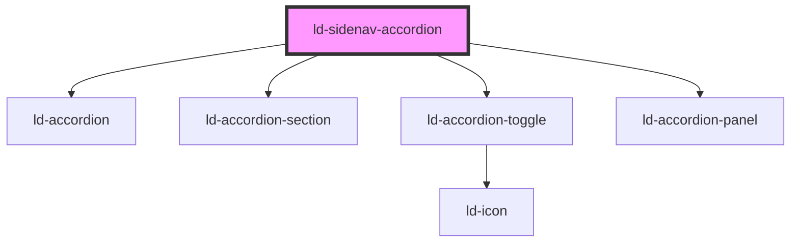

---
eleventyNavigation:
  key: Sidenav Accordion
  parent: Sidenav
layout: layout.njk
title: Sidenav Accordion
permalink: components/ld-sidenav/ld-sidenav-accordion/
---

# ld-sidenav-accordion

The `ld-sidenav-accordion` component is a subcomponent for `ld-sidenav`.

Please refer to the [`ld-sidenav` documentation](components/ld-sidenav/#ld-sidenav-accordion) for usage examples.

---

<!-- Auto Generated Below -->

## Properties

| Property        | Attribute        | Description                                                                                                                                                  | Type               | Default     |
| --------------- | ---------------- | ------------------------------------------------------------------------------------------------------------------------------------------------------------ | ------------------ | ----------- |
| `expanded`      | `expanded`       | Indicates that the accordion section is expanded.                                                                                                            | `boolean`          | `undefined` |
| `key`           | `key`            | for tracking the node's identity when working with lists                                                                                                     | `string \| number` | `undefined` |
| `preserveState` | `preserve-state` | Set to false to make the accordion collapse on sidenav collapse or slide change.                                                                             | `boolean`          | `true`      |
| `ref`           | `ref`            | reference to component                                                                                                                                       | `any`              | `undefined` |
| `split`         | `split`          | Split the accordion toggle in two parts with the second part containing the caret icon and being responsible for expanding / collapsing the accordion panel. | `boolean`          | `undefined` |

## Events

| Event                             | Description                                            | Type               |
| --------------------------------- | ------------------------------------------------------ | ------------------ |
| `ldSidenavAccordionTransitionEnd` | Emitted on accordion expand or collaps transition end. | `CustomEvent<any>` |

## Dependencies

### Depends on

- [ld-accordion](../../ld-accordion)
- [ld-accordion-section](../../ld-accordion/ld-accordion-section)
- [ld-accordion-toggle](../../ld-accordion/ld-accordion-toggle)
- [ld-accordion-panel](../../ld-accordion/ld-accordion-panel)

### Graph

----------------------------------------------

*Built with [StencilJS](https://stenciljs.com/)*
