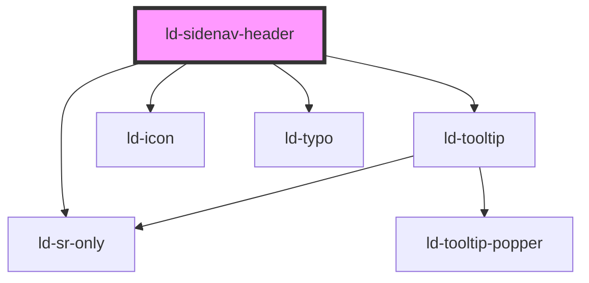

---
eleventyNavigation:
  key: Sidenav Header
  parent: Sidenav
layout: layout.njk
title: Sidenav Header
permalink: components/ld-sidenav/ld-sidenav-header/
---

# ld-sidenav-header

The `ld-sidenav-header` component is a subcomponent for `ld-sidenav` component.

Please refer to the [`ld-sidenav` documentation](components/ld-sidenav/#ld-sidenav-header) for usage examples.

---

<!-- Auto Generated Below -->

## Properties

| Property        | Attribute        | Description                                                            | Type               | Default                      |
| --------------- | ---------------- | ---------------------------------------------------------------------- | ------------------ | ---------------------------- |
| `ariaLabel`     | `aria-label`     | aria-label to be used on the anchor element within the sidenav header. | `string`           | `undefined`                  |
| `href`          | `href`           | href to be used on the anchor element within the sidenav header.       | `string`           | `undefined`                  |
| `key`           | `key`            | for tracking the node's identity when working with lists               | `string \| number` | `undefined`                  |
| `labelCollapse` | `label-collapse` | Label to be used for the toggle button when navigation is expanded.    | `string`           | `'Collapse side navigation'` |
| `labelExpand`   | `label-expand`   | Label to be used for the toggle button when navigation is collapsed.   | `string`           | `'Expand side navigation'`   |
| `ref`           | `ref`            | reference to component                                                 | `any`              | `undefined`                  |

## Events

| Event                        | Description              | Type               |
| ---------------------------- | ------------------------ | ------------------ |
| `ldSidenavHeaderToggleClick` | Emitted on toggle click. | `CustomEvent<any>` |

## Shadow Parts

| Part            | Description |
| --------------- | ----------- |
| `"anchor"`      |             |
| `"toggle"`      |             |
| `"toggle-icon"` |             |

## Dependencies

### Depends on

- [ld-tooltip](../../ld-tooltip)
- [ld-icon](../../ld-icon)
- [ld-sr-only](../../ld-sr-only)
- [ld-typo](../../ld-typo)

### Graph

----------------------------------------------

 
