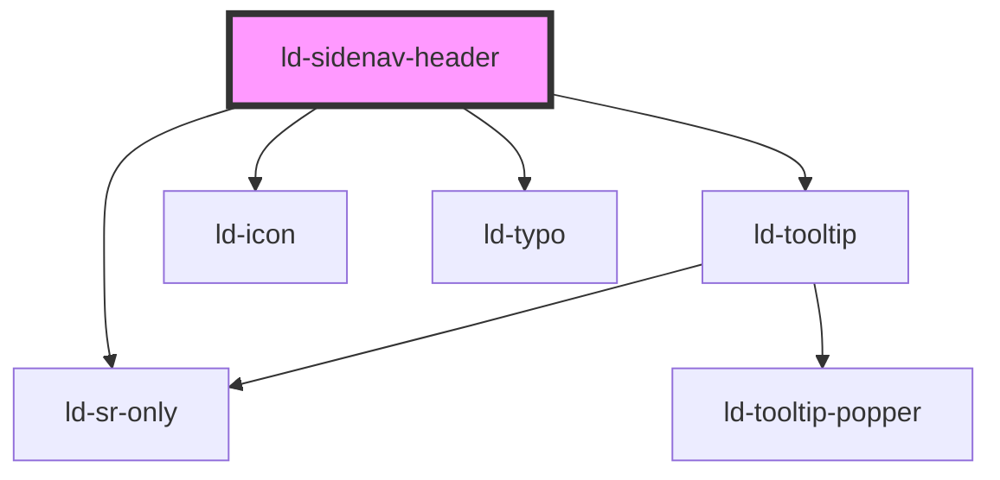

---
eleventyNavigation:
  key: Sidenav Header
  parent: Sidenav
layout: layout.njk
title: Sidenav Header
permalink: components/ld-sidenav/ld-sidenav-header/
---

# ld-sidenav-header

The `ld-sidenav-header` component is a subcomponent for `ld-sidenav` component.

Please refer to the [`ld-sidenav` documentation](components/ld-sidenav/#ld-sidenav-header) for general usage examples. The expamples in this page focus on the customization of the `ld-sidenav-header` component itself.

## Default


<ld-sidenav open collapsible narrow>
  <ld-sidenav-header href="#" slot="header">Liquid Oxygen</ld-sidenav-header>
</ld-sidenav>


## With custom logo


<ld-sidenav open collapsible narrow>
  <ld-sidenav-header href="#" slot="header">
    <svg slot="logo" viewBox="0 0 32 32">
      <path d="M8.40273 3.00317C16.3674 -1.08484 30.9212 8.31547 30.2215 17.1105C29.5219 25.9055 13.8966 33.1344 6.62487 28.4376C-0.650379 23.7238 0.431303 7.10139 8.40273 3.00317Z" fill="#2DBECD"/>
      <path d="M4.69207 12.6056C6.77561 6.76982 18.5736 4.62074 22.3863 9.39108C26.199 14.1614 21.7368 25.211 15.842 26.2848C9.93739 27.3517 2.60995 18.4498 4.69207 12.6056Z" fill="#FFC832"/>
      <path d="M11.2893 10.9795C13.2965 8.19935 19.898 8.87655 21.1887 11.9997C22.4793 15.1229 18.4039 20.3071 15.1055 19.9688C11.803 19.6253 9.28149 13.7644 11.2893 10.9795Z" fill="#0F69AF"/>
    </svg>
    Liquid Oxygen
  </ld-sidenav-header>
</ld-sidenav>


If your logo takes up a lot of horizontal space, you can omit the title and use all space for the logo:


<ld-sidenav open collapsible narrow>
  <ld-sidenav-header href="#" slot="header">
    <svg slot="logo" width="160" viewBox="0 0 1120 90">
      <title>Liquid Oxygen</title>
      <path d="M4.984 8.982h3.752c.158 0 .246-.07.246-.211v-.722c0-.863-.51-1.391-1.391-1.391H5.002c-1.55 0-2.536-1.357-2.536-2.836v-2.43C2.466.527 1.955 0 1.074 0H.211C.071 0 0 .088 0 .247v3.628c0 2.888 2.096 5.107 4.984 5.107Zm6.29 0h2.413c.159 0 .247-.07.247-.211V6.869c0-.141-.088-.211-.247-.211h-.546V2.87c0-.37.176-.546.546-.546.159 0 .247-.07.247-.212V1.39c0-.44-.124-.775-.37-1.021-.247-.247-.581-.37-1.022-.37H10.13c-.158 0-.246.07-.246.211v1.903c0 .14.088.21.246.21.37 0 .546.177.546.547v3.787h-.546c-.158 0-.246.07-.246.21v.723c0 .44.123.775.37 1.022.246.246.58.37 1.021.37h-.001Zm8.695 0h3.576c.158 0 .246-.07.246-.211V7.045c0-.14-.088-.211-.246-.211h-.67c.318-.265.547-.582.705-.916.14-.335.211-.722.211-1.163 0-.598-.158-1.18-.457-1.76a5.562 5.562 0 0 0-1.18-1.533A6.021 6.021 0 0 0 20.497.405 4.751 4.751 0 0 0 18.63 0h-3.61c-.142 0-.212.088-.212.247v3.575c0 .687.14 1.356.44 1.973.282.616.67 1.162 1.145 1.637.476.476 1.04.864 1.656 1.128.616.281 1.25.422 1.92.422Zm-.035-2.307a1.83 1.83 0 0 1-.933-.264 3.897 3.897 0 0 1-.863-.67 3.227 3.227 0 0 1-.617-.915 2.413 2.413 0 0 1-.246-1.022c0-.44.123-.792.387-1.056a1.364 1.364 0 0 1 1.004-.406c.3 0 .617.089.934.265.317.176.598.405.863.669.246.264.458.581.616.916.159.352.247.687.247 1.021 0 .423-.124.775-.388 1.04a1.316 1.316 0 0 1-1.004.422Zm9.989 2.307h3.522c.141 0 .212-.07.212-.229V1.41c0-.863-.511-1.391-1.392-1.391h-.863c-.14 0-.211.088-.211.246V5.16c0 .881-.529 1.515-1.444 1.515-1.515 0-2.607-1.409-2.607-3.012V1.41c0-.863-.51-1.391-1.391-1.391h-.863c-.141 0-.212.088-.212.246V3.7c0 3.029 2.06 5.301 5.249 5.301v-.019Zm6.007 0h2.414c.158 0 .246-.07.246-.211V6.869c0-.141-.088-.211-.246-.211h-.546V2.87c0-.37.176-.546.546-.546.158 0 .246-.07.246-.212V1.39c0-.44-.123-.775-.37-1.021C37.974.123 37.64 0 37.2 0h-2.413c-.159 0-.247.07-.247.211v1.903c0 .14.088.21.247.21.37 0 .546.177.546.547v3.787h-.546c-.159 0-.247.07-.247.21v.723c0 .44.124.775.37 1.022.247.246.581.37 1.022.37l-.002-.001Zm4.927 0h3.804c1.25 0 2.22-.299 2.924-.95.687-.635 1.04-1.568 1.04-2.819 0-.722-.142-1.391-.441-2.025a5.62 5.62 0 0 0-1.198-1.656A5.572 5.572 0 0 0 45.26.422a5.305 5.305 0 0 0-2.008-.404h-3.575c-.141 0-.211.088-.211.246V7.61c0 .44.123.775.37 1.021.246.247.58.37 1.021.37v-.019Zm1.074-2.307V3.822c0-.44.124-.793.353-1.074.229-.265.546-.406.95-.406.353 0 .705.089 1.057.247.335.176.652.405.934.687.264.282.493.599.67.951.175.352.263.705.263 1.074 0 .44-.14.775-.422 1.004-.3.247-.652.37-1.057.37H41.93h.001Z" style="fill: var(--ld-thm-primary);fill-rule:nonzero" transform="scale(10)"/>
      <path d="M59.8 9c2.336 0 3.824-1.592 3.824-3.825C63.624 2.44 61.184 0 58.45 0h-3.617c-.139 0-.208.087-.208.242v3.583C54.624 6.542 57.082 9 59.8 9Zm-.018-2.285c-1.281 0-2.735-1.627-2.735-2.942 0-.865.571-1.488 1.42-1.488 1.315 0 2.734 1.592 2.734 2.942 0 .883-.537 1.488-1.42 1.488h.001Zm4.727 2.112h.813c.433 0 .762-.121 1.022-.38l1.54-1.576c.242-.242.52-.363.813-.363.295 0 .554.12.796.363l1.54 1.575c.26.26.59.38 1.022.38h.865c.139 0 .208-.068.208-.224v-.83c0-.434-.121-.762-.38-1.022l-2.406-2.337 2.405-2.353c.26-.26.381-.589.381-1.022V.26c0-.156-.07-.243-.208-.243h-.813c-.433 0-.762.121-1.021.381l-1.54 1.575c-.243.242-.52.364-.814.364-.294 0-.554-.122-.796-.364L66.396.398c-.26-.26-.589-.38-1.022-.38h-.865c-.139 0-.208.086-.208.242v.83c0 .433.121.762.381 1.022l2.406 2.353-2.406 2.337c-.26.26-.38.588-.38 1.021v.779c0 .156.068.225.207.225Zm14.073 0h.848c.139 0 .208-.07.208-.225V5.365l2.804-3.253c.26-.312.398-.606.398-.987V.26c0-.156-.07-.243-.208-.243h-.813a1.252 1.252 0 0 0-.987.433l-1.557 1.852c-.226.26-.554.363-.814.363-.277 0-.606-.155-.796-.363L76.055.398c-.225-.26-.554-.38-1.02-.38h-.814c-.139 0-.208.086-.208.242v.865c0 .398.19.796.38 1.021l2.822 3.289v2.042c0 .848.502 1.367 1.367 1.367v-.017Zm10.145 0h3.565c.156 0 .242-.07.242-.208V4.915c0-.432-.12-.761-.363-1.003-.242-.243-.571-.364-1.004-.364h-3.998c-.156 0-.242.07-.242.208 0 .761.484 1.419 1.211 1.696.225.086.45.138.71.138h1.35v.952h-1.454c-.364 0-.727-.086-1.056-.26a2.923 2.923 0 0 1-.883-.657 3.395 3.395 0 0 1-.623-.935 2.523 2.523 0 0 1-.225-1.055c0-.433.139-.78.416-1.004.277-.225.623-.346 1.038-.346h4.708c.156 0 .242-.07.242-.208v-.71c0-.432-.12-.761-.363-1.004C91.755.121 91.427 0 90.994 0h-3.565a4.46 4.46 0 0 0-1.558.26c-.467.19-.883.432-1.229.761a3.423 3.423 0 0 0-.813 1.16 4.01 4.01 0 0 0-.295 1.54c0 .71.139 1.367.416 1.99.277.624.657 1.16 1.142 1.627a4.924 4.924 0 0 0 1.662 1.09c.623.26 1.28.399 1.973.399Zm9.694 0h3.392c.156 0 .243-.07.243-.208v-.71c0-.847-.502-1.367-1.368-1.367h-2.25c-1.419 0-2.613-1.35-2.613-2.804 0-.9.537-1.453 1.61-1.453.813 0 1.661.45 2.198 1.35h-2.596c-.156 0-.243.069-.243.207 0 1.056.952 1.835 1.887 1.835h2.475c.83 0 1.159-.467 1.159-1.16 0-2.302-2.51-4.517-5.036-4.517h-3.67c-.138 0-.207.087-.207.242v3.496c0 2.804 2.302 5.089 5.02 5.089h-.001Zm6.043 0h.848c.138 0 .207-.07.207-.225v-4.69l4.223 4.534c.243.26.554.398.952.398h1.022c.138 0 .207-.086.207-.242V1.385c0-.433-.121-.762-.363-1.004-.243-.243-.571-.364-1.004-.364h-.848c-.139 0-.208.087-.208.243v2.717c0 .225-.052.415-.156.554-.121.156-.277.225-.502.225-.259 0-.501-.121-.726-.364l-2.77-2.977c-.242-.26-.554-.398-.952-.398h-1.09c-.138 0-.208.087-.208.243v7.217c0 .433.121.761.364 1.004.242.242.571.363 1.004.363v-.017Z" style="fill: var(--ld-thm-secondary);fill-rule:nonzero" transform="scale(10)"/>
    </svg>
  </ld-sidenav-header>
</ld-sidenav>


---

<!-- Auto Generated Below -->

## Properties

| Property        | Attribute        | Description                                                            | Type               | Default                      |
| --------------- | ---------------- | ---------------------------------------------------------------------- | ------------------ | ---------------------------- |
| `ariaLabel`     | `aria-label`     | aria-label to be used on the anchor element within the sidenav header. | `string`           | `undefined`                  |
| `href`          | `href`           | href to be used on the anchor element within the sidenav header.       | `string`           | `undefined`                  |
| `key`           | `key`            | for tracking the node's identity when working with lists               | `string \| number` | `undefined`                  |
| `labelCollapse` | `label-collapse` | Label to be used for the toggle button when navigation is expanded.    | `string`           | `'Collapse side navigation'` |
| `labelExpand`   | `label-expand`   | Label to be used for the toggle button when navigation is collapsed.   | `string`           | `'Expand side navigation'`   |
| `ref`           | `ref`            | reference to component                                                 | `any`              | `undefined`                  |

## Events

| Event                        | Description              | Type               |
| ---------------------------- | ------------------------ | ------------------ |
| `ldSidenavHeaderToggleClick` | Emitted on toggle click. | `CustomEvent<any>` |

## Slots

| Slot     | Description                                  |
| -------- | -------------------------------------------- |
|          | Slot for the header title.                   |
| `"logo"` | Replace the initial M with your custom logo. |

## Shadow Parts

| Part            | Description |
| --------------- | ----------- |
| `"anchor"`      |             |
| `"toggle"`      |             |
| `"toggle-icon"` |             |

## Dependencies

### Depends on

- [ld-tooltip](../../ld-tooltip)
- [ld-icon](../../ld-icon)
- [ld-sr-only](../../ld-sr-only)
- [ld-typo](../../ld-typo)

### Graph

----------------------------------------------

*Built with [StencilJS](https://stenciljs.com/)*
