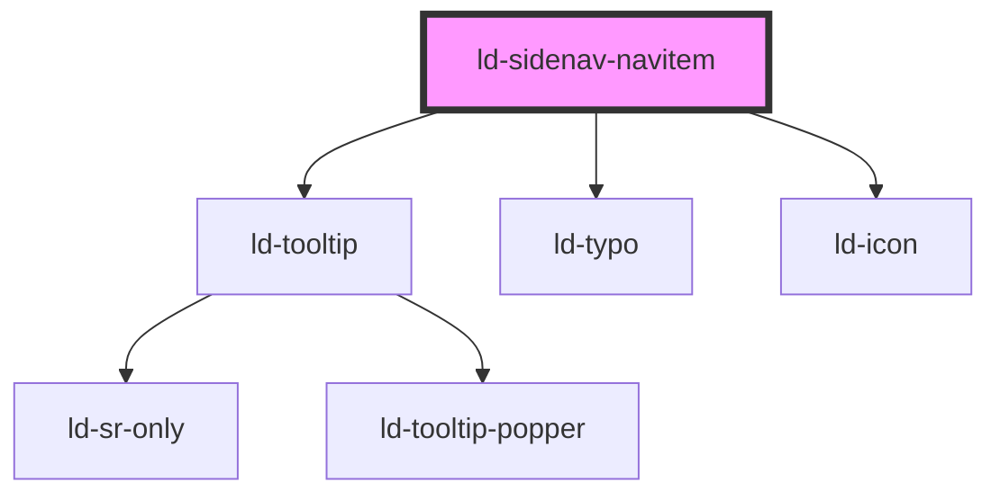

---
eleventyNavigation:
  key: Sidenav Navitem
  parent: Sidenav
layout: layout.njk
title: Sidenav Navitem
permalink: components/ld-sidenav/ld-sidenav-navitem/
---

# ld-sidenav-navitem

The `ld-sidenav-navitem` component is a subcomponent for `ld-sidenav` and is meant to be used in the slot of either the [`ld-sidenav-slider`](../ld-sidenav-slider), the [`ld-sidenav-subnav`](../ld-sidenav-subnav) or the [`ld-sidenav-back`](../ld-sidenav-back) component.

Please refer to the [`ld-sidenav` documentation](components/ld-sidenav/#ld-sidenav-navitem) for general usage examples. The expamples in this page focus on the customization of the `ld-sidenav-navitem` component itself.

---

## Primary mode

### Icon


<ld-sidenav open>
  <ld-sidenav-slider label="Outline of CS">
    <ld-sidenav-navitem>
      <ld-icon slot="icon" name="bottle"></ld-icon>
      Liquid Oxygen
    </ld-sidenav-navitem>
  </ld-sidenav-slider>
</ld-sidenav>


### Custom icon


<ld-sidenav open>
  <ld-sidenav-slider label="Outline of CS">
    <ld-sidenav-navitem>
      <svg slot="icon" viewBox="0 0 32 32">
        <g transform="scale(0.75) translate(5, 5)">
          <path d="M8.40273 3.00317C16.3674 -1.08484 30.9212 8.31547 30.2215 17.1105C29.5219 25.9055 13.8966 33.1344 6.62487 28.4376C-0.650379 23.7238 0.431303 7.10139 8.40273 3.00317Z" fill="#2DBECD"/>
          <path d="M4.69207 12.6056C6.77561 6.76982 18.5736 4.62074 22.3863 9.39108C26.199 14.1614 21.7368 25.211 15.842 26.2848C9.93739 27.3517 2.60995 18.4498 4.69207 12.6056Z" fill="#FFC832"/>
          <path d="M11.2893 10.9795C13.2965 8.19935 19.898 8.87655 21.1887 11.9997C22.4793 15.1229 18.4039 20.3071 15.1055 19.9688C11.803 19.6253 9.28149 13.7644 11.2893 10.9795Z" fill="#0F69AF"/>
        </g>
      </svg>
      Liquid Oxygen
    </ld-sidenav-navitem>
  </ld-sidenav-slider>
</ld-sidenav>


### Custom image


<ld-sidenav open>
  <ld-sidenav-slider label="Outline of CS">
    <ld-sidenav-navitem>
      
      Liquid Oxygen
    </ld-sidenav-navitem>
  </ld-sidenav-slider>
</ld-sidenav>


### Icon fallback


<ld-sidenav open>
  <ld-sidenav-slider label="Outline of CS">
    <ld-sidenav-navitem>Liquid Oxygen</ld-sidenav-navitem>
  </ld-sidenav-slider>
</ld-sidenav>


## Secondary mode


<ld-sidenav open>
  <ld-sidenav-slider label="Outline of CS">
    <ld-sidenav-navitem mode="secondary">Liquid Oxygen</ld-sidenav-navitem>
  </ld-sidenav-slider>
</ld-sidenav>


## Tertiary mode


<ld-sidenav open>
  <ld-sidenav-slider label="Outline of CS">
    <ld-sidenav-navitem mode="tertiary">Liquid Oxygen</ld-sidenav-navitem>
  </ld-sidenav-slider>
</ld-sidenav>


## Selected


<ld-sidenav open>
  <ld-sidenav-slider label="Outline of CS">
    <ld-sidenav-navitem selected>Liquid Oxygen</ld-sidenav-navitem>
    <ld-sidenav-navitem mode="secondary" selected>Liquid Oxygen</ld-sidenav-navitem>
    <ld-sidenav-navitem mode="tertiary" selected>Liquid Oxygen</ld-sidenav-navitem>
  </ld-sidenav-slider>
</ld-sidenav>


## Rounded


<ld-sidenav open>
  <ld-sidenav-slider label="Outline of CS">
    <ld-sidenav-navitem rounded>
      <svg slot="icon" viewBox="0 0 32 32">
        <g transform="scale(0.75) translate(5, 5)">
          <path d="M8.40273 3.00317C16.3674 -1.08484 30.9212 8.31547 30.2215 17.1105C29.5219 25.9055 13.8966 33.1344 6.62487 28.4376C-0.650379 23.7238 0.431303 7.10139 8.40273 3.00317Z" fill="#2DBECD"/>
          <path d="M4.69207 12.6056C6.77561 6.76982 18.5736 4.62074 22.3863 9.39108C26.199 14.1614 21.7368 25.211 15.842 26.2848C9.93739 27.3517 2.60995 18.4498 4.69207 12.6056Z" fill="#FFC832"/>
          <path d="M11.2893 10.9795C13.2965 8.19935 19.898 8.87655 21.1887 11.9997C22.4793 15.1229 18.4039 20.3071 15.1055 19.9688C11.803 19.6253 9.28149 13.7644 11.2893 10.9795Z" fill="#0F69AF"/>
        </g>
      </svg>
      Liquid Oxygen
    </ld-sidenav-navitem>
    <ld-sidenav-navitem rounded>Liquid Oxygen</ld-sidenav-navitem>
    <ld-sidenav-navitem mode="secondary" rounded>Liquid Oxygen</ld-sidenav-navitem>
    <ld-sidenav-navitem mode="tertiary" rounded>Liquid Oxygen</ld-sidenav-navitem>
  </ld-sidenav-slider>
</ld-sidenav>


## Background color


<ld-sidenav open>
  <ld-sidenav-slider label="Outline of CS">
    <ld-sidenav-navitem style="--ld-sidenav-navitem-icon-bg-col: var(--ld-col-vm)" >
      <svg slot="icon" viewBox="0 0 32 32">
        <g transform="scale(0.75) translate(5, 5)">
          <path d="M8.40273 3.00317C16.3674 -1.08484 30.9212 8.31547 30.2215 17.1105C29.5219 25.9055 13.8966 33.1344 6.62487 28.4376C-0.650379 23.7238 0.431303 7.10139 8.40273 3.00317Z" fill="#2DBECD"/>
          <path d="M4.69207 12.6056C6.77561 6.76982 18.5736 4.62074 22.3863 9.39108C26.199 14.1614 21.7368 25.211 15.842 26.2848C9.93739 27.3517 2.60995 18.4498 4.69207 12.6056Z" fill="#FFC832"/>
          <path d="M11.2893 10.9795C13.2965 8.19935 19.898 8.87655 21.1887 11.9997C22.4793 15.1229 18.4039 20.3071 15.1055 19.9688C11.803 19.6253 9.28149 13.7644 11.2893 10.9795Z" fill="#0F69AF"/>
        </g>
      </svg>
      Liquid Oxygen
    </ld-sidenav-navitem>
    <ld-sidenav-navitem style="--ld-sidenav-navitem-icon-bg-col: var(--ld-col-rp)" >Liquid Oxygen</ld-sidenav-navitem>
    <ld-sidenav-navitem style="--ld-sidenav-navitem-icon-bg-col: var(--ld-col-rr)" mode="secondary">Liquid Oxygen</ld-sidenav-navitem>
    <ld-sidenav-navitem style="--ld-sidenav-navitem-icon-bg-col: var(--ld-col-rg)" mode="tertiary">Liquid Oxygen</ld-sidenav-navitem>
  </ld-sidenav-slider>
</ld-sidenav>


## Secondary icon


<ld-sidenav open>
  <ld-sidenav-slider label="Outline of CS">
    <ld-sidenav-navitem>
      <svg slot="icon" viewBox="0 0 32 32">
        <g transform="scale(0.75) translate(5, 5)">
          <path d="M8.40273 3.00317C16.3674 -1.08484 30.9212 8.31547 30.2215 17.1105C29.5219 25.9055 13.8966 33.1344 6.62487 28.4376C-0.650379 23.7238 0.431303 7.10139 8.40273 3.00317Z" fill="#2DBECD"/>
          <path d="M4.69207 12.6056C6.77561 6.76982 18.5736 4.62074 22.3863 9.39108C26.199 14.1614 21.7368 25.211 15.842 26.2848C9.93739 27.3517 2.60995 18.4498 4.69207 12.6056Z" fill="#FFC832"/>
          <path d="M11.2893 10.9795C13.2965 8.19935 19.898 8.87655 21.1887 11.9997C22.4793 15.1229 18.4039 20.3071 15.1055 19.9688C11.803 19.6253 9.28149 13.7644 11.2893 10.9795Z" fill="#0F69AF"/>
        </g>
      </svg>
      Liquid Oxygen
      <ld-icon slot="icon-secondary" name="bottle" size="sm" />
    </ld-sidenav-navitem>
    <ld-sidenav-navitem mode="secondary">
      Liquid Oxygen
      <ld-icon slot="icon-secondary" name="bottle" size="sm" />
    </ld-sidenav-navitem>
    <ld-sidenav-navitem mode="tertiary">
      Liquid Oxygen
      <ld-icon slot="icon-secondary" name="bottle" size="sm" />
    </ld-sidenav-navitem>
  </ld-sidenav-slider>
</ld-sidenav>


---

## CSS Variables

| Variable                                             | Description                                                                 |
|------------------------------------------------------|-----------------------------------------------------------------------------|
| `--ld-sidenav-navitem-border-radius`                 | Border radius of the `ld-sidenav-navitem` component.                        |
| `--ld-sidenav-navitem-icon-font-size`                | Icon font size of the `ld-sidenav-navitem` component.                       |
| `--ld-sidenav-navitem-icon-size`                     | Icon size of the `ld-sidenav-navitem` component.                            |
| `--ld-sidenav-navitem-icon-bg-col`                   | Icon background color (overwrites current theme color).                     |

<!-- Auto Generated Below -->

## Properties

| Property        | Attribute         | Description                                                                                                                                                                                                                                                          | Type                                         | Default     |
| --------------- | ----------------- | -------------------------------------------------------------------------------------------------------------------------------------------------------------------------------------------------------------------------------------------------------------------- | -------------------------------------------- | ----------- |
| `expandOnClick` | `expand-on-click` | By default, the sidenav automatically expands on click of a navitem, which has a `to` property or acts as an accordion toggle. You can overwrite this behavior by using this prop to explicitly force or prevent expansion of the sidenav.                           | `boolean`                                    | `undefined` |
| `href`          | `href`            | Transforms the nav item to an anchor element.                                                                                                                                                                                                                        | `string`                                     | `undefined` |
| `key`           | `key`             | for tracking the node's identity when working with lists                                                                                                                                                                                                             | `string \| number`                           | `undefined` |
| `ldTabindex`    | `ld-tabindex`     | Tab index of the button.                                                                                                                                                                                                                                             | `number`                                     | `undefined` |
| `mode`          | `mode`            | Display mode. In secondary mode the navitem is less high, displays a filled dot instead of the icon and is hidden when the sidenav collapses. The tertiary mode is similar to secondary mode, with the navitem indented and the dot being empty and having a border. | `"secondary" \| "tertiary"`                  | `undefined` |
| `ref`           | `ref`             | reference to component                                                                                                                                                                                                                                               | `any`                                        | `undefined` |
| `rounded`       | `rounded`         | Applies full border-radius.                                                                                                                                                                                                                                          | `boolean`                                    | `false`     |
| `selected`      | `selected`        | Sets visual indicator to denote that the nav item is currently selected.                                                                                                                                                                                             | `boolean`                                    | `false`     |
| `target`        | `target`          | The `target` attributed can be used in conjunction with the `href` attribute. See [mdn docs](https://developer.mozilla.org/en-US/docs/Web/HTML/Element/a#attr-target) for more information on the `target` attribute.                                                | `"_blank" \| "_parent" \| "_self" \| "_top"` | `undefined` |
| `to`            | `to`              | Accepts an id of an ld-subnav component to navigate to it on click.                                                                                                                                                                                                  | `string`                                     | `undefined` |

## Events

| Event                   | Description                         | Type                                          |
| ----------------------- | ----------------------------------- | --------------------------------------------- |
| `ldSidenavNavitemClick` | Emitted on click.                   | `CustomEvent<any>`                            |
| `ldSidenavNavitemTo`    | Emitted on click if prop to is set. | `CustomEvent<{ id: string; label: string; }>` |

## Methods

### `focusInner() => Promise<void>`

Sets focus on the anchor or button

#### Returns

Type: `Promise<void>`

## Slots

| Slot     | Description                          |
| -------- | ------------------------------------ |
|          | default slot for the nav item label. |
| `"icon"` | slot for svg or icon component.      |

## Shadow Parts

| Part                    | Description |
| ----------------------- | ----------- |
| `"abbreviation"`        |             |
| `"bg"`                  |             |
| `"dot"`                 |             |
| `"focusable"`           |             |
| `"navitem"`             |             |
| `"slot-container"`      |             |
| `"slot-container-icon"` |             |

## Dependencies

### Depends on

- [ld-tooltip](../../ld-tooltip)
- [ld-typo](../../ld-typo)
- [ld-icon](../../ld-icon)

### Graph

----------------------------------------------

 
