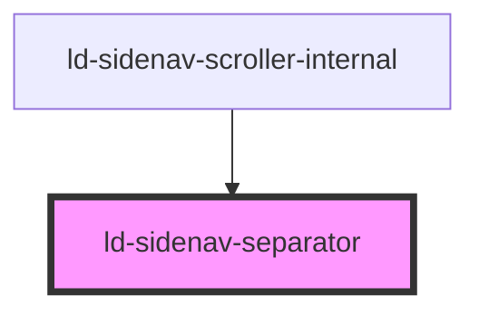

---
eleventyNavigation:
  key: Sidenav Separator
  parent: Sidenav
layout: layout.njk
title: Sidenav Separator
permalink: components/ld-sidenav/ld-sidenav-separator/
---

# ld-sidenav-separator

The `ld-sidenav-separator` component is a subcomponent for `ld-sidenav`.

Please refer to the [`ld-sidenav` documentation](components/ld-sidenav/#ld-sidenav-separator) for usage examples.

---

<!-- Auto Generated Below -->

## Properties

| Property | Attribute | Description                                              | Type               | Default     |
| -------- | --------- | -------------------------------------------------------- | ------------------ | ----------- |
| `key`    | `key`     | for tracking the node's identity when working with lists | `string \| number` | `undefined` |
| `ref`    | `ref`     | reference to component                                   | `any`              | `undefined` |

## Shadow Parts

| Part   | Description |
| ------ | ----------- |
| `"hr"` |             |

## Dependencies

### Used by

 - ld-sidenav-scroller-internal

### Graph

----------------------------------------------

*Built with [StencilJS](https://stenciljs.com/)*
