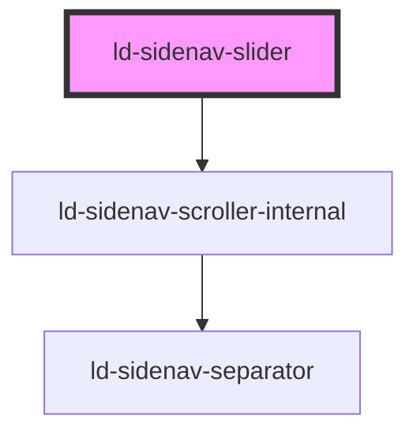

---
eleventyNavigation:
  key: Sidenav Slider
  parent: Sidenav
layout: layout.njk
title: Sidenav Slider
permalink: components/ld-sidenav/ld-sidenav-slider/
---

# ld-sidenav-slider

The `ld-sidenav-slider` component is a subcomponent for `ld-sidenav`.

Please refer to the [`ld-sidenav` documentation](components/ld-sidenav/#ld-sidenav-slider) for usage examples.

---

<!-- Auto Generated Below -->

## Properties

| Property             | Attribute        | Description                                                        | Type               | Default     |
| -------------------- | ---------------- | ------------------------------------------------------------------ | ------------------ | ----------- |
| `currentSubnav`      | `current-subnav` | ID of the subnav that shall be shown on initial render.            | `string`           | `undefined` |
| `key`                | `key`            | for tracking the node's identity when working with lists           | `string \| number` | `undefined` |
| `label` _(required)_ | `label`          | Used in the ld-sidenav-back component to display parent nav label. | `string`           | `undefined` |
| `ref`                | `ref`            | reference to component                                             | `any`              | `undefined` |

## Events

| Event                   | Description                                     | Type                                          |
| ----------------------- | ----------------------------------------------- | --------------------------------------------- |
| `ldSidenavSliderChange` | Emitted on navigation (before transition ends). | `CustomEvent<{ id: string; label: string; }>` |

## Methods

### `navigateBack() => Promise<void>`

Navigates back to the parent nav.

#### Returns

Type: `Promise<void>`

## Shadow Parts

| Part                 | Description |
| -------------------- | ----------- |
| `"scroll-container"` |             |

## Dependencies

### Depends on

- ld-sidenav-scroller-internal

### Graph

----------------------------------------------

*Built with [StencilJS](https://stenciljs.com/)*
