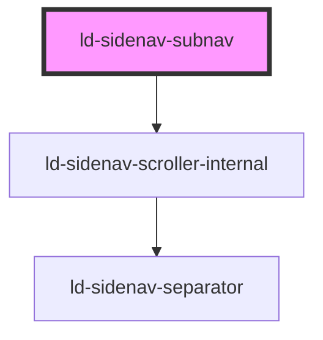

---
eleventyNavigation:
  key: Sidenav Subnav
  parent: Sidenav
layout: layout.njk
title: Sidenav Subnav
permalink: components/ld-sidenav/ld-sidenav-subnav/
---

# ld-sidenav-subnav

The `ld-sidenav-subnav` component is a subcomponent for `ld-sidenav`.

Please refer to the [`ld-sidenav` documentation](components/ld-sidenav/#ld-sidenav-subnav) for usage examples.

---

<!-- Auto Generated Below -->

## Properties

| Property             | Attribute | Description                                                        | Type               | Default     |
| -------------------- | --------- | ------------------------------------------------------------------ | ------------------ | ----------- |
| `key`                | `key`     | for tracking the node's identity when working with lists           | `string \| number` | `undefined` |
| `label` _(required)_ | `label`   | Used in the ld-sidenav-back component to display parent nav label. | `string`           | `undefined` |
| `ref`                | `ref`     | reference to component                                             | `any`              | `undefined` |

## Methods

### `scrollToTop(smoothly?: boolean) => Promise<void>`

Scrolls the subnav scroll container to the top.

#### Parameters

| Name       | Type      | Description |
| ---------- | --------- | ----------- |
| `smoothly` | `boolean` |             |

#### Returns

Type: `Promise<void>`

## Shadow Parts

| Part                 | Description |
| -------------------- | ----------- |
| `"scroll-container"` |             |

## Dependencies

### Depends on

- ld-sidenav-scroller-internal

### Graph

----------------------------------------------

*Built with [StencilJS](https://stenciljs.com/)*
