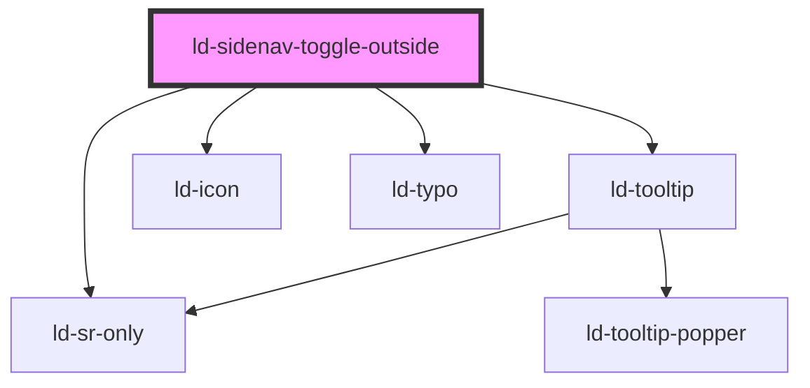

---
eleventyNavigation:
  key: Sidenav Toggle Outsid
  parent: Sidenav
layout: layout.njk
title: Sidenav Toggle Outsid
permalink: components/ld-sidenav/ld-sidenav-toggle-outside/
---

# ld-sidenav-toggle-outside

The `ld-sidenav-toggle-outside` component is supposed to be used in combination with the `ld-sidenav` component.

Please refer to the [`ld-sidenav` documentation](components/ld-sidenav/#ld-sidenav-toggle-outside) for usage examples.

---

<!-- Auto Generated Below -->

## Properties

| Property      | Attribute      | Description                                                          | Type               | Default                    |
| ------------- | -------------- | -------------------------------------------------------------------- | ------------------ | -------------------------- |
| `key`         | `key`          | for tracking the node's identity when working with lists             | `string \| number` | `undefined`                |
| `labelExpand` | `label-expand` | Label to be used for the toggle button when navigation is collapsed. | `string`           | `'Expand side navigation'` |
| `ldTabindex`  | `ld-tabindex`  | Tab index of the toggle.                                             | `number`           | `undefined`                |
| `ref`         | `ref`          | reference to component                                               | `any`              | `undefined`                |

## Methods

### `focusInner() => Promise<void>`

Sets focus on the radio button.

#### Returns

Type: `Promise<void>`

## Shadow Parts

| Part            | Description |
| --------------- | ----------- |
| `"focusable"`   |             |
| `"toggle"`      |             |
| `"toggle-icon"` |             |

## Dependencies

### Depends on

- [ld-tooltip](../../ld-tooltip)
- [ld-icon](../../ld-icon)
- [ld-sr-only](../../ld-sr-only)
- [ld-typo](../../ld-typo)

### Graph

----------------------------------------------

*Built with [StencilJS](https://stenciljs.com/)*
