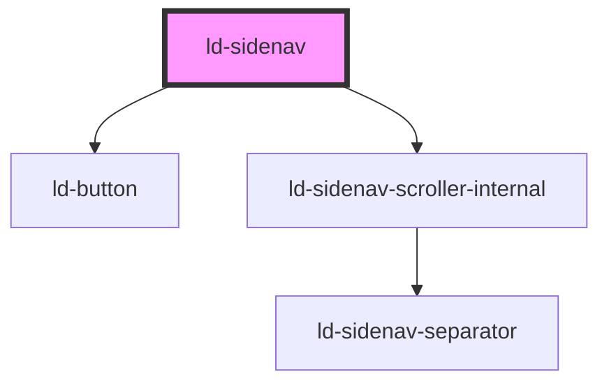

---
eleventyNavigation:
  key: Sidenav
  parent: Components
layout: layout.njk
title: Sidenav
permalink: components/ld-sidenav/
tags:
  - navigation
  - menu
---

# ld-sidenav

Use the `ld-sidenav` component to render a navigation placed on a side of a containing element (or full size, if the viewport is small).

---

## Introduction

The component can be used on its own with arbitrary content (i.e. your custom navigation). However, in order to implement a flexible navigation for your application you may want to compose it with components, which have been built for specificly this purpose.

Before diving into detailed usage instructions, let's first have a look at a comprehensive sidenav example from a bird's eye view.


<ld-sidenav open style="--ld-sidenav-width: 20rem">
  <ld-sidenav-back slot="top">
    <ld-sidenav-navitem>Outline of Computer Science</ld-sidenav-navitem>
  </ld-sidenav-back>
  <ld-sidenav-slider label="Outline of Computer Science">
    <ld-sidenav-heading>Subfields</ld-sidenav-heading>
    <ld-sidenav-navitem to="mathematical-foundations">Mathematical foundations</ld-sidenav-navitem>
    <ld-sidenav-navitem to="algorithms-and-data-structures">Algorithms and data structures</ld-sidenav-navitem>
    <ld-sidenav-navitem to="artificial-intelligence">Artificial intelligence</ld-sidenav-navitem>
    <ld-sidenav-navitem to="communication-and-security">Communication and security</ld-sidenav-navitem>
    <ld-sidenav-navitem to="artificial-intelligence">Artificial intelligence</ld-sidenav-navitem>
    <ld-sidenav-navitem to="communication-and-security">Communication and security</ld-sidenav-navitem>
    <ld-sidenav-navitem to="computer-architecture">Computer architecture</ld-sidenav-navitem>
    <ld-sidenav-navitem to="computer-graphics">Computer graphics</ld-sidenav-navitem>
    <ld-sidenav-navitem to="concurrent-parallel-and-distributed-systems">Concurrent, parallel, and distributed systems</ld-sidenav-navitem>
    <ld-sidenav-navitem to="databases">Databases</ld-sidenav-navitem>
    <ld-sidenav-navitem to="programming-languages-and-compilers">Programming languages and compilers</ld-sidenav-navitem>
    <ld-sidenav-navitem to="scientific-computing">Scientific computing</ld-sidenav-navitem>
    <ld-sidenav-navitem to="software-engineering">Software engineering</ld-sidenav-navitem>
    <ld-sidenav-navitem to="theory-of-computation">Theory of computation</ld-sidenav-navitem>
    <ld-sidenav-subnav id="mathematical-foundations" label="Mathematical foundations">
      <ld-sidenav-heading>Mathematical foundations</ld-sidenav-heading>
      <ld-sidenav-navitem mode="secondary">Coding theory</ld-sidenav-navitem>
      <ld-sidenav-navitem mode="secondary">Game theory</ld-sidenav-navitem>
      <ld-sidenav-navitem mode="secondary">Discrete Mathematics</ld-sidenav-navitem>
      <ld-sidenav-navitem mode="secondary">Graph theory</ld-sidenav-navitem>
      <ld-sidenav-navitem mode="secondary">Mathematical logic</ld-sidenav-navitem>
      <ld-sidenav-navitem mode="secondary">Number theory</ld-sidenav-navitem>
    </ld-sidenav-subnav>
    <ld-sidenav-subnav id="algorithms-and-data-structures" label="Algorithms and data structures">
      <ld-sidenav-heading>Algorithms and data structures</ld-sidenav-heading>
      <ld-sidenav-navitem mode="secondary">Algorithms</ld-sidenav-navitem>
      <ld-sidenav-navitem mode="secondary">Data structures</ld-sidenav-navitem>
    </ld-sidenav-subnav>
    <ld-sidenav-subnav id="artificial-intelligence" label="Artificial intelligence">
      <ld-sidenav-heading>Artificial intelligence</ld-sidenav-heading>
      <ld-sidenav-navitem mode="secondary">Artificial intelligence</ld-sidenav-navitem>
      <ld-sidenav-navitem mode="secondary">Automated reasoning</ld-sidenav-navitem>
      <ld-sidenav-navitem mode="secondary">Computer vision</ld-sidenav-navitem>
      <ld-sidenav-navitem to="soft-computing">Soft computing</ld-sidenav-navitem>
      <ld-sidenav-navitem mode="secondary">Natural language processing</ld-sidenav-navitem>
      <ld-sidenav-navitem mode="secondary">Robotics</ld-sidenav-navitem>
      <ld-sidenav-subnav id="soft-computing" label="Soft computing">
        <ld-sidenav-heading>Soft computing</ld-sidenav-heading>
        <ld-sidenav-navitem mode="secondary">Machine learning</ld-sidenav-navitem>
        <ld-sidenav-navitem mode="secondary">Evolutionary computing</ld-sidenav-navitem>
      </ld-sidenav-subnav>
    </ld-sidenav-subnav>
    <ld-sidenav-subnav id="communication-and-security" label="Communication and security">
      <ld-sidenav-heading>Communication and security</ld-sidenav-heading>
      <ld-sidenav-navitem mode="secondary">Networking</ld-sidenav-navitem>
      <ld-sidenav-navitem mode="secondary">Computer security</ld-sidenav-navitem>
      <ld-sidenav-navitem mode="secondary">Cryptography</ld-sidenav-navitem>
    </ld-sidenav-subnav>
    <ld-sidenav-subnav id="computer-architecture" label="Computer architecture">
      <ld-sidenav-heading>Computer architecture</ld-sidenav-heading>
      <ld-sidenav-navitem mode="secondary">Computer architecture </ld-sidenav-navitem>
      <ld-sidenav-navitem mode="secondary">Operating systems</ld-sidenav-navitem>
    </ld-sidenav-subnav>
    <ld-sidenav-subnav id="computer-graphics" label="Computer graphics">
      <ld-sidenav-heading>Computer graphics</ld-sidenav-heading>
      <ld-sidenav-navitem mode="secondary">Computer graphics</ld-sidenav-navitem>
      <ld-sidenav-navitem mode="secondary">Image processing</ld-sidenav-navitem>
      <ld-sidenav-navitem mode="secondary">Information visualization</ld-sidenav-navitem>
    </ld-sidenav-subnav>
    <ld-sidenav-subnav id="concurrent-parallel-and-distributed-systems" label="Concurrent parallel and distributed systems">
      <ld-sidenav-heading>Concurrent parallel and distributed systems</ld-sidenav-heading>
      <ld-sidenav-navitem mode="secondary">Parallel computing</ld-sidenav-navitem>
      <ld-sidenav-navitem mode="secondary">Concurrency (computer science)</ld-sidenav-navitem>
      <ld-sidenav-navitem mode="secondary">Distributed computing</ld-sidenav-navitem>
    </ld-sidenav-subnav>
    <ld-sidenav-subnav id="databases" label="Databases">
      <ld-sidenav-heading>Databases</ld-sidenav-heading>
      <ld-sidenav-navitem mode="secondary">Relational databases</ld-sidenav-navitem>
      <ld-sidenav-navitem mode="secondary">Structured Storage</ld-sidenav-navitem>
      <ld-sidenav-navitem mode="secondary">Data mining</ld-sidenav-navitem>
    </ld-sidenav-subnav>
    <ld-sidenav-subnav id="programming-languages-and-compilers" label="Programming languages and compilers">
      <ld-sidenav-heading>Programming languages and compilers</ld-sidenav-heading>
      <ld-sidenav-navitem mode="secondary">Compiler theory</ld-sidenav-navitem>
      <ld-sidenav-navitem mode="secondary">Programming language pragmatics</ld-sidenav-navitem>
      <ld-sidenav-navitem mode="secondary">Programming language theory</ld-sidenav-navitem>
      <ld-sidenav-navitem mode="secondary">Formal semantics</ld-sidenav-navitem>
      <ld-sidenav-navitem mode="secondary">Type theory</ld-sidenav-navitem> 
    </ld-sidenav-subnav>
    <ld-sidenav-subnav id="scientific-computing" label="Scientific computing">
      <ld-sidenav-heading>Scientific computing</ld-sidenav-heading>
      <ld-sidenav-navitem mode="secondary">Computational science</ld-sidenav-navitem>
      <ld-sidenav-navitem mode="secondary">Numerical analysis</ld-sidenav-navitem>
      <ld-sidenav-navitem mode="secondary">Symbolic computation</ld-sidenav-navitem>
      <ld-sidenav-navitem mode="secondary">Computational physics</ld-sidenav-navitem>
      <ld-sidenav-navitem mode="secondary">Computational chemistry</ld-sidenav-navitem>
      <ld-sidenav-navitem mode="secondary">Bioinformatics and Computational biology</ld-sidenav-navitem>
      <ld-sidenav-navitem mode="secondary">Computational neuroscience</ld-sidenav-navitem>
    </ld-sidenav-subnav>
    <ld-sidenav-subnav id="software-engineering" label="Software engineering">
      <ld-sidenav-heading>Software engineering</ld-sidenav-heading>
      <ld-sidenav-navitem mode="secondary">Computational science</ld-sidenav-navitem>
      <ld-sidenav-navitem mode="secondary">Formal methods</ld-sidenav-navitem>
      <ld-sidenav-navitem mode="secondary">Software engineering</ld-sidenav-navitem>
      <ld-sidenav-navitem mode="secondary">Algorithm design</ld-sidenav-navitem>
      <ld-sidenav-navitem mode="secondary">Computer programming</ld-sidenav-navitem>
      <ld-sidenav-navitem mode="secondary">Human–computer interaction</ld-sidenav-navitem>
      <ld-sidenav-navitem mode="secondary">Reverse engineering</ld-sidenav-navitem>
    </ld-sidenav-subnav>
    <ld-sidenav-subnav id="theory-of-computation" label="Theory of computation">
      <ld-sidenav-heading>Theory of computation</ld-sidenav-heading>
      <ld-sidenav-navitem mode="secondary">Automata theory</ld-sidenav-navitem>
      <ld-sidenav-navitem mode="secondary">Computability theory</ld-sidenav-navitem>
      <ld-sidenav-navitem mode="secondary">Computational complexity theory</ld-sidenav-navitem>
      <ld-sidenav-navitem mode="secondary">Quantum computing theory</ld-sidenav-navitem>
    </ld-sidenav-subnav>
  </ld-sidenav-slider>
  <ld-sidenav-navitem slot="bottom" rounded>Student profile</ld-sidenav-navitem>
</ld-sidenav>


Like we said, the example is quite comprehensive. To better understand how everything works together we suggest reading the docs below, which go into specifics for each component used, starting with the `ld-sidenav` itself.

---

## `ld-sidenav`

The `ld-sidenav` on its own is not very spectacular. Here is the simplest example of the sidenav:


<ld-sidenav></ld-sidenav>


## Handing mobile

On narrow view ports the sidenav works differently than on wide view ports. It takes the full width of its container and can be opened and closed "from the outside". Your can change the default breakpoint at which the sidenav changes into each mode using the `breakpoint` prop and toggle the sidenav using the `open` prop. Resize the browser window (or rotate your device) in order to see how the sidenav changes its display mode.



<ld-header site-name="Liquid Oxygen">
  <ld-button role="switch" aria-haspopup="true" aria-checked="false" id="hamburger" mode="ghost" slot="start" title="Toggle menu" type="button">
    <ld-icon aria-label="Open menu" name="burger-menu" size="lg"></ld-icon>
  </ld-button>
</ld-header>

  <ld-sidenav id="sidenav" breakpoint="30rem"></ld-sidenav>



### Focus trapping

The user should be able to focus interactive UI elements using the keyboard. However, when the `ld-sidenav` opens to full width, it covers the main part of the screen and with that hides potentially focusable elements. In order to reflect the hidden state of these elements, **you should enable focus trapping** in the `ld-sidenav` component, meaning that the component will make sure the user can not focus UI elements behind the sidenav. 

To enable focus trapping, use the `trap-focus` prop and set a CSS selector for elements, which are still visible and allowed to receive focus when the sidenav is open to full width, as the prop value.



<ld-header id="my-header" site-name="Liquid Oxygen">
  <ld-button role="switch" aria-haspopup="true" aria-checked="false" id="my-hamburger" mode="ghost" slot="start" title="Toggle menu" type="button">
    <ld-icon aria-label="Open menu" name="burger-menu" size="lg"></ld-icon>
  </ld-button>
</ld-header>

  <ld-sidenav
    open
    id="my-sidenav"
    breakpoint="30rem"
    trap-focus="#my-header *"
  >
    <ld-button style="margin: 1rem" mode="highlight">I'm focusable</ld-button>
  </ld-sidenav>



## Alignement

You can align the side navigation either to the left or the right of its container:


<ld-sidenav open align="left"></ld-sidenav>



<ld-sidenav open align="right"></ld-sidenav>


## Collapsible mode

In some cases you will want to make space for your main content. Use the `collapsible` prop to enable collapsing and expanding of the sidenav component.


<ld-sidenav open collapsible></ld-sidenav>


### Expand trigger

Use the expand trigger property to configure on which events the side navigation expands. You can configure it to expand

- on explicit toggle button click,
- when the user moves the cursor over the side navigation.

The trigger modes are inclusive as follows:
- `'toggle'` applies as well if the collapse trigger is set to `'mouseenter'`

#### toggle


<ld-sidenav open collapsed collapsible expand-trigger="toggle"></ld-sidenav>


#### mouseenter


<ld-sidenav open collapsed collapsible expand-trigger="mouseenter"></ld-sidenav>


### Collapse trigger

Use the collapse trigger property to configure on which events the side navigation collapses. You can configure it to collapse

- on explicit toggle button click,
- when the user clicks somewhere outside the side navigation,
- when the user moves the cursor outside the side navigation.

The trigger modes are inclusive as follows:
- `'clickoutside'` applies as well if the collapse trigger is set to `'mouseout'`
- `'toggle'` applies as well if the collapse trigger is set to `'clickoutside'`

#### toggle


<ld-sidenav open collapsed collapsible collapse-trigger="toggle"></ld-sidenav>


#### clickoutside


<ld-sidenav open collapsed collapsible collapse-trigger="clickoutside"></ld-sidenav>


#### mouseout


<ld-sidenav open collapsed collapsible collapse-trigger="mouseout"></ld-sidenav>


## Slots

The `ld-sidenav` offers three slots. Two slots for fixed positioned content at the top and the bottom of the navigation element and the default slot for content placed inside a scroll container.


<ld-sidenav open>
  <ld-typo style="padding: 1rem" slot="top" variant="cap-l">The lorem ipsum</ld-typo>
  <ld-typo style="padding: 1rem">Lorem ipsum dolor sit amet, consectetur adipiscing elit, sed do eiusmod tempor incididunt ut labore et dolore magna aliqua. Ut enim ad minim veniam, quis nostrud exercitation ullamco laboris nisi ut aliquip ex ea commodo consequat. Duis aute irure dolor in reprehenderit in voluptate velit esse cillum dolore eu fugiat nulla pariatur. Excepteur sint occaecat cupidatat non proident, sunt in culpa qui officia deserunt mollit anim id est laborum. Sed ut perspiciatis unde omnis iste natus error sit voluptatem accusantium doloremque laudantium, totam rem aperiam, eaque ipsa quae ab illo inventore veritatis et quasi architecto beatae vitae dicta sunt explicabo. Nemo enim ipsam voluptatem quia voluptas sit aspernatur aut odit aut fugit, sed quia consequuntur magni dolores eos qui ratione voluptatem sequi nesciunt. Neque porro quisquam est, qui dolorem ipsum quia dolor sit amet, consectetur, adipisci velit, sed quia non numquam eius modi tempora incidunt ut labore et dolore magnam aliquam quaerat voluptatem. Ut enim ad minima veniam, quis nostrum exercitationem ullam corporis suscipit laboriosam, nisi ut aliquid ex ea commodi consequatur? Quis autem vel eum iure reprehenderit qui in ea voluptate velit esse quam nihil molestiae consequatur, vel illum qui dolorem eum fugiat quo voluptas nulla pariatur?</ld-typo>
  <ld-typo style="padding: 1rem" slot="bottom" variant="body-s">Copyright 2022</ld-typo>
</ld-sidenav>


## Sub-navigation

Although you could use the `ld-sidenav` component slots to place arbitrary content in your sidenav, the slots are actually intended for specific sub-componets of the `ld-sidenav` component, which help you build a navigation with as many sub-navigation layers as you need. These components are [`ld-sidenav-slider`](./ld-sidenav-slider), [`ld-sidenav-subnav`](./ld-sidenav-subnav), [`ld-sidenav-navitem`](./ld-sidenav-navitem) and [`ld-sidenav-back`](./ld-sidenav-back).

The sections below illustrate in a tutorial-like manner how to compose a sidenav with its subcomponents walking you through each of the subcomponets of `ld-sidenav`. You may also want to check out the documentation page of each subcomponent for details on the available props, events etc. while learning how the components work together. 

### `ld-sidenav-slider`

The [`ld-sidenav-slider`](./ld-sidenav-slider) is responsible for managing navigation into and out of a sub-navigation.

Although the slider can contain arbitrary content, it is ment to mainly contain [`ld-sidenav-subnav`](./ld-sidenav-subnav) and [`ld-sidenav-navitem`](./ld-sidenav-navitem) components.

Place the [`ld-sidenav-slider`](./ld-sidenav-slider) component in the main slot of `ld-sidenav`:


<ld-sidenav open>
  <ld-sidenav-slider label="Outline of CS">
  </ld-sidenav-slider>
</ld-sidenav>


### `ld-sidenav-subnav`

The [`ld-sidenav-subnav`](./ld-sidenav-subnav) represents a sub-navigation which, simlar to [`ld-sidenav-slider`](./ld-sidenav-slider), can contain arbitrary content, but mainly is ment to contain other [`ld-sidenav-subnav`](./ld-sidenav-subnav) as well as [`ld-sidenav-navitem`](./ld-sidenav-navitem) components.

Place the [`ld-sidenav-subnav`](./ld-sidenav-subnav) component in the [`ld-sidenav-slider`](./ld-sidenav-slider)'s slot or in another [`ld-sidenav-subnav`](./ld-sidenav-subnav)'s slot:


<ld-sidenav open>
  <ld-sidenav-slider label="Outline of CS">
    <ld-sidenav-subnav id="art-int" label="Artificial intelligence">
      <ld-sidenav-subnav id="soft-comp" label="Soft computing">
      </ld-sidenav-subnav>
    </ld-sidenav-subnav>
  </ld-sidenav-slider>
</ld-sidenav>


As you can see, each [`ld-sidenav-subnav`](./ld-sidenav-subnav) component is annotated with a unique id prop. The id will be referenced by a [`ld-sidenav-navitem`](./ld-sidenav-navitem) component to denote that on click the respective subnav should be shown (slided into view by the [`ld-sidenav-slider`](./ld-sidenav-slider) component).

The labels on [`ld-sidenav-slider`](./ld-sidenav-slider) and [`ld-sidenav-subnav`](./ld-sidenav-subnav) are also important; they will be used by the [`ld-sidenav-back`](./ld-sidenav-back) component (as soon as we add it).

### `ld-sidenav-navitem`

With the [`ld-sidenav-slider`](./ld-sidenav-slider) and [`ld-sidenav-subnav`](./ld-sidenav-subnav)s in place we can add [`ld-sidenav-navitem`](./ld-sidenav-navitem)s to the mix, with some of the [`ld-sidenav-navitem`](./ld-sidenav-navitem) components referencing our [`ld-sidenav-subnav`](./ld-sidenav-subnav) components via the `to` prop.


<ld-sidenav open>
  <ld-sidenav-slider label="Outline of CS">
    <ld-sidenav-navitem to="art-intel">Artificial intelligence</ld-sidenav-navitem>
    <ld-sidenav-subnav id="art-intel" label="Artificial intelligence">
      <ld-sidenav-navitem mode="secondary">Automated reasoning</ld-sidenav-navitem>
      <ld-sidenav-navitem mode="secondary">Computer vision</ld-sidenav-navitem>
      <ld-sidenav-navitem to="soft-compu">Soft computing</ld-sidenav-navitem>
      <ld-sidenav-navitem mode="secondary">Natural language processing</ld-sidenav-navitem>
      <ld-sidenav-subnav id="soft-compu" label="Soft computing">
        <ld-sidenav-navitem mode="secondary">Machine learning</ld-sidenav-navitem>
        <ld-sidenav-navitem mode="secondary">Evolutionary computing</ld-sidenav-navitem>
      </ld-sidenav-subnav>
    </ld-sidenav-subnav>
  </ld-sidenav-slider>
</ld-sidenav>


### `ld-sidenav-back`

The only thing that is missing in our example above for a fully working nav with sub-navs is the possibility to navigate back / out of a sub-navigation. We can achieve this by adding the [`ld-sidenav-back`](./ld-sidenav-back) component to the `ld-sidenav` `top` slot.

The [`ld-sidenav-back`](./ld-sidenav-back) component will use the label prop on [`ld-sidenav-slider`](./ld-sidenav-slider) and [`ld-sidenav-subnav`](./ld-sidenav-subnav) to indicate where the user will navigate back to when clicking on the button. Also, it contains another [`ld-sidenav-navitem`](./ld-sidenav-navitem) in its slot, which is used as a fallback for when the user navigates back to the navigation root.


<ld-sidenav open>
  <ld-sidenav-back slot="top">
    <ld-sidenav-navitem>Outline of CS</ld-sidenav-navitem>
  </ld-sidenav-back>
  <ld-sidenav-slider label="Outline of CS">
    <ld-sidenav-navitem to="art-intell">Artificial intelligence</ld-sidenav-navitem>
    <ld-sidenav-subnav id="art-intell" label="Artificial intelligence">
      <ld-sidenav-navitem mode="secondary">Automated reasoning</ld-sidenav-navitem>
      <ld-sidenav-navitem mode="secondary">Computer vision</ld-sidenav-navitem>
      <ld-sidenav-navitem to="soft-comput">Soft computing</ld-sidenav-navitem>
      <ld-sidenav-navitem mode="secondary">Natural language processing</ld-sidenav-navitem>
      <ld-sidenav-subnav id="soft-comput" label="Soft computing">
        <ld-sidenav-navitem mode="secondary">Machine learning</ld-sidenav-navitem>
        <ld-sidenav-navitem mode="secondary">Evolutionary computing</ld-sidenav-navitem>
      </ld-sidenav-subnav>
    </ld-sidenav-subnav>
  </ld-sidenav-slider>
</ld-sidenav>


### `ld-sidenav-heading`

Use the [`ld-sidenav-heading`](./ld-sidenav-heading) component to display headings in your sidenav.


<ld-sidenav open>
  <ld-sidenav-back slot="top">
    <ld-sidenav-navitem>Outline of CS</ld-sidenav-navitem>
  </ld-sidenav-back>
  <ld-sidenav-slider label="Outline of CS">
    <ld-sidenav-heading>Subfields</ld-sidenav-heading>
    <ld-sidenav-navitem to="artif-intellig">Artificial intelligence</ld-sidenav-navitem>
    <ld-sidenav-subnav id="artif-intellig" label="Artificial intelligence">
      <ld-sidenav-heading>Artificial intelligence</ld-sidenav-heading>
      <ld-sidenav-navitem mode="secondary">Automated reasoning</ld-sidenav-navitem>
      <ld-sidenav-navitem mode="secondary">Computer vision</ld-sidenav-navitem>
      <ld-sidenav-navitem to="soft-computi">Soft computing</ld-sidenav-navitem>
      <ld-sidenav-navitem mode="secondary">Natural language processing</ld-sidenav-navitem>
      <ld-sidenav-subnav id="soft-computi" label="Soft computing">
        <ld-sidenav-heading>Soft computing</ld-sidenav-heading>
        <ld-sidenav-navitem mode="secondary">Machine learning</ld-sidenav-navitem>
        <ld-sidenav-navitem mode="secondary">Evolutionary computing</ld-sidenav-navitem>
      </ld-sidenav-subnav>
    </ld-sidenav-subnav>
  </ld-sidenav-slider>
</ld-sidenav>


### `ld-sidenav-separator`

The [`ld-sidenav-separator`](./ld-sidenav-separator) component allows you to visually separate elements from each other within the sidenav by drawing a thin line and making some vertical space between them.


<ld-sidenav open>
  <ld-sidenav-back slot="top">
    <ld-sidenav-navitem>Outline of CS</ld-sidenav-navitem>
  </ld-sidenav-back>
  <ld-sidenav-slider label="Outline of CS">
    <ld-sidenav-heading>Subfields</ld-sidenav-heading>
    <ld-sidenav-navitem>Maths</ld-sidenav-navitem>
    <ld-sidenav-navitem>Artificial intelligence</ld-sidenav-navitem>
    <ld-sidenav-separator></ld-sidenav-separator>
    <ld-sidenav-navitem>Fruits</ld-sidenav-navitem>
    <ld-sidenav-navitem>Vegetables</ld-sidenav-navitem>
  </ld-sidenav-slider>
</ld-sidenav>


## Listening for events

The sidenav as well as its subcomponents emit different events which you can use in order to react to user interaction with the sidenav or changes to its context. The following example demonstrates just one possibility of how you could listen for some available events. Refer to the _Events_ section of each component to see a list of all available events.


<ld-sidenav open id="my-sidenav">
  <ld-sidenav-back slot="top">
    <ld-sidenav-navitem>Outline of CS</ld-sidenav-navitem>
  </ld-sidenav-back>
  <ld-sidenav-slider label="Outline of CS">
    <ld-sidenav-heading>Subfields</ld-sidenav-heading>
    <ld-sidenav-navitem to="nav-artificial-intelligence">Artificial intelligence</ld-sidenav-navitem>
    <ld-sidenav-subnav id="nav-artificial-intelligence" label="Artificial intelligence">
      <ld-sidenav-heading>Artificial intelligence</ld-sidenav-heading>
      <ld-sidenav-navitem mode="secondary">Automated reasoning</ld-sidenav-navitem>
      <ld-sidenav-navitem mode="secondary">Computer vision</ld-sidenav-navitem>
      <ld-sidenav-navitem to="nav-soft-computing">Soft computing</ld-sidenav-navitem>
      <ld-sidenav-navitem mode="secondary">Natural language processing</ld-sidenav-navitem>
      <ld-sidenav-subnav id="nav-soft-computing" label="Soft computing">
        <ld-sidenav-heading>Soft computing</ld-sidenav-heading>
        <ld-sidenav-navitem mode="secondary">Machine learning</ld-sidenav-navitem>
        <ld-sidenav-navitem mode="secondary">Evolutionary computing</ld-sidenav-navitem>
      </ld-sidenav-subnav>
    </ld-sidenav-subnav>
  </ld-sidenav-slider>
</ld-sidenav>



## Advanced settings

### Narrow mode

Use the prop `narrow` for advanced use cases, where you'd like to have a sidenav which partially collapses in way, that slotted `ld-sidenav-navitem` components are displayed as icon buttons.

The sidenav only collapses to narrow mode, if navigation to a sub-nav is possible via a nav item in the current state. Otherwise, it collapses fully. All slotted elements, which are not `ld-sidenav-navitem` (in primary mode), `ld-sidenav-back` or `ld-sidenav-separator`, are hidden in narrow mode. The latter components move up on sidenav collapse, taking up freed vertical space of the hidden elements, and move back down as soon as the sidenav expands.


<ld-sidenav open collapsed collapsible narrow>
  <ld-sidenav-back slot="top">
    <ld-sidenav-navitem>Outline of CS</ld-sidenav-navitem>
  </ld-sidenav-back>
  <ld-sidenav-slider label="Outline of CS">
    <ld-sidenav-heading>Subfields</ld-sidenav-heading>
    <ld-sidenav-navitem to="artif-intelligence">Artificial intelligence</ld-sidenav-navitem>
    <ld-sidenav-subnav id="artif-intelligence" label="Artificial intelligence">
      <ld-sidenav-heading>Artificial intelligence</ld-sidenav-heading>
      <ld-sidenav-navitem mode="secondary">Automated reasoning</ld-sidenav-navitem>
      <ld-sidenav-navitem mode="secondary">Computer vision</ld-sidenav-navitem>
      <ld-sidenav-navitem to="s-computing">Soft computing</ld-sidenav-navitem>
      <ld-sidenav-navitem mode="secondary">Natural language processing</ld-sidenav-navitem>
      <ld-sidenav-subnav id="s-computing" label="Soft computing">
        <ld-sidenav-heading>Soft computing</ld-sidenav-heading>
        <ld-sidenav-navitem mode="secondary">Machine learning</ld-sidenav-navitem>
        <ld-sidenav-navitem mode="secondary">Evolutionary computing</ld-sidenav-navitem>
      </ld-sidenav-subnav>
    </ld-sidenav-subnav>
  </ld-sidenav-slider>
</ld-sidenav>


<ld-notice headline="Note" mode="warning">
  Narrow mode works best in a sidenav containing <code>ld-sidenav-navitem</code> components exclusively, or as little as possible other components, which eventually get hidden on collapse. This ensures that transitions are minimalistic and there is no unnecessary scrolling when the scroll container content is reduced to <code>ld-sidenav-navitem</code> components only.
</ld-notice>

---

## CSS Variables

| Variable                             | Description                                                         |
|--------------------------------------|---------------------------------------------------------------------|
| `--ld-sidenav-bg-color`              | Background color of the `ld-sidenav` component.                     |
| `--ld-sidenav-closable-min-width`    | Minimum width of the `ld-sidenav` component when closable.          |
| `--ld-sidenav-padding-x`             | Horizontal padding applied on the component and its subcomponents. |
| `--ld-sidenav-padding-y`             | Vertical padding applied on the component and its subcomponents.   |
| `--ld-sidenav-transition-duration`   | Transition duration for all sidenav specific transitions.           |
| `--ld-sidenav-width`                 | Width of the `ld-sidenav` component.                                |
| `--ld-sidenav-width-collapsed`       | Width of the `ld-sidenav` component when collapsed.                 |
| `--ld-sidenav-width-fully-collapsed` | Width of the `ld-sidenav` component when fully collapsed.           |

<!-- Auto Generated Below -->

## Properties

| Property          | Attribute          | Description                                                                                                                                                                                                                                                                                                                                                         | Type                                       | Default                      |
| ----------------- | ------------------ | ------------------------------------------------------------------------------------------------------------------------------------------------------------------------------------------------------------------------------------------------------------------------------------------------------------------------------------------------------------------- | ------------------------------------------ | ---------------------------- |
| `align`           | `align`            | Whether the nav should be aligned to the left or the right side of its container.                                                                                                                                                                                                                                                                                   | `"left" \| "right"`                        | `'left'`                     |
| `breakpoint`      | `breakpoint`       | The breakpoint at which the sidenav takes full width and can be opened and closed as opposed to being expanded and collapsed. The prop value is used in a max-width media query.                                                                                                                                                                                    | `string`                                   | `'23.4375rem'`               |
| `collapseTrigger` | `collapse-trigger` | Makes the navigation collapse either on - explicit toggle button click, - when the user clicks somewhere outside the element or - when the user moves the cursor outside the element. The modes are inclusive from right to left: - clickoutside applies if the collapse trigger is set to mouseout - toggle applies if the collapse trigger is set to clickoutside | `"clickoutside" \| "mouseout" \| "toggle"` | `'toggle'`                   |
| `collapsed`       | `collapsed`        | Indicates that the navigation is collapsed to the side of its container.                                                                                                                                                                                                                                                                                            | `boolean`                                  | `false`                      |
| `collapsible`     | `collapsible`      | Allows the side navigation to be collapsed to the side of its container.                                                                                                                                                                                                                                                                                            | `boolean`                                  | `false`                      |
| `expandTrigger`   | `expand-trigger`   | Makes the navigation expand either on - explicit toggle button click, - when the user moves the cursor over the element. The modes are inclusive from right to left: - toggle applies if the expand trigger is set to mouseenter                                                                                                                                    | `"mouseenter" \| "toggle"`                 | `'toggle'`                   |
| `key`             | `key`              | for tracking the node's identity when working with lists                                                                                                                                                                                                                                                                                                            | `string \| number`                         | `undefined`                  |
| `label`           | `label`            | Label to be used for the landmark element (the sidenav itself).                                                                                                                                                                                                                                                                                                     | `string`                                   | `'Side navigation'`          |
| `labelCollapse`   | `label-collapse`   | Label to be used for the toggle button when navigation is expanded.                                                                                                                                                                                                                                                                                                 | `string`                                   | `'Collapse side navigation'` |
| `labelExpand`     | `label-expand`     | Label to be used for the toggle button when navigation is collapsed.                                                                                                                                                                                                                                                                                                | `string`                                   | `'Expand side navigation'`   |
| `narrow`          | `narrow`           | Set to true if where you'd like to have a sidenav which partially collapses in way, that slotted ld-navitem components are displayed as icon buttons.                                                                                                                                                                                                               | `boolean`                                  | `false`                      |
| `open`            | `open`             | Indicates that the navigation is visible in a viewport which is smaller than the value of the `breakpoint` prop.                                                                                                                                                                                                                                                    | `boolean`                                  | `false`                      |
| `ref`             | `ref`              | reference to component                                                                                                                                                                                                                                                                                                                                              | `any`                                      | `undefined`                  |
| `trapFocus`       | `trap-focus`       | Enables focus trapping. Accespts a CSS selector which indicates what is still focusable outside the sidenav, when the sidenav is closable and open (i.e. "ld-header *"). Use an empty string to enable focus trapping without specifying focusable elements outside the sidenav component.                                                                          | `string`                                   | `undefined`                  |

## Events

| Event                       | Description                                                    | Type                   |
| --------------------------- | -------------------------------------------------------------- | ---------------------- |
| `ldSidenavBreakpointChange` | Emitted when the sidenav registers a match media change event. | `CustomEvent<boolean>` |
| `ldSidenavCollapsedChange`  | Emitted when the sidenav collapses or expands.                 | `CustomEvent<boolean>` |
| `ldSidenavOpenChange`       | Emitted when the sidenav opens or closes.                      | `CustomEvent<boolean>` |

## Slots

| Slot       | Description                                              |
| ---------- | -------------------------------------------------------- |
|            | default slot, vertically scrollable.                     |
| `"bottom"` | slot fixed at the bottom, below scrollable default slot. |
| `"top"`    | slot fixed at the top, above scrollable default slot.    |

## Shadow Parts

| Part                      | Description |
| ------------------------- | ----------- |
| `"scroll-container"`      |             |
| `"slot-container"`        |             |
| `"slot-container-bottom"` |             |
| `"slot-container-top"`    |             |
| `"toggle"`                |             |
| `"toggle-icon"`           |             |

## Dependencies

### Depends on

- [ld-button](../ld-button)
- ld-sidenav-scroller-internal

### Graph

----------------------------------------------

 
