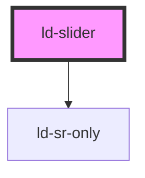

---
eleventyNavigation:
  key: Slider
  parent: Components
layout: layout.njk
title: Slider
permalink: components/ld-slider/
---

<!-- <link rel="stylesheet" href="css_components/ld-slider.css"> -->

# ld-slider

The `ld-slider` component can be used to select a single numeric value or a range of numeric values.

---

## Default


<ld-slider></ld-slider>


## Predefined value


<ld-slider value="40"></ld-slider>


## Custom min/max values


<ld-slider min="-50" max="50"></ld-slider>


## Size


<ld-slider size="sm"></ld-slider>
<ld-slider></ld-slider>
<ld-slider size="lg"></ld-slider>


## Disabled


<ld-slider disabled value="40"></ld-slider>
<ld-slider aria-disabled="true" value="40"></ld-slider>


## Custom steps


<ld-slider step="5"></ld-slider>


## Custom stops

Custom stops behave just like steps, but without the need for an even distance between them.


<ld-slider stops="20,35,45,60,85"></ld-slider>


<ld-notice mode="warning">
  Use the prop <code>snap-offset="0"</code> to just add the labels for the custom stops without forcing them to behave like steps.
</ld-notice>

## With step/stop indicators


<ld-slider indicators step="10"></ld-slider>
<ld-slider indicators stops="20,35,45,60,85"></ld-slider>


## With step/stop snapping


<ld-slider indicators snap-offset="2" step="10"></ld-slider>
<ld-slider snap-offset="2" stops="20,35,45,60,85"></ld-slider>


<ld-notice mode="warning">
  Use the keyboard arrows <code>←</code> <code>→</code> <code>↑</code> <code>↓</code> or click on the track to select values near the snap-points.
</ld-notice>

## Multiple values

You can add 2 or more comma-separated values to the slider. This results in additional thumbs being added.


<ld-slider value="40,90"></ld-slider>
<ld-slider value="30,60,90"></ld-slider>
<ld-slider value="20,50,70,90"></ld-slider>


## Swappable mode

The swappable mode allows swapping the thumbs.


<ld-slider swappable value="40,90"></ld-slider>


## Hide values


<ld-slider hide-values value="40,90"></ld-slider>


## Hide value labels


<ld-slider hide-value-labels value="40,90"></ld-slider>


## Hide stop labels


<ld-slider hide-stop-labels indicators stops="20,40,60,90" value="40,90"></ld-slider>


## Units


<ld-slider unit="%"></ld-slider>
<ld-slider unit=" px" stops="24,64,96" max="128"></ld-slider>


## Negative

The negative mode highlights deselected ranges as selected and vice versa.


<ld-slider negative value="50"></ld-slider>
<ld-slider negative value="40,90"></ld-slider>


## Custom width

By default, the `ld-slider` applies a width of `100%`. You can set it to any fixed width using the `width` prop.


<ld-slider width="20rem"></ld-slider>


<ld-notice mode="warning">
  A relative width below <code>100%</code> is not supported, but you can work around this by wrapping the component in a container and give that container any width you like.
    
  Be aware that you also need to do this, if you want to use the <code>ld-slider</code> inside a flexbox container.
</ld-notice>

## Integration



  <ld-input id="from" type="number" value="40"></ld-input>
  <ld-slider id="slider1" value="40,90" width="20rem"></ld-slider>
  <ld-input id="to" type="number" value="90"></ld-input>

  <ld-button id="minus">-</ld-button>
  <ld-slider id="slider2" value="40" width="20rem"></ld-slider>
  <ld-button id="plus">+</ld-button>



<!-- Auto Generated Below -->

## Properties

| Property          | Attribute           | Description                                                  | Type               | Default            |
| ----------------- | ------------------- | ------------------------------------------------------------ | ------------------ | ------------------ |
| `ariaDisabled`    | `aria-disabled`     | Alternative disabled state that keeps element focusable      | `string`           | `undefined`        |
| `disabled`        | `disabled`          | Disabled state of the slider                                 | `boolean`          | `false`            |
| `hideStopLabels`  | `hide-stop-labels`  | Prevents rendering of the stop labels below the slider       | `boolean`          | `false`            |
| `hideValueLabels` | `hide-value-labels` | Prevents rendering of the value labels below the slider      | `boolean`          | `false`            |
| `hideValues`      | `hide-values`       | Makes the current values only visible on interaction         | `boolean`          | `false`            |
| `indicators`      | `indicators`        | Specifies the legal number intervals                         | `boolean`          | `false`            |
| `key`             | `key`               | for tracking the node's identity when working with lists     | `string \| number` | `undefined`        |
| `labelFrom`       | `label-from`        | "From" value label (when exactly 2 values are given)         | `string`           | `'From'`           |
| `labelTo`         | `label-to`          | "To" value label (when exactly 2 values are given)           | `string`           | `'To'`             |
| `labelValue`      | `label-value`       | "Value" label (when exactly 2 values are given)              | `string`           | `'Value'`          |
| `ldTabindex`      | `ld-tabindex`       | Tab index of the input(s).                                   | `number`           | `undefined`        |
| `max`             | `max`               | Specifies the maximum value allowed                          | `number`           | `100`              |
| `min`             | `min`               | Specifies the minimum value allowed                          | `number`           | `0`                |
| `negative`        | `negative`          | Swap which areas are being marked as selected and deselected | `boolean`          | `false`            |
| `ref`             | `ref`               | reference to component                                       | `any`              | `undefined`        |
| `size`            | `size`              | Size of the thumb(s).                                        | `"lg" \| "sm"`     | `undefined`        |
| `snapOffset`      | `snap-offset`       | Offset inside which a thumb snaps to a stop point            | `number`           | `undefined`        |
| `step`            | `step`              | Specifies the legal number intervals                         | `number`           | `undefined`        |
| `stops`           | `stops`             | Adds custom stop points to the slider (instead of steps)     | `string`           | `undefined`        |
| `swappable`       | `swappable`         | Allows swapping of thumbs                                    | `boolean`          | `false`            |
| `unit`            | `unit`              | Adds custom stop points to the slider (instead of steps)     | `string`           | `undefined`        |
| `value`           | `value`             | Specifies the default value                                  | `string`           | `String(this.min)` |
| `width`           | `width`             | Width of the slider                                          | `string`           | `'100%'`           |

## Events

| Event      | Description | Type                    |
| ---------- | ----------- | ----------------------- |
| `ldchange` |             | `CustomEvent<number[]>` |

## Methods

### `focusInner() => Promise<void>`

Focuses the toggle

#### Returns

Type: `Promise<void>`

## Shadow Parts

| Part            | Description                                              |
| --------------- | -------------------------------------------------------- |
| `"focusable"`   |                                                          |
| `"indicator"`   | Stop/step indicator div elements                         |
| `"input"`       | `input` elements                                         |
| `"label"`       | `ld-sr-only` elements labelling an input                 |
| `"output"`      | `output` elements                                        |
| `"value-label"` | `div` element containing the max/min/stops values + unit |

## Dependencies

### Depends on

- [ld-sr-only](../ld-sr-only)

### Graph

----------------------------------------------

*Built with [StencilJS](https://stenciljs.com/)*
