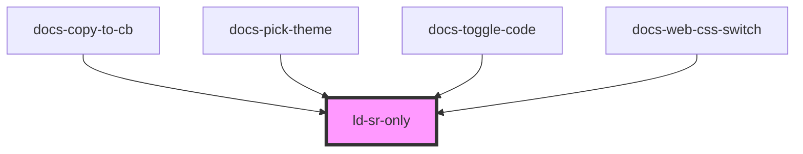

---
eleventyNavigation:
  key: Screen Readers
  parent: Components
layout: layout.njk
title: Screen Readers
permalink: liquid/components/ld-sr-only/
---

# Screen Readers
Utilities for improving accessibility with screen readers.

## sr-only Web component

Use sr-only to hide an element visually without hiding it from screen readers:


<ld-sr-only>Hello screen reader</ld-sr-only>


## sr-only CSS class

The CSS class sr-only works the same way as its web component counterpart, except that it can be applied to an HTML element directly while the web component wraps the element which needs to be only screen reader visible:

<link rel="stylesheet" href="ld-sr-only.css">

Hello screen reader


<!-- Auto Generated Below -->

## Dependencies

### Used by

 - docs-copy-to-cb
 - docs-pick-theme
 - docs-toggle-code
 - docs-web-css-switch

### Graph

----------------------------------------------

*Built with [StencilJS](https://stenciljs.com/)*
