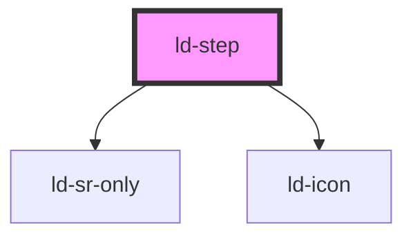

---
eleventyNavigation:
  key: Step
  parent: Stepper
layout: layout.njk
title: Step
permalink: components/ld-stepper/ld-step/
---

# ld-step

The `ld-step` component is a subcomponent for `ld-stepper`.

Please refer to the [`ld-stepper` documentation](components/ld-stepper) for usage examples.

---

<!-- Auto Generated Below -->

## Properties

| Property           | Attribute            | Description                                                                         | Type               | Default          |
| ------------------ | -------------------- | ----------------------------------------------------------------------------------- | ------------------ | ---------------- |
| `brandColor`       | `brand-color`        | Switch colors for brand background                                                  | `boolean`          | `false`          |
| `current`          | `current`            | Step is the current step                                                            | `boolean`          | `false`          |
| `description`      | `description`        | Description text to display below the step name (vertical mode only)                | `string`           | `undefined`      |
| `done`             | `done`               | Step is done                                                                        | `boolean`          | `false`          |
| `icon`             | `icon`               | Permanently show a custom icon inside the dot                                       | `string`           | `undefined`      |
| `key`              | `key`                | for tracking the node's identity when working with lists                            | `string \| number` | `undefined`      |
| `labelCurrent`     | `label-current`      | Label for current step (scree-reader only)                                          | `string`           | `'Current'`      |
| `labelDone`        | `label-done`         | Label for step that is done (scree-reader only)                                     | `string`           | `'Done'`         |
| `labelOptional`    | `label-optional`     | Label for step that is optional (scree-reader only)                                 | `string`           | `'Optional'`     |
| `labelSkipped`     | `label-skipped`      | Label for step that was skipped (scree-reader only)                                 | `string`           | `'Skipped'`      |
| `labelWasOptional` | `label-was-optional` | Additional hint in label for step that is done and was optional (scree-reader only) | `string`           | `'was optional'` |
| `ldTabindex`       | `ld-tabindex`        | Tab index of the step                                                               | `number`           | `undefined`      |
| `optional`         | `optional`           | Step may be skipped                                                                 | `boolean`          | `false`          |
| `ref`              | `ref`                | reference to component                                                              | `any`              | `undefined`      |
| `size`             | `size`               | Step size                                                                           | `"lg" \| "sm"`     | `undefined`      |
| `skipped`          | `skipped`            | Step was skipped                                                                    | `boolean`          | `false`          |
| `vertical`         | `vertical`           | Vertical layout                                                                     | `boolean`          | `false`          |

## Events

| Event            | Description | Type                                             |
| ---------------- | ----------- | ------------------------------------------------ |
| `ldstepselected` |             | `CustomEvent<{ index: number; label: string; }>` |

## Methods

### `focusInner() => Promise<void>`

Sets focus on the step

#### Returns

Type: `Promise<void>`

## Shadow Parts

| Part            | Description                                  |
| --------------- | -------------------------------------------- |
| `"button"`      | actual `button` element                      |
| `"description"` | `span` element wrapping the description text |
| `"focusable"`   |                                              |
| `"li"`          | actual `li` element                          |

## Dependencies

### Depends on

- [ld-sr-only](../../ld-sr-only)
- [ld-icon](../../ld-icon)

### Graph

----------------------------------------------

 
