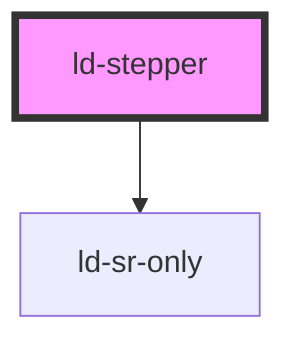

---
eleventyNavigation:
  key: Stepper
  parent: Components
layout: layout.njk
title: Stepper
permalink: components/ld-stepper/
tags:
  - step-progress
---

<link rel="stylesheet" href="css_components/ld-stepper.css">
<link rel="stylesheet" href="css_components/ld-step.css">
<link rel="stylesheet" href="css_components/ld-icon.css">
<link rel="stylesheet" href="css_components/ld-sr-only.css">

# ld-stepper

The `ld-stepper` component visualizes a process by showing all the process steps and indicating its completeness level.

<ld-notice>
  Use this component considerately on mobile devices. In many cases a <a href="components/ld-progress/#steps">progress bar</a> with additional text may be sufficient.
</ld-notice>

---

## Horizontal

### Default


<ld-stepper>
  <ld-step aria-label="Billing" done></ld-step>
  <ld-step aria-label="Shipping" done></ld-step>
  <ld-step aria-label="Payment" current next last-active></ld-step>
  <ld-step aria-label="Summary" disabled></ld-step>
  <ld-step aria-label="Confirmation" disabled></ld-step>
</ld-stepper>

<!-- CSS component -->

Payment, step 3 of 5
<nav class="ld-stepper">
  <ol>
    <li class="ld-step ld-step--done ld-step--with-icon">
      Completed: 
      <button aria-label="Billing" class="ld-step__focusable-element" type="button"></button>
      <svg class="ld-icon" role="presentation" viewBox="0 0 14 14" fill="none" xmlns="http://www.w3.org/2000/svg"><path d="m12 4-6.592 6L2 6.6396" stroke="currentcolor" stroke-width="3" stroke-linecap="round" stroke-linejoin="round"/></svg>
    </li>
    <li class="ld-step ld-step--done ld-step--with-icon">
      Completed: 
      <button aria-label="Shipping" class="ld-step__focusable-element" type="button"></button>
      <svg class="ld-icon" role="presentation" viewBox="0 0 14 14" fill="none" xmlns="http://www.w3.org/2000/svg"><path d="m12 4-6.592 6L2 6.6396" stroke="currentcolor" stroke-width="3" stroke-linecap="round" stroke-linejoin="round"/></svg>
    </li>
    <li class="ld-step ld-step--current ld-step--next ld-step--last-active">
      Current: 
      <button aria-label="Payment" class="ld-step__focusable-element" type="button" aria-current="step"></button>
    </li>
    <li class="ld-step">
      <button aria-label="Summary" class="ld-step__focusable-element" type="button" aria-disabled="true"></button>
    </li>
    <li class="ld-step">
      <button aria-label="Confirmation" class="ld-step__focusable-element" type="button" aria-disabled="true"></button>
    </li>
  </ol>
</nav>


### With text


<ld-stepper style="min-width: 25rem">
  <ld-step done>Billing</ld-step>
  <ld-step done>Shipping</ld-step>
  <ld-step current next last-active>Payment</ld-step>
  <ld-step disabled>Summary</ld-step>
  <ld-step disabled>Confirmation</ld-step>
</ld-stepper>

<!-- CSS component -->

Payment, step 3 of 5
<nav class="ld-stepper" style="min-width: 25rem">
  <ol>
    <li class="ld-step ld-step--done ld-step--with-icon">
      Completed: 
      <button class="ld-step__focusable-element" type="button">Billing</button>
      <svg class="ld-icon" role="presentation" viewBox="0 0 14 14" fill="none" xmlns="http://www.w3.org/2000/svg"><path d="m12 4-6.592 6L2 6.6396" stroke="currentcolor" stroke-width="3" stroke-linecap="round" stroke-linejoin="round"/></svg>
    </li>
    <li class="ld-step ld-step--done ld-step--with-icon">
      Completed: 
      <button class="ld-step__focusable-element" type="button">Shipping</button>
      <svg class="ld-icon" role="presentation" viewBox="0 0 14 14" fill="none" xmlns="http://www.w3.org/2000/svg"><path d="m12 4-6.592 6L2 6.6396" stroke="currentcolor" stroke-width="3" stroke-linecap="round" stroke-linejoin="round"/></svg>
    </li>
    <li class="ld-step ld-step--current ld-step--next ld-step--last-active">
      Current: 
      <button class="ld-step__focusable-element" type="button" aria-current="step">Payment</button>
    </li>
    <li class="ld-step">
      <button class="ld-step__focusable-element" type="button" aria-disabled="true">Summary</button>
    </li>
    <li class="ld-step">
      <button class="ld-step__focusable-element" type="button" aria-disabled="true">Confirmation</button>
    </li>
  </ol>
</nav>


## Vertical

### Default


<ld-stepper vertical>
  <ld-step aria-label="Billing" done></ld-step>
  <ld-step aria-label="Shipping" done></ld-step>
  <ld-step aria-label="Payment" current next last-active></ld-step>
  <ld-step aria-label="Summary" disabled></ld-step>
  <ld-step aria-label="Confirmation" disabled></ld-step>
</ld-stepper>

<!-- CSS component -->

Payment, step 3 of 5
<nav class="ld-stepper ld-stepper--vertical">
  <ol>
    <li class="ld-step ld-step--done ld-step--with-icon ld-step--vertical">
      Completed: 
      <button aria-label="Billing" class="ld-step__focusable-element" type="button"></button>
      <svg class="ld-icon" role="presentation" viewBox="0 0 14 14" fill="none" xmlns="http://www.w3.org/2000/svg"><path d="m12 4-6.592 6L2 6.6396" stroke="currentcolor" stroke-width="3" stroke-linecap="round" stroke-linejoin="round"/></svg>
    </li>
    <li class="ld-step ld-step--done ld-step--with-icon ld-step--vertical">
      Completed: 
      <button aria-label="Shipping" class="ld-step__focusable-element" type="button"></button>
      <svg class="ld-icon" role="presentation" viewBox="0 0 14 14" fill="none" xmlns="http://www.w3.org/2000/svg"><path d="m12 4-6.592 6L2 6.6396" stroke="currentcolor" stroke-width="3" stroke-linecap="round" stroke-linejoin="round"/></svg>
    </li>
    <li class="ld-step ld-step--current ld-step--next ld-step--last-active ld-step--vertical">
      Current: 
      <button aria-label="Payment" class="ld-step__focusable-element" type="button" aria-current="step"></button>
    </li>
    <li class="ld-step ld-step--vertical">
      <button aria-label="Summary" class="ld-step__focusable-element" type="button" aria-disabled="true"></button>
    </li>
    <li class="ld-step ld-step--vertical">
      <button aria-label="Confirmation" class="ld-step__focusable-element" type="button" aria-disabled="true"></button>
    </li>
  </ol>
</nav>


### With text


<ld-stepper vertical>
  <ld-step done>Billing</ld-step>
  <ld-step done>Shipping</ld-step>
  <ld-step current next last-active>Payment</ld-step>
  <ld-step disabled>Summary</ld-step>
  <ld-step disabled>Confirmation</ld-step>
</ld-stepper>

<!-- CSS component -->

Payment, step 3 of 5
<nav class="ld-stepper ld-stepper--vertical">
  <ol>
    <li class="ld-step ld-step--done ld-step--with-icon ld-step--vertical">
      Completed: 
      <button class="ld-step__focusable-element" type="button">Billing</button>
      <svg class="ld-icon" role="presentation" viewBox="0 0 14 14" fill="none" xmlns="http://www.w3.org/2000/svg"><path d="m12 4-6.592 6L2 6.6396" stroke="currentcolor" stroke-width="3" stroke-linecap="round" stroke-linejoin="round"/></svg>
    </li>
    <li class="ld-step ld-step--done ld-step--with-icon ld-step--vertical">
      Completed: 
      <button class="ld-step__focusable-element" type="button">Shipping</button>
      <svg class="ld-icon" role="presentation" viewBox="0 0 14 14" fill="none" xmlns="http://www.w3.org/2000/svg"><path d="m12 4-6.592 6L2 6.6396" stroke="currentcolor" stroke-width="3" stroke-linecap="round" stroke-linejoin="round"/></svg>
    </li>
    <li class="ld-step ld-step--current ld-step--next ld-step--last-active ld-step--vertical">
      Current: 
      <button class="ld-step__focusable-element" type="button" aria-current="step">Payment</button>
    </li>
    <li class="ld-step ld-step--vertical">
      <button class="ld-step__focusable-element" type="button" aria-disabled="true">Summary</button>
    </li>
    <li class="ld-step ld-step--vertical">
      <button class="ld-step__focusable-element" type="button" aria-disabled="true">Confirmation</button>
    </li>
  </ol>
</nav>


### With description


<ld-stepper vertical style="width: 17rem">
  <ld-step done description="Personal data including the billing address and optional additional information">Billing</ld-step>
  <ld-step done description="Shipping address, if it differs from the billing addres">Shipping</ld-step>
  <ld-step current next last-active description="Payment method selection">Payment</ld-step>
  <ld-step description="Summary of your articles and all the previously given information" disabled>Summary</ld-step>
  <ld-step description="Order confirmation with follow-up information" disabled>Confirmation</ld-step>
</ld-stepper>

<!-- CSS component -->

Payment, step 3 of 5
<nav class="ld-stepper ld-stepper--vertical" style="width: 17rem">
  <ol>
    <li class="ld-step ld-step--done ld-step--with-icon ld-step--vertical">
      Completed: 
      <button class="ld-step__focusable-element" type="button">Billing</button>
      <svg class="ld-icon" role="presentation" viewBox="0 0 14 14" fill="none" xmlns="http://www.w3.org/2000/svg"><path d="m12 4-6.592 6L2 6.6396" stroke="currentcolor" stroke-width="3" stroke-linecap="round" stroke-linejoin="round"/></svg>
      
        Personal data including the billing address and optional additional information
      
    </li>
    <li class="ld-step ld-step--done ld-step--with-icon ld-step--vertical">
      Completed: 
      <button class="ld-step__focusable-element" type="button">Shipping</button>
      <svg class="ld-icon" role="presentation" viewBox="0 0 14 14" fill="none" xmlns="http://www.w3.org/2000/svg"><path d="m12 4-6.592 6L2 6.6396" stroke="currentcolor" stroke-width="3" stroke-linecap="round" stroke-linejoin="round"/></svg>
      
        Shipping address, if it differs from the billing addres
      
    </li>
    <li class="ld-step ld-step--current ld-step--next ld-step--last-active ld-step--vertical">
      Current: 
      <button class="ld-step__focusable-element" type="button" aria-current="step">Payment</button>
      
        Payment method selection
      
    </li>
    <li class="ld-step ld-step--vertical">
      <button class="ld-step__focusable-element" type="button" aria-disabled="true">Summary</button>
      
        Summary of your articles and all the previously given information
      
    </li>
    <li class="ld-step ld-step--vertical">
      <button class="ld-step__focusable-element" type="button" aria-disabled="true">Confirmation</button>
      
        Order confirmation with follow-up information
      
    </li>
  </ol>
</nav>


## Size


<ld-stepper size="sm" vertical style="width: 15rem">
  <ld-step done description="Personal data including the billing address and optional additional information">Billing</ld-step>
  <ld-step done description="Shipping address, if it differs from the billing addres">Shipping</ld-step>
  <ld-step current next last-active description="Payment method selection">Payment</ld-step>
  <ld-step description="Summary of your articles and all the previously given information" disabled>Summary</ld-step>
  <ld-step description="Order confirmation with follow-up information" disabled>Confirmation</ld-step>
</ld-stepper>

<ld-stepper vertical style="width: 17rem">
  <ld-step done description="Personal data including the billing address and optional additional information">Billing</ld-step>
  <ld-step done description="Shipping address, if it differs from the billing addres">Shipping</ld-step>
  <ld-step current next last-active description="Payment method selection">Payment</ld-step>
  <ld-step description="Summary of your articles and all the previously given information" disabled>Summary</ld-step>
  <ld-step description="Order confirmation with follow-up information" disabled>Confirmation</ld-step>
</ld-stepper>

<ld-stepper size="lg" vertical style="width: 19rem">
  <ld-step done description="Personal data including the billing address and optional additional information">Billing</ld-step>
  <ld-step done description="Shipping address, if it differs from the billing addres">Shipping</ld-step>
  <ld-step current next last-active description="Payment method selection">Payment</ld-step>
  <ld-step description="Summary of your articles and all the previously given information" disabled>Summary</ld-step>
  <ld-step description="Order confirmation with follow-up information" disabled>Confirmation</ld-step>
</ld-stepper>

<!-- CSS component -->

Payment, step 3 of 5
<nav class="ld-stepper ld-stepper--sm ld-stepper--vertical" style="width: 15rem">
  <ol>
    <li class="ld-step ld-step--done ld-step--sm ld-step--with-icon ld-step--vertical">
      Completed: 
      <button class="ld-step__focusable-element" type="button">Billing</button>
      <svg class="ld-icon" role="presentation" viewBox="0 0 14 14" fill="none" xmlns="http://www.w3.org/2000/svg"><path d="m12 4-6.592 6L2 6.6396" stroke="currentcolor" stroke-width="3" stroke-linecap="round" stroke-linejoin="round"/></svg>
      
        Personal data including the billing address and optional additional information
      
    </li>
    <li class="ld-step ld-step--done ld-step--sm ld-step--with-icon ld-step--vertical">
      Completed: 
      <button class="ld-step__focusable-element" type="button">Shipping</button>
      <svg class="ld-icon" role="presentation" viewBox="0 0 14 14" fill="none" xmlns="http://www.w3.org/2000/svg"><path d="m12 4-6.592 6L2 6.6396" stroke="currentcolor" stroke-width="3" stroke-linecap="round" stroke-linejoin="round"/></svg>
      
        Shipping address, if it differs from the billing addres
      
    </li>
    <li class="ld-step ld-step--current ld-step--next ld-step--last-active ld-step--sm ld-step--vertical">
      Current: 
      <button class="ld-step__focusable-element" type="button" aria-current="step">Payment</button>
      
        Payment method selection
      
    </li>
    <li class="ld-step ld-step--sm ld-step--vertical">
      <button class="ld-step__focusable-element" type="button" aria-disabled="true">Summary</button>
      
        Summary of your articles and all the previously given information
      
    </li>
    <li class="ld-step ld-step--sm ld-step--vertical">
      <button class="ld-step__focusable-element" type="button" aria-disabled="true">Confirmation</button>
      
        Order confirmation with follow-up information
      
    </li>
  </ol>
</nav>

Payment, step 3 of 5
<nav class="ld-stepper ld-stepper--vertical" style="width: 17rem">
  <ol>
    <li class="ld-step ld-step--done ld-step--with-icon ld-step--vertical">
      Completed: 
      <button class="ld-step__focusable-element" type="button">Billing</button>
      <svg class="ld-icon" role="presentation" viewBox="0 0 14 14" fill="none" xmlns="http://www.w3.org/2000/svg"><path d="m12 4-6.592 6L2 6.6396" stroke="currentcolor" stroke-width="3" stroke-linecap="round" stroke-linejoin="round"/></svg>
      
        Personal data including the billing address and optional additional information
      
    </li>
    <li class="ld-step ld-step--done ld-step--with-icon ld-step--vertical">
      Completed: 
      <button class="ld-step__focusable-element" type="button">Shipping</button>
      <svg class="ld-icon" role="presentation" viewBox="0 0 14 14" fill="none" xmlns="http://www.w3.org/2000/svg"><path d="m12 4-6.592 6L2 6.6396" stroke="currentcolor" stroke-width="3" stroke-linecap="round" stroke-linejoin="round"/></svg>
      
        Shipping address, if it differs from the billing addres
      
    </li>
    <li class="ld-step ld-step--current ld-step--next ld-step--last-active ld-step--vertical">
      Current: 
      <button class="ld-step__focusable-element" type="button" aria-current="step">Payment</button>
      
        Payment method selection
      
    </li>
    <li class="ld-step ld-step--vertical">
      <button class="ld-step__focusable-element" type="button" aria-disabled="true">Summary</button>
      
        Summary of your articles and all the previously given information
      
    </li>
    <li class="ld-step ld-step--vertical">
      <button class="ld-step__focusable-element" type="button" aria-disabled="true">Confirmation</button>
      
        Order confirmation with follow-up information
      
    </li>
  </ol>
</nav>

Payment, step 3 of 5
<nav class="ld-stepper ld-stepper--lg ld-stepper--vertical" style="width: 19rem">
  <ol>
    <li class="ld-step ld-step--done ld-step--lg ld-step--with-icon ld-step--vertical">
      Completed: 
      <button class="ld-step__focusable-element" type="button">Billing</button>
      <svg class="ld-icon" role="presentation" viewBox="0 0 14 14" fill="none" xmlns="http://www.w3.org/2000/svg"><path d="m12 4-6.592 6L2 6.6396" stroke="currentcolor" stroke-width="3" stroke-linecap="round" stroke-linejoin="round"/></svg>
      
        Personal data including the billing address and optional additional information
      
    </li>
    <li class="ld-step ld-step--done ld-step--lg ld-step--with-icon ld-step--vertical">
      Completed: 
      <button class="ld-step__focusable-element" type="button">Shipping</button>
      <svg class="ld-icon" role="presentation" viewBox="0 0 14 14" fill="none" xmlns="http://www.w3.org/2000/svg"><path d="m12 4-6.592 6L2 6.6396" stroke="currentcolor" stroke-width="3" stroke-linecap="round" stroke-linejoin="round"/></svg>
      
        Shipping address, if it differs from the billing addres
      
    </li>
    <li class="ld-step ld-step--current ld-step--next ld-step--last-active ld-step--lg ld-step--vertical">
      Current: 
      <button class="ld-step__focusable-element" type="button" aria-current="step">Payment</button>
      
        Payment method selection
      
    </li>
    <li class="ld-step ld-step--lg ld-step--vertical">
      <button class="ld-step__focusable-element" type="button" aria-disabled="true">Summary</button>
      
        Summary of your articles and all the previously given information
      
    </li>
    <li class="ld-step ld-step--lg ld-step--vertical">
      <button class="ld-step__focusable-element" type="button" aria-disabled="true">Confirmation</button>
      
        Order confirmation with follow-up information
      
    </li>
  </ol>
</nav>


## On brand color


<ld-stepper brand-color>
  <ld-step done>Billing</ld-step>
  <ld-step done>Shipping</ld-step>
  <ld-step current next last-active>Payment</ld-step>
  <ld-step disabled>Summary</ld-step>
  <ld-step disabled>Confirmation</ld-step>
</ld-stepper>

<ld-stepper brand-color vertical style="width: 17rem">
  <ld-step done description="Personal data including the billing address and optional additional information">Billing</ld-step>
  <ld-step done description="Shipping address, if it differs from the billing addres">Shipping</ld-step>
  <ld-step current next last-active description="Payment method selection">Payment</ld-step>
  <ld-step description="Summary of your articles and all the previously given information" disabled>Summary</ld-step>
  <ld-step description="Order confirmation with follow-up information" disabled>Confirmation</ld-step>
</ld-stepper>

<!-- CSS component -->

Payment, step 3 of 5
<nav class="ld-stepper">
  <ol>
    <li class="ld-step ld-step--brand-color ld-step--done ld-step--with-icon">
      Completed: 
      <button class="ld-step__focusable-element" type="button">Billing</button>
      <svg class="ld-icon" role="presentation" viewBox="0 0 14 14" fill="none" xmlns="http://www.w3.org/2000/svg"><path d="m12 4-6.592 6L2 6.6396" stroke="currentcolor" stroke-width="3" stroke-linecap="round" stroke-linejoin="round"/></svg>
    </li>
    <li class="ld-step ld-step--brand-color ld-step--done ld-step--with-icon">
      Completed: 
      <button class="ld-step__focusable-element" type="button">Shipping</button>
      <svg class="ld-icon" role="presentation" viewBox="0 0 14 14" fill="none" xmlns="http://www.w3.org/2000/svg"><path d="m12 4-6.592 6L2 6.6396" stroke="currentcolor" stroke-width="3" stroke-linecap="round" stroke-linejoin="round"/></svg>
    </li>
    <li class="ld-step ld-step--brand-color ld-step--current ld-step--next ld-step--last-active">
      Current: 
      <button class="ld-step__focusable-element" type="button" aria-current="step">Payment</button>
    </li>
    <li class="ld-step ld-step--brand-color">
      <button class="ld-step__focusable-element" type="button" aria-disabled="true">Summary</button>
    </li>
    <li class="ld-step ld-step--brand-color">
      <button class="ld-step__focusable-element" type="button" aria-disabled="true">Confirmation</button>
    </li>
  </ol>
</nav>

Payment, step 3 of 5
<nav class="ld-stepper ld-stepper--vertical" style="width: 17rem">
  <ol>
    <li class="ld-step ld-step--brand-color ld-step--done ld-step--with-icon ld-step--vertical">
      Completed: 
      <button class="ld-step__focusable-element" type="button">Billing</button>
      <svg class="ld-icon" role="presentation" viewBox="0 0 14 14" fill="none" xmlns="http://www.w3.org/2000/svg"><path d="m12 4-6.592 6L2 6.6396" stroke="currentcolor" stroke-width="3" stroke-linecap="round" stroke-linejoin="round"/></svg>
      
        Personal data including the billing address and optional additional information
      
    </li>
    <li class="ld-step ld-step--brand-color ld-step--done ld-step--with-icon ld-step--vertical">
      Completed: 
      <button class="ld-step__focusable-element" type="button">Shipping</button>
      <svg class="ld-icon" role="presentation" viewBox="0 0 14 14" fill="none" xmlns="http://www.w3.org/2000/svg"><path d="m12 4-6.592 6L2 6.6396" stroke="currentcolor" stroke-width="3" stroke-linecap="round" stroke-linejoin="round"/></svg>
      
        Shipping address, if it differs from the billing addres
      
    </li>
    <li class="ld-step ld-step--brand-color ld-step--current ld-step--next ld-step--last-active ld-step--vertical">
      Current: 
      <button class="ld-step__focusable-element" type="button" aria-current="step">Payment</button>
      
        Payment method selection
      
    </li>
    <li class="ld-step ld-step--brand-color ld-step--vertical">
      <button class="ld-step__focusable-element" type="button" aria-disabled="true">Summary</button>
      
        Summary of your articles and all the previously given information
      
    </li>
    <li class="ld-step ld-step--brand-color ld-step--vertical">
      <button class="ld-step__focusable-element" type="button" aria-disabled="true">Confirmation</button>
      
        Order confirmation with follow-up information
      
    </li>
  </ol>
</nav>


## Fit content


<ld-stepper fit-content>
  <ld-step done>Billing</ld-step>
  <ld-step done>Shipping</ld-step>
  <ld-step current next last-active>Payment</ld-step>
  <ld-step disabled>Summary</ld-step>
  <ld-step disabled>Confirmation</ld-step>
</ld-stepper>

<ld-stepper fit-content vertical style="width: 17rem">
  <ld-step done description="Personal data including the billing address and optional additional information">Billing</ld-step>
  <ld-step done description="Shipping address, if it differs from the billing addres">Shipping</ld-step>
  <ld-step current next last-active description="Payment method selection">Payment</ld-step>
  <ld-step description="Summary of your articles and all the previously given information" disabled>Summary</ld-step>
  <ld-step description="Order confirmation with follow-up information" disabled>Confirmation</ld-step>
</ld-stepper>

<!-- CSS component -->

Payment, step 3 of 5
<nav class="ld-stepper ld-stepper--fit-content">
  <ol>
    <li class="ld-step ld-step--done ld-step--with-icon">
      Completed: 
      <button class="ld-step__focusable-element" type="button">
        Billing
      </button>
      <svg class="ld-icon" role="presentation" viewBox="0 0 14 14" fill="none" xmlns="http://www.w3.org/2000/svg"><path d="m12 4-6.592 6L2 6.6396" stroke="currentcolor" stroke-width="3" stroke-linecap="round" stroke-linejoin="round"/></svg>
    </li>
    <li class="ld-step ld-step--done ld-step--with-icon">
      Completed: 
      <button class="ld-step__focusable-element" type="button">Shipping</button>
      <svg class="ld-icon" role="presentation" viewBox="0 0 14 14" fill="none" xmlns="http://www.w3.org/2000/svg"><path d="m12 4-6.592 6L2 6.6396" stroke="currentcolor" stroke-width="3" stroke-linecap="round" stroke-linejoin="round"/></svg>
    </li>
    <li class="ld-step ld-step--current ld-step--next ld-step--last-active">
      Current: 
      <button class="ld-step__focusable-element" type="button" aria-current="step">Payment</button>
    </li>
    <li class="ld-step">
      <button class="ld-step__focusable-element" type="button" aria-disabled="true">Summary</button>
    </li>
    <li class="ld-step">
      <button class="ld-step__focusable-element" type="button" aria-disabled="true">Confirmation</button>
    </li>
  </ol>
</nav>

Payment, step 3 of 5
<nav class="ld-stepper ld-stepper--fit-content ld-stepper--vertical" style="width: 17rem">
  <ol>
    <li class="ld-step ld-step--done ld-step--with-icon ld-step--vertical">
      Completed: 
      <button class="ld-step__focusable-element" type="button">Billing</button>
      <svg class="ld-icon" role="presentation" viewBox="0 0 14 14" fill="none" xmlns="http://www.w3.org/2000/svg"><path d="m12 4-6.592 6L2 6.6396" stroke="currentcolor" stroke-width="3" stroke-linecap="round" stroke-linejoin="round"/></svg>
      
        Personal data including the billing address and optional additional information
      
    </li>
    <li class="ld-step ld-step--done ld-step--with-icon ld-step--vertical">
      Completed: 
      <button class="ld-step__focusable-element" type="button">Shipping</button>
      <svg class="ld-icon" role="presentation" viewBox="0 0 14 14" fill="none" xmlns="http://www.w3.org/2000/svg"><path d="m12 4-6.592 6L2 6.6396" stroke="currentcolor" stroke-width="3" stroke-linecap="round" stroke-linejoin="round"/></svg>
      
        Shipping address, if it differs from the billing addres
      
    </li>
    <li class="ld-step ld-step--current ld-step--next ld-step--last-active ld-step--vertical">
      Current: 
      <button class="ld-step__focusable-element" type="button" aria-current="step">Payment</button>
      
        Payment method selection
      
    </li>
    <li class="ld-step ld-step--vertical">
      <button class="ld-step__focusable-element" type="button" aria-disabled="true">Summary</button>
      
        Summary of your articles and all the previously given information
      
    </li>
    <li class="ld-step ld-step--vertical">
      <button class="ld-step__focusable-element" type="button" aria-disabled="true">Confirmation</button>
      
        Order confirmation with follow-up information
      
    </li>
  </ol>
</nav>


## With custom icons


<ld-stepper style="min-width: 25rem">
  <ld-step done icon="documents">Billing</ld-step>
  <ld-step done icon="truck">Shipping</ld-step>
  <ld-step current next last-active icon="money">Payment</ld-step>
  <ld-step icon="visibility" disabled>Summary</ld-step>
  <ld-step icon="favorite" disabled>Confirmation</ld-step>
</ld-stepper>

<!-- CSS component -->

Payment, step 3 of 5
<nav class="ld-stepper" style="min-width: 25rem">
  <ol>
    <li class="ld-step ld-step--custom-icon ld-step--done ld-step--with-icon">
      Completed: 
      <button class="ld-step__focusable-element" type="button">
        Billing
      </button>
      <svg class="ld-icon" role="presentation" viewBox="0 0 24 24" fill="none" xmlns="http://www.w3.org/2000/svg"><path fill-rule="evenodd" clip-rule="evenodd" d="M14.5 2.1917C13.7855 2.0732 12.9568 2 12 2c-2.867 0-4.7477.3288-5.8305.6093C5.436 2.7993 5 3.4785 5 4.2361v15.5278c0 .7576.4361 1.4368 1.1695 1.6268C7.2522 21.6712 9.1329 22 12 22c2.8671 0 4.7477-.3288 5.8305-.6093.7334-.19 1.1695-.8692 1.1695-1.6268V7.0719a.8783.8783 0 0 0-.0118-.143 10.458 10.458 0 0 0-.0807-.4289H15a.5.5 0 0 1-.5-.5V2.1917ZM18.6369 5.5H15.5V2.403a9.682 9.682 0 0 1 .4584.1314c1.3917.437 2.2168 1.6014 2.6785 2.9656ZM7 9.5a.5.5 0 0 1 .5-.5h9a.5.5 0 0 1 .5.5v.5a.5.5 0 0 1-.5.5h-9A.5.5 0 0 1 7 10v-.5Zm0 3a.5.5 0 0 1 .5-.5h9a.5.5 0 0 1 .5.5v.5a.5.5 0 0 1-.5.5h-9A.5.5 0 0 1 7 13v-.5Zm4.5 2.5h-4a.5.5 0 0 0-.5.5v.5a.5.5 0 0 0 .5.5h4a.5.5 0 0 0 .5-.5v-.5a.5.5 0 0 0-.5-.5Z" fill="currentcolor"/></svg>
    </li>
    <li class="ld-step ld-step--custom-icon ld-step--done ld-step--with-icon">
      Completed: 
      <button class="ld-step__focusable-element" type="button">Shipping</button>
      <svg class="ld-icon" role="presentation" viewBox="0 0 24 24" fill="none" xmlns="http://www.w3.org/2000/svg"><path fill-rule="evenodd" clip-rule="evenodd" d="M5.2037 5.2185C3.2229 5.4665 2 7.2216 2 9.2178V17c0 .5523.4477 1 1 1h1v-.0008C4 16.3441 5.3428 15 7 15s3 1.3441 3 2.9992V18h4v-.0008C14 16.3441 15.3428 15 17 15s3 1.3441 3 2.9992V18h1c.5523 0 1-.4477 1-1v-2.1691a3 3 0 0 0-.4275-1.5434l-1.6986-2.831A3 3 0 0 0 17.3014 9H16V7.2443c0-.7985-.482-1.5082-1.2599-1.6883C13.6247 5.2977 11.7439 5 9 5c-1.5272 0-2.787.0922-3.7963.2185ZM16 10.6a.1.1 0 0 1 .1-.1h1.6756c.3666 0 .7038.2006.8788.5227l1.2654 2.3296a.1.1 0 0 1-.0879.1477H16.1a.1.1 0 0 1-.1-.1v-2.8ZM7 20c1.1048 0 2-.8961 2-2.0006C9 16.8961 8.1048 16 7 16s-2 .8961-2 1.9994C5 19.1039 5.8952 20 7 20Zm10 0c1.1048 0 2-.8961 2-2.0006C19 16.8961 18.1048 16 17 16s-2 .8961-2 1.9994C15 19.1039 15.8952 20 17 20Z" fill="currentcolor"/></svg>
    </li>
    <li class="ld-step ld-step--current ld-step--next ld-step--last-active ld-step--custom-icon ld-step--with-icon">
      Current: 
      <button class="ld-step__focusable-element" type="button" aria-current="step">Payment</button>
      <svg class="ld-icon" role="presentation" viewBox="0 0 24 24" fill="none" xmlns="http://www.w3.org/2000/svg"><path fill-rule="evenodd" clip-rule="evenodd" d="M17.3669 5C18.2625 5 19 4.3226 19 3.5S18.2625 2 17.3669 2H6.6331C5.7375 2 5 2.6774 5 3.5S5.7375 5 6.6331 5H17.367Zm-2.523 3.1363c.1-.1936.1561-.4095.1561-.6363 0-.8226-.7375-1.5-1.6331-1.5H2.6331C1.7375 6 1 6.6774 1 7.5S1.7375 9 2.6331 9h9.9405a7.2042 7.2042 0 0 1 2.2703-.8637ZM9.5398 18c.4892 1.1923 1.2869 2.2254 2.2939 3H4.6331C3.7375 21 3 20.3226 3 19.5S3.7375 18 4.6331 18h4.9067Zm-.4324-4A7.2951 7.2951 0 0 0 9 15.25c0 .6034.0737 1.1896.2126 1.75H5.6331C4.7375 17 4 16.3226 4 15.5S4.7375 14 5.6331 14h3.4743Zm2.1427-4c-.8591.8184-1.5176 1.8455-1.8941 3H5.633C4.7375 13 4 12.3226 4 11.5S4.7375 10 5.6331 10h5.617Z" fill="currentcolor"/><path fill-rule="evenodd" clip-rule="evenodd" d="M10 15.25C10 11.7984 12.7984 9 16.25 9s6.25 2.7984 6.25 6.25-2.7984 6.25-6.25 6.25S10 18.7016 10 15.25Zm4.6592 2.5832c.2621.1344.5368.2288.8239.2832L15.4082 19h.427c.0874 0 .1586-.0329.2135-.0987a.3722.3722 0 0 0 .0936-.2144l.045-.5362c.2896-.0258.5468-.0958.7715-.2102.2247-.1173.4145-.2674.5693-.4504.1548-.183.2722-.3932.352-.6306.08-.2402.1199-.4961.1199-.7678 0-.1802-.02-.3403-.0599-.4804-.04-.143-.0962-.2689-.1686-.3775a1.2114 1.2114 0 0 0-.2509-.2831 1.7796 1.7796 0 0 0-.3109-.2102 2.446 2.446 0 0 0-.3445-.163 6.0762 6.0762 0 0 0-.3596-.133l.1311-1.5228c.0774.0258.1498.0558.2172.0901.0699.0343.1349.0672.1948.0987.0599.0286.1148.0529.1648.0729.0499.02.0949.03.1348.03.0599 0 .1111-.0157.1536-.0472.0449-.0343.0886-.0872.1311-.1587l.2846-.4761c-.1348-.1459-.2996-.2817-.4944-.4075-.1947-.1287-.4269-.2217-.6966-.2789l.0749-.845h-.427c-.0874 0-.1585.0329-.2135.0987a.3722.3722 0 0 0-.0936.2144l-.0412.4762c-.2896.0171-.5468.0815-.7715.193-.2247.1087-.4145.2488-.5693.4204a1.8246 1.8246 0 0 0-.3483.5791 1.8773 1.8773 0 0 0-.1199.6606c0 .3059.0437.5605.1311.7635.0899.203.206.3703.3483.5019.1424.1315.3022.2359.4794.3131.1773.0772.3558.1444.5356.2016l-.1386 1.6215c-.1123-.0343-.2122-.0772-.2996-.1287a6.5179 6.5179 0 0 1-.2434-.1587 2.0909 2.0909 0 0 0-.2023-.1287c-.0624-.0372-.1236-.0558-.1835-.0558-.0574 0-.1124.0172-.1648.0515a.3695.3695 0 0 0-.1198.1201L14 17.3399c.1798.1916.3995.3561.6592.4933Zm2.1011-1.9345c.0924.0972.1386.2273.1386.3903 0 .4375-.206.6978-.618.7807l.1198-1.4155c.1499.0657.2697.1472.3596.2445Zm-1.3109-1.9732c-.0923-.1058-.1385-.2431-.1385-.4118a.645.645 0 0 1 .0337-.2102.5274.5274 0 0 1 .1048-.1845c.05-.0543.1136-.1001.191-.1372.0799-.0401.1773-.0701.2922-.0901l-.1124 1.2954c-.1523-.0715-.2759-.1587-.3708-.2616Z" fill="currentcolor"/></svg>
    </li>
    <li class="ld-step ld-step--custom-icon ld-step--with-icon">
      <button class="ld-step__focusable-element" type="button" aria-disabled="true">Summary</button>
      <svg class="ld-icon" role="presentation" viewBox="0 0 24 24" fill="none" xmlns="http://www.w3.org/2000/svg"><path fill-rule="evenodd" clip-rule="evenodd" d="M12 5.8081c4.7545 0 9.3313 5.3941 9.5241 5.6232l.4759.5688-.4759.5687c-.1928.2291-4.7696 5.6232-9.5241 5.6232-4.7545 0-9.3313-5.3941-9.5241-5.6232L2 12.0001l.4759-.5688C2.6687 11.2022 7.2455 5.8081 12 5.8081Zm-3.5383 6.192c0 1.9513 1.587 3.5382 3.5383 3.5382s3.5383-1.5869 3.5383-3.5382c0-1.9514-1.587-3.5383-3.5383-3.5383s-3.5383 1.5869-3.5383 3.5383ZM13.7692 12c0 .9771-.7921 1.7692-1.7692 1.7692-.977 0-1.7691-.7921-1.7691-1.7692 0-.977.7921-1.7691 1.7691-1.7691.9771 0 1.7692.7921 1.7692 1.7691Z" fill="currentcolor"/></svg>
    </li>
    <li class="ld-step ld-step--custom-icon ld-step--with-icon">
      <button class="ld-step__focusable-element" type="button" aria-disabled="true">Confirmation</button>
      <svg class="ld-icon" role="presentation" viewBox="0 0 24 24" fill="none" xmlns="http://www.w3.org/2000/svg"><path d="M22 9.882V8.2404a10.6878 10.6878 0 0 0-.238-1.1267c-.724-2.239-2.2119-3.6303-4.4818-4.0202-1.9228-.3318-3.6209.3176-4.9747 1.6997-.1695.1731-.4482.1816-.6136.0045-.1415-.1514-.2795-.297-.4374-.436C8.1226 1.585 3.0949 3.278 2.1869 7.4215a7.139 7.139 0 0 0-.0945 2.7677 7.0721 7.0721 0 0 0 .9645 2.5865 17.8018 17.8018 0 0 0 3.2058 3.852c1.2789 1.1771 2.7123 2.3355 4.1789 3.3535.9368.6502 2.1741.6426 3.1134-.004 1.9495-1.342 3.8433-2.8849 5.4451-4.5952.9932-1.0189 1.8125-2.2017 2.4239-3.499a6.2782 6.2782 0 0 0 .54-1.888.6093.6093 0 0 1 .036-.113Z" fill="currentcolor"/></svg>
    </li>
  </ol>
</nav>


## With optional steps


<ld-stepper style="min-width: 25rem">
  <ld-step done>Part 1</ld-step>
  <ld-step optional skipped>Part 2 (can be skipped)</ld-step>
  <ld-step done optional>Part 3 (can be skipped)</ld-step>
  <ld-step current next last-active optional>Part 4 (can be skipped)</ld-step>
  <ld-step optional>Part 5 (can be skipped)</ld-step>
</ld-stepper>

<!-- CSS component -->

Part 4 (can be skipped), step 4 of 5
<nav class="ld-stepper" style="min-width: 25rem">
  <ol>
    <li class="ld-step ld-step--done ld-step--with-icon">
      Completed: 
      <button class="ld-step__focusable-element" type="button">Part 1</button>
      <svg class="ld-icon" role="presentation" viewBox="0 0 14 14" fill="none" xmlns="http://www.w3.org/2000/svg"><path d="m12 4-6.592 6L2 6.6396" stroke="currentcolor" stroke-width="3" stroke-linecap="round" stroke-linejoin="round"/></svg>
    </li>
    <li class="ld-step ld-step--skipped ld-step--optional">
      Skipped: 
      <button class="ld-step__focusable-element" type="button">Part 2 (can be skipped)</button>
    </li>
    <li class="ld-step ld-step--done ld-step--optional ld-step--with-icon">
      Completed (was optional): 
      <button class="ld-step__focusable-element" type="button">Part 3 (can be skipped)</button>
      <svg class="ld-icon" role="presentation" viewBox="0 0 14 14" fill="none" xmlns="http://www.w3.org/2000/svg"><path d="m12 4-6.592 6L2 6.6396" stroke="currentcolor" stroke-width="3" stroke-linecap="round" stroke-linejoin="round"/></svg>
    </li>
    <li class="ld-step ld-step--current ld-step--next ld-step--last-active ld-step--optional">
      Current: 
      <button class="ld-step__focusable-element" type="button" aria-current="step">Part 4 (can be skipped)</button>
    </li>
    <li class="ld-step ld-step--optional">
      <button class="ld-step__focusable-element" type="button" aria-disabled="true">Part 5 (can be skipped)</button>
    </li>
  </ol>
</nav>


## With links


<ld-stepper style="min-width: 25rem">
  <ld-step href="components/ld-stepper/#billing" done>Billing</ld-step>
  <ld-step href="components/ld-stepper/#shipping" done>Shipping</ld-step>
  <ld-step href="components/ld-stepper/#payment" current next last-active>Payment</ld-step>
  <ld-step href="components/ld-stepper/#summary" disabled>Summary</ld-step>
  <ld-step href="components/ld-stepper/#confirmation" disabled>Confirmation</ld-step>
</ld-stepper>

<!-- CSS component -->

Payment, step 3 of 5
<nav class="ld-stepper" style="min-width: 25rem">
  <ol>
    <li class="ld-step ld-step--done ld-step--with-icon">
      Completed: 
      <a class="ld-step__focusable-element" href="components/ld-stepper/#billing">Billing</a>
      <svg class="ld-icon" role="presentation" viewBox="0 0 14 14" fill="none" xmlns="http://www.w3.org/2000/svg"><path d="m12 4-6.592 6L2 6.6396" stroke="currentcolor" stroke-width="3" stroke-linecap="round" stroke-linejoin="round"/></svg>
    </li>
    <li class="ld-step ld-step--done ld-step--with-icon">
      Completed: 
      <a class="ld-step__focusable-element" href="components/ld-stepper/#shipping">Shipping</a>
      <svg class="ld-icon" role="presentation" viewBox="0 0 14 14" fill="none" xmlns="http://www.w3.org/2000/svg"><path d="m12 4-6.592 6L2 6.6396" stroke="currentcolor" stroke-width="3" stroke-linecap="round" stroke-linejoin="round"/></svg>
    </li>
    <li class="ld-step ld-step--current ld-step--next ld-step--last-active">
      Current: 
      <a class="ld-step__focusable-element" aria-current="step">Payment</a>
    </li>
    <li class="ld-step">
      <a class="ld-step__focusable-element" aria-disabled="true">Summary</a>
    </li>
    <li class="ld-step">
      <a class="ld-step__focusable-element" aria-disabled="true">Confirmation</a>
    </li>
  </ol>
</nav>


## Interaction


<ld-stepper id="stepper" style="min-width: 25rem">
  <ld-step done>Billing</ld-step>
  <ld-step done>Shipping</ld-step>
  <ld-step current next last-active>Payment</ld-step>
  <ld-step disabled>Summary</ld-step>
  <ld-step disabled>Confirmation</ld-step>
</ld-stepper>



<!-- Auto Generated Below -->

## Properties

| Property               | Attribute                | Description                                                                                                                 | Type               | Default           |
| ---------------------- | ------------------------ | --------------------------------------------------------------------------------------------------------------------------- | ------------------ | ----------------- |
| `brandColor`           | `brand-color`            | Switch colors for brand background.                                                                                         | `boolean`          | `false`           |
| `fitContent`           | `fit-content`            | Indicates whether the steps should be evenly distributed or fit to their content                                            | `boolean`          | `false`           |
| `key`                  | `key`                    | for tracking the node's identity when working with lists                                                                    | `string \| number` | `undefined`       |
| `labelSummaryTemplate` | `label-summary-template` | Step summary template for the screen-reader label, containing the index of the current step and the overall number of steps | `string`           | `'step $1 of $2'` |
| `labelTemplate`        | `label-template`         | Template for the screen-reader label, containing the label of the current step and the steps summary                        | `string`           | `'$1, $2'`        |
| `ref`                  | `ref`                    | reference to component                                                                                                      | `any`              | `undefined`       |
| `size`                 | `size`                   | Step size                                                                                                                   | `"lg" \| "sm"`     | `undefined`       |
| `vertical`             | `vertical`               | Vertical layout                                                                                                             | `boolean`          | `false`           |

## Shadow Parts

| Part      | Description                               |
| --------- | ----------------------------------------- |
| `"label"` | `ld-sr-only` element containing the label |
| `"list"`  | `ol` element wrapping the slot            |

## Dependencies

### Depends on

- [ld-sr-only](../ld-sr-only)

### Graph

----------------------------------------------

*Built with [StencilJS](https://stenciljs.com/)*
