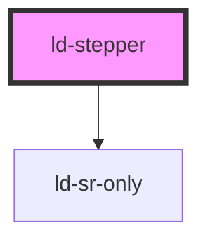

---
eleventyNavigation:
  key: Stepper
  parent: Components
layout: layout.njk
title: Stepper
permalink: components/ld-stepper/
---

<link rel="stylesheet" href="css_components/ld-stepper.css">
<link rel="stylesheet" href="css_components/ld-step.css">
<link rel="stylesheet" href="css_components/ld-icon.css">
<link rel="stylesheet" href="css_components/ld-sr-only.css">

# ld-stepper

The `ld-stepper` component hides content behind selectable items and thereby helps to place content in a space-saving manner.

---

## Examples

### Default


<ld-stepper>
  <ld-step done>Billing</ld-step>
  <ld-step optional skipped>Shipping</ld-step>
  <ld-step current>Payment</ld-step>
  <ld-step optional>Summary</ld-step>
  <ld-step>Confirmation</ld-step>
</ld-stepper>

<!-- CSS component -->

Payment, step 3 of 5
<nav class="ld-stepper">
  <ol>
    <li class="ld-step ld-step--done">
      Completed: 
      <a href="components/ld-stepper/#billing">
        <svg class="ld-icon" role="presentation" viewBox="0 0 14 14" fill="none" xmlns="http://www.w3.org/2000/svg"><path d="m12 4-6.592 6L2 6.6396" stroke="currentcolor" stroke-width="3" stroke-linecap="round" stroke-linejoin="round"/></svg>
        Billing
      </a>
    </li>
    <li class="ld-step ld-step--optional ld-step--skipped">
      Skipped: 
      <a href="components/ld-stepper/#shipping">Shipping</a>
    </li>
    <li class="ld-step ld-step--current">
      Current: 
      <a aria-current="step">Payment</a>
    </li>
    <li class="ld-step ld-step--optional">
      Optional: 
      <a>Summary</a>
    </li>
    <li class="ld-step"><a>Confirmation</a></li>
  </ol>
</nav>


### Vertical


<ld-stepper vertical style="width: 15rem">
  <ld-step done description="Personal data including the billing address and optional additional information">Billing</ld-step>
  <ld-step optional done description="Shipping address, if it differs from the billing addres (can be skipped)">Shipping</ld-step>
  <ld-step current description="Payment method selection">Payment</ld-step>
  <ld-step optional description="Summary of your articles and all the previously given information">Summary</ld-step>
  <ld-step description="Order confirmation with follow-up information">Confirmation</ld-step>
</ld-stepper>

<!-- CSS component -->

Payment, step 3 of 5
<nav class="ld-stepper ld-stepper--vertical" style="width: 15rem">
  <ol>
    <li class="ld-step ld-step--done ld-step--vertical">
      Completed: 
      <a href="components/ld-stepper/#billing">
        <svg class="ld-icon" role="presentation" viewBox="0 0 14 14" fill="none" xmlns="http://www.w3.org/2000/svg"><path d="m12 4-6.592 6L2 6.6396" stroke="currentcolor" stroke-width="3" stroke-linecap="round" stroke-linejoin="round"/></svg>
        Billing
      </a>
      
        Personal data including the billing address and optional additional information
      
    </li>
    <li class="ld-step ld-step--optional ld-step--done ld-step--vertical">
      Done (was optional): 
      <a href="components/ld-stepper/#shipping">
        <svg class="ld-icon" role="presentation" viewBox="0 0 14 14" fill="none" xmlns="http://www.w3.org/2000/svg"><path d="m12 4-6.592 6L2 6.6396" stroke="currentcolor" stroke-width="3" stroke-linecap="round" stroke-linejoin="round"/></svg>
        Shipping
      </a>
      
        Shipping address, if it differs from the billing addres (can be skipped)
      
    </li>
    <li class="ld-step ld-step--current ld-step--vertical">
      Current: 
      <a aria-current="step">Payment</a>
      
        Payment method selection
      
    </li>
    <li class="ld-step ld-step--optional ld-step--vertical">
      Optional: 
      <a>Summary</a>
      
        Summary of your articles and all the previously given information
      
    </li>
    <li class="ld-step ld-step--vertical">
      <a>Confirmation</a>
      
        Order confirmation with follow-up information
      
    </li>
  </ol>
</nav>


### On brand color


<ld-stepper brand-color>
  <ld-step done>Billing</ld-step>
  <ld-step optional skipped>Shipping</ld-step>
  <ld-step current>Payment</ld-step>
  <ld-step optional>Summary</ld-step>
  <ld-step>Confirmation</ld-step>
</ld-stepper>

<ld-stepper brand-color vertical style="width: 15rem">
  <ld-step done description="Personal data including the billing address and optional additional information">Billing</ld-step>
  <ld-step optional done description="Shipping address, if it differs from the billing addres (can be skipped)">Shipping</ld-step>
  <ld-step current description="Payment method selection">Payment</ld-step>
  <ld-step optional description="Summary of your articles and all the previously given information">Summary</ld-step>
  <ld-step description="Order confirmation with follow-up information">Confirmation</ld-step>
</ld-stepper>

<!-- CSS component -->

Payment, step 3 of 5
<nav class="ld-stepper">
  <ol>
    <li class="ld-step ld-step--brand-color ld-step--done">
      Completed: 
      <a href="components/ld-stepper/#billing">
        <svg class="ld-icon" role="presentation" viewBox="0 0 14 14" fill="none" xmlns="http://www.w3.org/2000/svg"><path d="m12 4-6.592 6L2 6.6396" stroke="currentcolor" stroke-width="3" stroke-linecap="round" stroke-linejoin="round"/></svg>
        Billing
      </a>
    </li>
    <li class="ld-step ld-step--brand-color ld-step--optional ld-step--skipped">
      Skipped: 
      <a href="components/ld-stepper/#shipping">Shipping</a>
    </li>
    <li class="ld-step ld-step--brand-color ld-step--current">
      Current: 
      <a aria-current="step">Payment</a>
    </li>
    <li class="ld-step ld-step--brand-color ld-step--optional">
      Optional: 
      <a>Summary</a>
    </li>
    <li class="ld-step ld-step--brand-color"><a>Confirmation</a></li>
  </ol>
</nav>

Payment, step 3 of 5
<nav class="ld-stepper ld-stepper--vertical" style="width: 15rem">
  <ol>
    <li class="ld-step ld-step--brand-color ld-step--done ld-step--vertical">
      Completed: 
      <a href="components/ld-stepper/#billing">
        <svg class="ld-icon" role="presentation" viewBox="0 0 14 14" fill="none" xmlns="http://www.w3.org/2000/svg"><path d="m12 4-6.592 6L2 6.6396" stroke="currentcolor" stroke-width="3" stroke-linecap="round" stroke-linejoin="round"/></svg>
        Billing
      </a>
      
        Personal data including the billing address and optional additional information
      
    </li>
    <li class="ld-step ld-step--brand-color ld-step--optional ld-step--done ld-step--vertical">
      Done (was optional): 
      <a href="components/ld-stepper/#shipping">
        <svg class="ld-icon" role="presentation" viewBox="0 0 14 14" fill="none" xmlns="http://www.w3.org/2000/svg"><path d="m12 4-6.592 6L2 6.6396" stroke="currentcolor" stroke-width="3" stroke-linecap="round" stroke-linejoin="round"/></svg>
        Shipping
      </a>
      
        Shipping address, if it differs from the billing addres (can be skipped)
      
    </li>
    <li class="ld-step ld-step--brand-color ld-step--current ld-step--vertical">
      Current: 
      <a aria-current="step">Payment</a>
      
        Payment method selection
      
    </li>
    <li class="ld-step ld-step--brand-color ld-step--optional ld-step--vertical">
      Optional: 
      <a>Summary</a>
      
        Summary of your articles and all the previously given information
      
    </li>
    <li class="ld-step ld-step--brand-color ld-step--vertical">
      <a>Confirmation</a>
      
        Order confirmation with follow-up information
      
    </li>
  </ol>
</nav>


### Fit content


<ld-stepper fit-content>
  <ld-step done>Billing</ld-step>
  <ld-step optional skipped>Shipping</ld-step>
  <ld-step current>Payment</ld-step>
  <ld-step optional>Summary</ld-step>
  <ld-step>Confirmation</ld-step>
</ld-stepper>

<ld-stepper fit-content vertical style="width: 15rem">
  <ld-step done description="Personal data including the billing address and optional additional information">Billing</ld-step>
  <ld-step optional done description="Shipping address, if it differs from the billing addres (can be skipped)">Shipping</ld-step>
  <ld-step current description="Payment method selection">Payment</ld-step>
  <ld-step optional description="Summary of your articles and all the previously given information">Summary</ld-step>
  <ld-step description="Order confirmation with follow-up information">Confirmation</ld-step>
</ld-stepper>

<!-- CSS component -->

Payment, step 3 of 5
<nav class="ld-stepper ld-stepper--fit-content">
  <ol>
    <li class="ld-step ld-step--done">
      Completed: 
      <a href="components/ld-stepper/#billing">
        <svg class="ld-icon" role="presentation" viewBox="0 0 14 14" fill="none" xmlns="http://www.w3.org/2000/svg"><path d="m12 4-6.592 6L2 6.6396" stroke="currentcolor" stroke-width="3" stroke-linecap="round" stroke-linejoin="round"/></svg>
        Billing
      </a>
    </li>
    <li class="ld-step ld-step--optional ld-step--skipped">
      Skipped: 
      <a href="components/ld-stepper/#shipping">Shipping</a>
    </li>
    <li class="ld-step ld-step--current">
      Current: 
      <a aria-current="step">Payment</a>
    </li>
    <li class="ld-step ld-step--optional">
      Optional: 
      <a>Summary</a>
    </li>
    <li class="ld-step"><a>Confirmation</a></li>
  </ol>
</nav>

Payment, step 3 of 5
<nav class="ld-stepper ld-stepper--fit-content ld-stepper--vertical" style="width: 15rem">
  <ol>
    <li class="ld-step ld-step--done ld-step--vertical">
      Completed: 
      <a href="components/ld-stepper/#billing">
        <svg class="ld-icon" role="presentation" viewBox="0 0 14 14" fill="none" xmlns="http://www.w3.org/2000/svg"><path d="m12 4-6.592 6L2 6.6396" stroke="currentcolor" stroke-width="3" stroke-linecap="round" stroke-linejoin="round"/></svg>
        Billing
      </a>
      
        Personal data including the billing address and optional additional information
      
    </li>
    <li class="ld-step ld-step--optional ld-step--done ld-step--vertical">
      Done (was optional): 
      <a href="components/ld-stepper/#shipping">
        <svg class="ld-icon" role="presentation" viewBox="0 0 14 14" fill="none" xmlns="http://www.w3.org/2000/svg"><path d="m12 4-6.592 6L2 6.6396" stroke="currentcolor" stroke-width="3" stroke-linecap="round" stroke-linejoin="round"/></svg>
        Shipping
      </a>
      
        Shipping address, if it differs from the billing addres (can be skipped)
      
    </li>
    <li class="ld-step ld-step--current ld-step--vertical">
      Current: 
      <a aria-current="step">Payment</a>
      
        Payment method selection
      
    </li>
    <li class="ld-step ld-step--optional ld-step--vertical">
      Optional: 
      <a>Summary</a>
      
        Summary of your articles and all the previously given information
      
    </li>
    <li class="ld-step ld-step--vertical">
      <a>Confirmation</a>
      
        Order confirmation with follow-up information
      
    </li>
  </ol>
</nav>


<!-- Auto Generated Below -->

## Properties

| Property        | Attribute        | Description                                                                                                              | Type               | Default                   |
| --------------- | ---------------- | ------------------------------------------------------------------------------------------------------------------------ | ------------------ | ------------------------- |
| `brandColor`    | `brand-color`    | Switch colors for brand background.                                                                                      | `boolean`          | `false`                   |
| `fitContent`    | `fit-content`    | Indicates whether the steps should be evenly distributed or fit to their content                                         | `boolean`          | `false`                   |
| `key`           | `key`            | for tracking the node's identity when working with lists                                                                 | `string \| number` | `undefined`               |
| `labelTemplate` | `label-template` | Template for the screen-reader label, containing the label and index of the current step and the overall number of steps | `string`           | `'$label, step $1 of $2'` |
| `ref`           | `ref`            | reference to component                                                                                                   | `any`              | `undefined`               |
| `vertical`      | `vertical`       | Vertical layout                                                                                                          | `boolean`          | `false`                   |

## Shadow Parts

| Part      | Description                               |
| --------- | ----------------------------------------- |
| `"label"` | `ld-sr-only` element containing the label |
| `"list"`  | `ol` element wrapping the slot            |

## Dependencies

### Depends on

- [ld-sr-only](../ld-sr-only)

### Graph

----------------------------------------------

 
