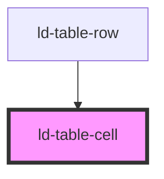

---
eleventyNavigation:
  key: Table Cell
  parent: Table
layout: layout.njk
title: Table Cell
permalink: components/ld-table/ld-table-cell/
tags:
  - td
  - data cell
---

# ld-table-cell

The `ld-table-cell` component is a subcomponent for `ld-table`.

Please refer to the [`ld-table` documentation](components/ld-table/) for usage examples.

---

<!-- Auto Generated Below -->

## Properties

| Property  | Attribute | Description                                                                                                                                 | Type               | Default     |
| --------- | --------- | ------------------------------------------------------------------------------------------------------------------------------------------- | ------------------ | ----------- |
| `colspan` | `colspan` | Contains a non-negative integer value that indicates for how many columns the cell extends.                                                 | `number`           | `undefined` |
| `headers` | `headers` | Contains a list of space-separated strings, each corresponding to the id attribute of the table header elements that apply to this element. | `string`           | `undefined` |
| `key`     | `key`     | for tracking the node's identity when working with lists                                                                                    | `string \| number` | `undefined` |
| `ref`     | `ref`     | reference to component                                                                                                                      | `any`              | `undefined` |
| `rowspan` | `rowspan` | Contains a non-negative integer value that indicates for how many rows the cell extends.                                                    | `number`           | `undefined` |

## Shadow Parts

| Part     | Description    |
| -------- | -------------- |
| `"cell"` | the table cell |

## Dependencies

### Used by

 - [ld-table-row](../ld-table-row)

### Graph

----------------------------------------------

*Built with [StencilJS](https://stenciljs.com/)*
