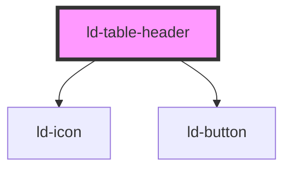

---
eleventyNavigation:
  key: Table Header
  parent: Table
layout: layout.njk
title: Table Header
permalink: components/ld-table/ld-table-header/
tags:
  - th
---

# ld-table-header

The `ld-table-header` component is a subcomponent for `ld-table`.

Please refer to the [`ld-table` documentation](components/ld-table/) for usage examples.

---

<!-- Auto Generated Below -->

## Properties

| Property        | Attribute         | Description                                                                                                                                                                      | Type               | Default             |
| --------------- | ----------------- | -------------------------------------------------------------------------------------------------------------------------------------------------------------------------------- | ------------------ | ------------------- |
| `abbr`          | `abbr`            | This attribute contains a short abbreviated description of the cell's content. Some user-agents, such as speech readers, may present this description before the content itself. | `string`           | `undefined`         |
| `colspan`       | `colspan`         | Indicates for how many columns the cell extends.                                                                                                                                 | `number`           | `undefined`         |
| `headers`       | `headers`         | This attribute contains a list of space-separated strings, each corresponding to the id attribute of the <th> elements that apply to this element.                               | `string`           | `undefined`         |
| `key`           | `key`             | for tracking the node's identity when working with lists                                                                                                                         | `string \| number` | `undefined`         |
| `ref`           | `ref`             | reference to component                                                                                                                                                           | `any`              | `undefined`         |
| `rowspan`       | `rowspan`         | Indicates for how many rows the cell extends.                                                                                                                                    | `number`           | `undefined`         |
| `scope`         | `scope`           | Defines the cells that the header element relates to.                                                                                                                            | `string`           | `undefined`         |
| `sortAscLabel`  | `sort-asc-label`  | The aria label used for sort ascending buttons.                                                                                                                                  | `string`           | `'Sort ascending'`  |
| `sortDescLabel` | `sort-desc-label` | The aria label used for sort descending buttons.                                                                                                                                 | `string`           | `'Sort descending'` |
| `sortOrder`     | `sort-order`      | Defines whether the column is sorted and in which order.                                                                                                                         | `"asc" \| "desc"`  | `undefined`         |
| `sortable`      | `sortable`        | Defines whether the column is sortable.                                                                                                                                          | `boolean`          | `false`             |

## Events

| Event         | Description                               | Type                                                                |
| ------------- | ----------------------------------------- | ------------------------------------------------------------------- |
| `ldTableSort` | Emitted with culumn index and sort order. | `CustomEvent<{ columnIndex: number; sortOrder: "desc" \| "asc"; }>` |

## Shadow Parts

| Part                 | Description                         |
| -------------------- | ----------------------------------- |
| `"cell"`             | the actual th element               |
| `"sort-button-asc"`  | ascending sort button               |
| `"sort-button-desc"` | descending sort button              |
| `"sort-buttons"`     | container wrapping the sort buttons |

## Dependencies

### Depends on

- [ld-icon](../../ld-icon)
- [ld-button](../../ld-button)

### Graph

----------------------------------------------

*Built with [StencilJS](https://stenciljs.com/)*
