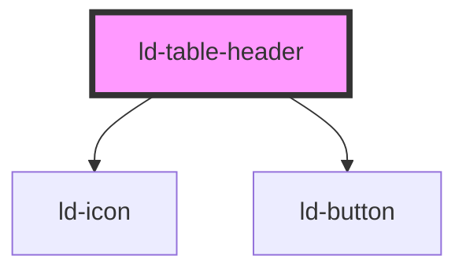

---
eleventyNavigation:
  key: Table Header
  parent: Table
layout: layout.njk
title: Table Header
permalink: components/ld-table/ld-table-header/
tags:
  - th
---

# ld-table-header

The `ld-table-header` component is a subcomponent for `ld-table`.

Please refer to the [`ld-table` documentation](components/ld-table/) for usage examples.

---

<!-- Auto Generated Below -->

## Properties

| Property   | Attribute  | Description                                              | Type               | Default     |
| ---------- | ---------- | -------------------------------------------------------- | ------------------ | ----------- |
| `key`      | `key`      | for tracking the node's identity when working with lists | `string \| number` | `undefined` |
| `ref`      | `ref`      | reference to component                                   | `any`              | `undefined` |
| `scope`    | `scope`    | Defines the cells that the header element relates to.    | `string`           | `undefined` |
| `sortable` | `sortable` | Defines whether the column is sortable.                  | `boolean`          | `false`     |
| `sorted`   | `sorted`   | Defines whether the column is sorted.                    | `"asc" \| "desc"`  | `undefined` |

## Events

| Event         | Description                               | Type                                                                |
| ------------- | ----------------------------------------- | ------------------------------------------------------------------- |
| `ldTableSort` | Emitted with culumn index and sort order. | `CustomEvent<{ columnIndex: number; sortOrder: "desc" \| "asc"; }>` |

## Shadow Parts

| Part                 | Description                         |
| -------------------- | ----------------------------------- |
| `"cell"`             | the table cell                      |
| `"sort-button-asc"`  | ascending sort button               |
| `"sort-button-desc"` | descending sort button              |
| `"sort-buttons"`     | container wrapping the sort buttons |

## Dependencies

### Depends on

- [ld-icon](../../ld-icon)
- [ld-button](../../ld-button)

### Graph

----------------------------------------------

*Built with [StencilJS](https://stenciljs.com/)*
