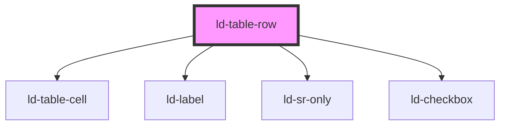

---
eleventyNavigation:
  key: Table Row
  parent: Table
layout: layout.njk
title: Table Row
permalink: components/ld-table/ld-table-row/
tags:
  - tr
---

# ld-table-row

The `ld-table-row` component is a subcomponent for `ld-table`.

Please refer to the [`ld-table` documentation](components/ld-table/) for usage examples.

---

<!-- Auto Generated Below -->

## Properties

| Property            | Attribute            | Description                                                            | Type               | Default           |
| ------------------- | -------------------- | ---------------------------------------------------------------------- | ------------------ | ----------------- |
| `indeterminate`     | `indeterminate`      | Indicates that the selection state is indeterminate.                   | `boolean`          | `undefined`       |
| `key`               | `key`                | for tracking the node's identity when working with lists               | `string \| number` | `undefined`       |
| `ref`               | `ref`                | reference to component                                                 | `any`              | `undefined`       |
| `selectable`        | `selectable`         | Makes the row selectable by adding a checkbox to the start of the row. | `boolean`          | `undefined`       |
| `selected`          | `selected`           | Indicates that the row is selected.                                    | `boolean`          | `undefined`       |
| `selectionDisabled` | `selection-disabled` | Indicates that the row selection is disabled.                          | `boolean`          | `undefined`       |
| `selectionSticky`   | `selection-sticky`   | In selectable mode the checkbox is sticky by default.                  | `boolean`          | `true`            |
| `selecttionLabel`   | `selecttion-label`   | Makes the row selectable by adding a checkbox to the start of the row. | `string`           | `'Row selection'` |

## Events

| Event              | Description                                | Type                                                    |
| ------------------ | ------------------------------------------ | ------------------------------------------------------- |
| `ldTableSelect`    | Emitted with row index and selected state. | `CustomEvent<{ rowIndex: number; selected: boolean; }>` |
| `ldTableSelectAll` | Emitted with selected state.               | `CustomEvent<{ selected: boolean; }>`                   |

## Shadow Parts

| Part         | Description            |
| ------------ | ---------------------- |
| `"cell"`     |                        |
| `"checkbox"` | the selection checkbox |
| `"label"`    | the selection label    |
| `"row"`      | the table row          |
| `"select"`   | the selection cell     |

## Dependencies

### Depends on

- [ld-table-cell](../ld-table-cell)
- [ld-label](../../ld-label)
- [ld-sr-only](../../ld-sr-only)
- [ld-checkbox](../../ld-checkbox)

### Graph

----------------------------------------------

*Built with [StencilJS](https://stenciljs.com/)*
