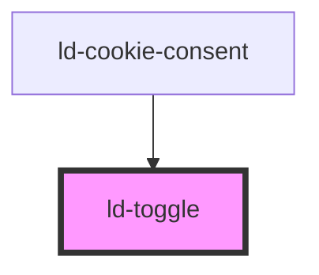

---
eleventyNavigation:
  key: Toggle
  parent: Components
layout: layout.njk
title: Toggle
permalink: components/ld-toggle/
tags:
  - switch
  - radio group
---

<link rel="stylesheet" href="{{ env.base }}/{{ buildstamp }}css_components/ld-toggle.css">
<link rel="stylesheet" href="{{ env.base }}/{{ buildstamp }}css_components/ld-label.css">
<link rel="stylesheet" href="{{ env.base }}/{{ buildstamp }}css_components/ld-icon.css">
<link rel="stylesheet" href="{{ env.base }}/{{ buildstamp }}css_components/ld-input-message.css">

# ld-toggle

A toggle allows the user to select and deselect single values.

This component can be used in conjunction with the [`ld-label`](components/ld-label/) and the [`ld-input-message`](components/ld-input-message/) component.

---

## Examples

### Primary


<ld-toggle></ld-toggle>

<!-- React component -->

<LdToggle />

<!-- CSS component -->

  <input type="checkbox" />
  



### Large


<ld-toggle size="lg"></ld-toggle>

<!-- React component -->

<LdToggle size="lg" />

<!-- CSS component -->

  <input type="checkbox" />
  



### Invalid


<ld-toggle required></ld-toggle>

<ld-toggle checked required></ld-toggle>

<!-- React component -->

<LdToggle required />

<LdToggle checked required />

<!-- CSS component -->

  <input type="checkbox" required />
  

  <input type="checkbox" checked required />
  



### Disabled


<ld-toggle disabled></ld-toggle>

<ld-toggle disabled checked></ld-toggle>

<!-- React component -->

<LdToggle disabled />

<LdToggle disabled checked />

<!-- CSS component -->

  <input type="checkbox" disabled />
  

  <input type="checkbox" disabled checked />
  



**If you want the toggle to stay focusable** even if it is disabled, use `aria-disabled` in place of `disabled`:


<ld-toggle aria-disabled="true"></ld-toggle>

<ld-toggle aria-disabled="true" checked></ld-toggle>

<!-- React component -->

<LdToggle aria-disabled="true" />

<LdToggle aria-disabled="true" checked />

<!-- CSS component -->

  <input type="checkbox" aria-disabled="true" id="focusable-disabled-toggle-1" />
  

  <input type="checkbox" aria-disabled="true" checked id="focusable-disabled-toggle-2" />
  

<!-- Example code for input prevention on aria-disabled toggle elements -->



<ld-notice headline="Note" mode="warning">
  When <code>aria-disabled</code> is applied on the toggle, the component will try to prevent user interaction using an internal click event handler, calling <code>preventDefault()</code> on the click event. With the CSS component version on the other hand, you will need to take care of preventing the default behaviour of the toggle yourself.
</ld-notice>

### With icons


<ld-toggle>
  <ld-icon name="placeholder" size="sm" slot="icon-start"></ld-icon>
  <ld-icon name="placeholder" size="sm" slot="icon-end"></ld-icon>
</ld-toggle>

<ld-toggle checked>
  <ld-icon name="placeholder" size="sm" slot="icon-start"></ld-icon>
  <ld-icon name="placeholder" size="sm" slot="icon-end"></ld-icon>
</ld-toggle>

<ld-toggle size="lg">
  <ld-icon name="placeholder" size="sm" slot="icon-start"></ld-icon>
  <ld-icon name="placeholder" size="sm" slot="icon-end"></ld-icon>
</ld-toggle>

<ld-toggle size="lg" checked>
  <ld-icon name="placeholder" size="sm" slot="icon-start"></ld-icon>
  <ld-icon name="placeholder" size="sm" slot="icon-end"></ld-icon>
</ld-toggle>

<!-- React component -->

<LdToggle>
  <LdIcon name="placeholder" size="sm" slot="icon-start" />
  <LdIcon name="placeholder" size="sm" slot="icon-end" />
</LdToggle>

<LdToggle checked>
  <LdIcon name="placeholder" size="sm" slot="icon-start" />
  <LdIcon name="placeholder" size="sm" slot="icon-end" />
</LdToggle>

<LdToggle size="lg">
  <LdIcon name="placeholder" size="sm" slot="icon-start" />
  <LdIcon name="placeholder" size="sm" slot="icon-end" />
</LdToggle>

<LdToggle size="lg" checked>
  <LdIcon name="placeholder" size="sm" slot="icon-start" />
  <LdIcon name="placeholder" size="sm" slot="icon-end" />
</LdToggle>

<!-- CSS component -->

  <input type="checkbox" />
  
  <svg class="ld-toggle__icon-start ld-icon ld-icon--sm" viewBox="0 0 24 24" fill="none">
    <rect x="1.5" y="1.5" width="21" height="21" rx="4.5" stroke="currentColor" stroke-width="3"></rect>
    <circle cx="12" cy="12" r="4.5" stroke="currentColor" stroke-width="3"></circle>
  </svg>
  <svg class="ld-toggle__icon-end ld-icon ld-icon--sm" viewBox="0 0 24 24" fill="none">
    <rect x="1.5" y="1.5" width="21" height="21" rx="4.5" stroke="currentColor" stroke-width="3"></rect>
    <circle cx="12" cy="12" r="4.5" stroke="currentColor" stroke-width="3"></circle>
  </svg>

  <input type="checkbox" checked />
  
  <svg class="ld-toggle__icon-start ld-icon ld-icon--sm" viewBox="0 0 24 24" fill="none">
    <rect x="1.5" y="1.5" width="21" height="21" rx="4.5" stroke="currentColor" stroke-width="3"></rect>
    <circle cx="12" cy="12" r="4.5" stroke="currentColor" stroke-width="3"></circle>
  </svg>
  <svg class="ld-toggle__icon-end ld-icon ld-icon--sm" viewBox="0 0 24 24" fill="none">
    <rect x="1.5" y="1.5" width="21" height="21" rx="4.5" stroke="currentColor" stroke-width="3"></rect>
    <circle cx="12" cy="12" r="4.5" stroke="currentColor" stroke-width="3"></circle>
  </svg>

  <input type="checkbox" />
  
  <svg class="ld-toggle__icon-start ld-icon ld-icon--sm" viewBox="0 0 24 24" fill="none">
    <rect x="1.5" y="1.5" width="21" height="21" rx="4.5" stroke="currentColor" stroke-width="3"></rect>
    <circle cx="12" cy="12" r="4.5" stroke="currentColor" stroke-width="3"></circle>
  </svg>
  <svg class="ld-toggle__icon-end ld-icon ld-icon--sm" viewBox="0 0 24 24" fill="none">
    <rect x="1.5" y="1.5" width="21" height="21" rx="4.5" stroke="currentColor" stroke-width="3"></rect>
    <circle cx="12" cy="12" r="4.5" stroke="currentColor" stroke-width="3"></circle>
  </svg>

  <input type="checkbox" checked />
  
  <svg class="ld-toggle__icon-start ld-icon ld-icon--sm" viewBox="0 0 24 24" fill="none">
    <rect x="1.5" y="1.5" width="21" height="21" rx="4.5" stroke="currentColor" stroke-width="3"></rect>
    <circle cx="12" cy="12" r="4.5" stroke="currentColor" stroke-width="3"></circle>
  </svg>
  <svg class="ld-toggle__icon-end ld-icon ld-icon--sm" viewBox="0 0 24 24" fill="none">
    <rect x="1.5" y="1.5" width="21" height="21" rx="4.5" stroke="currentColor" stroke-width="3"></rect>
    <circle cx="12" cy="12" r="4.5" stroke="currentColor" stroke-width="3"></circle>
  </svg>



### With icons (disabled)


<ld-toggle disabled>
  <ld-icon name="placeholder" size="sm" slot="icon-start"></ld-icon>
  <ld-icon name="placeholder" size="sm" slot="icon-end"></ld-icon>
</ld-toggle>

<ld-toggle checked disabled>
  <ld-icon name="placeholder" size="sm" slot="icon-start"></ld-icon>
  <ld-icon name="placeholder" size="sm" slot="icon-end"></ld-icon>
</ld-toggle>

<ld-toggle size="lg" disabled>
  <ld-icon name="placeholder" size="sm" slot="icon-start"></ld-icon>
  <ld-icon name="placeholder" size="sm" slot="icon-end"></ld-icon>
</ld-toggle>

<ld-toggle size="lg" checked disabled>
  <ld-icon name="placeholder" size="sm" slot="icon-start"></ld-icon>
  <ld-icon name="placeholder" size="sm" slot="icon-end"></ld-icon>
</ld-toggle>

<!-- React component -->

<LdToggle disabled>
  <LdIcon name="placeholder" size="sm" slot="icon-start" />
  <LdIcon name="placeholder" size="sm" slot="icon-end" />
</LdToggle>

<LdToggle checked disabled>
  <LdIcon name="placeholder" size="sm" slot="icon-start" />
  <LdIcon name="placeholder" size="sm" slot="icon-end" />
</LdToggle>

<LdToggle size="lg" disabled>
  <LdIcon name="placeholder" size="sm" slot="icon-start" />
  <LdIcon name="placeholder" size="sm" slot="icon-end" />
</LdToggle>

<LdToggle size="lg" checked disabled>
  <LdIcon name="placeholder" size="sm" slot="icon-start" />
  <LdIcon name="placeholder" size="sm" slot="icon-end" />
</LdToggle>

<!-- CSS component -->

  <input type="checkbox" disabled />
  
  <svg class="ld-toggle__icon-start ld-icon ld-icon--sm" viewBox="0 0 24 24" fill="none">
    <rect x="1.5" y="1.5" width="21" height="21" rx="4.5" stroke="currentColor" stroke-width="3"></rect>
    <circle cx="12" cy="12" r="4.5" stroke="currentColor" stroke-width="3"></circle>
  </svg>
  <svg class="ld-toggle__icon-end ld-icon ld-icon--sm" viewBox="0 0 24 24" fill="none">
    <rect x="1.5" y="1.5" width="21" height="21" rx="4.5" stroke="currentColor" stroke-width="3"></rect>
    <circle cx="12" cy="12" r="4.5" stroke="currentColor" stroke-width="3"></circle>
  </svg>

  <input type="checkbox" checked disabled />
  
  <svg class="ld-toggle__icon-start ld-icon ld-icon--sm" viewBox="0 0 24 24" fill="none">
    <rect x="1.5" y="1.5" width="21" height="21" rx="4.5" stroke="currentColor" stroke-width="3"></rect>
    <circle cx="12" cy="12" r="4.5" stroke="currentColor" stroke-width="3"></circle>
  </svg>
  <svg class="ld-toggle__icon-end ld-icon ld-icon--sm" viewBox="0 0 24 24" fill="none">
    <rect x="1.5" y="1.5" width="21" height="21" rx="4.5" stroke="currentColor" stroke-width="3"></rect>
    <circle cx="12" cy="12" r="4.5" stroke="currentColor" stroke-width="3"></circle>
  </svg>

  <input type="checkbox" disabled />
  
  <svg class="ld-toggle__icon-start ld-icon ld-icon--sm" viewBox="0 0 24 24" fill="none">
    <rect x="1.5" y="1.5" width="21" height="21" rx="4.5" stroke="currentColor" stroke-width="3"></rect>
    <circle cx="12" cy="12" r="4.5" stroke="currentColor" stroke-width="3"></circle>
  </svg>
  <svg class="ld-toggle__icon-end ld-icon ld-icon--sm" viewBox="0 0 24 24" fill="none">
    <rect x="1.5" y="1.5" width="21" height="21" rx="4.5" stroke="currentColor" stroke-width="3"></rect>
    <circle cx="12" cy="12" r="4.5" stroke="currentColor" stroke-width="3"></circle>
  </svg>

  <input type="checkbox" checked disabled />
  
  <svg class="ld-toggle__icon-start ld-icon ld-icon--sm" viewBox="0 0 24 24" fill="none">
    <rect x="1.5" y="1.5" width="21" height="21" rx="4.5" stroke="currentColor" stroke-width="3"></rect>
    <circle cx="12" cy="12" r="4.5" stroke="currentColor" stroke-width="3"></circle>
  </svg>
  <svg class="ld-toggle__icon-end ld-icon ld-icon--sm" viewBox="0 0 24 24" fill="none">
    <rect x="1.5" y="1.5" width="21" height="21" rx="4.5" stroke="currentColor" stroke-width="3"></rect>
    <circle cx="12" cy="12" r="4.5" stroke="currentColor" stroke-width="3"></circle>
  </svg>



### With icons (invalid)


<ld-toggle required>
  <ld-icon name="placeholder" size="sm" slot="icon-start"></ld-icon>
  <ld-icon name="placeholder" size="sm" slot="icon-end"></ld-icon>
</ld-toggle>

<ld-toggle checked required>
  <ld-icon name="placeholder" size="sm" slot="icon-start"></ld-icon>
  <ld-icon name="placeholder" size="sm" slot="icon-end"></ld-icon>
</ld-toggle>

<ld-toggle size="lg" required>
  <ld-icon name="placeholder" size="sm" slot="icon-start"></ld-icon>
  <ld-icon name="placeholder" size="sm" slot="icon-end"></ld-icon>
</ld-toggle>

<ld-toggle size="lg" checked required>
  <ld-icon name="placeholder" size="sm" slot="icon-start"></ld-icon>
  <ld-icon name="placeholder" size="sm" slot="icon-end"></ld-icon>
</ld-toggle>

<!-- React component -->

<LdToggle required>
  <LdIcon name="placeholder" size="sm" slot="icon-start" />
  <LdIcon name="placeholder" size="sm" slot="icon-end" />
</LdToggle>

<LdToggle checked required>
  <LdIcon name="placeholder" size="sm" slot="icon-start" />
  <LdIcon name="placeholder" size="sm" slot="icon-end" />
</LdToggle>

<LdToggle size="lg" required>
  <LdIcon name="placeholder" size="sm" slot="icon-start" />
  <LdIcon name="placeholder" size="sm" slot="icon-end" />
</LdToggle>

<LdToggle size="lg" checked required>
  <LdIcon name="placeholder" size="sm" slot="icon-start" />
  <LdIcon name="placeholder" size="sm" slot="icon-end" />
</LdToggle>

<!-- CSS component -->

  <input type="checkbox" required />
  
  <svg class="ld-toggle__icon-start ld-icon ld-icon--sm" viewBox="0 0 24 24" fill="none">
    <rect x="1.5" y="1.5" width="21" height="21" rx="4.5" stroke="currentColor" stroke-width="3"></rect>
    <circle cx="12" cy="12" r="4.5" stroke="currentColor" stroke-width="3"></circle>
  </svg>
  <svg class="ld-toggle__icon-end ld-icon ld-icon--sm" viewBox="0 0 24 24" fill="none">
    <rect x="1.5" y="1.5" width="21" height="21" rx="4.5" stroke="currentColor" stroke-width="3"></rect>
    <circle cx="12" cy="12" r="4.5" stroke="currentColor" stroke-width="3"></circle>
  </svg>

  <input type="checkbox" checked required />
  
  <svg class="ld-toggle__icon-start ld-icon ld-icon--sm" viewBox="0 0 24 24" fill="none">
    <rect x="1.5" y="1.5" width="21" height="21" rx="4.5" stroke="currentColor" stroke-width="3"></rect>
    <circle cx="12" cy="12" r="4.5" stroke="currentColor" stroke-width="3"></circle>
  </svg>
  <svg class="ld-toggle__icon-end ld-icon ld-icon--sm" viewBox="0 0 24 24" fill="none">
    <rect x="1.5" y="1.5" width="21" height="21" rx="4.5" stroke="currentColor" stroke-width="3"></rect>
    <circle cx="12" cy="12" r="4.5" stroke="currentColor" stroke-width="3"></circle>
  </svg>

  <input type="checkbox" required />
  
  <svg class="ld-toggle__icon-start ld-icon ld-icon--sm" viewBox="0 0 24 24" fill="none">
    <rect x="1.5" y="1.5" width="21" height="21" rx="4.5" stroke="currentColor" stroke-width="3"></rect>
    <circle cx="12" cy="12" r="4.5" stroke="currentColor" stroke-width="3"></circle>
  </svg>
  <svg class="ld-toggle__icon-end ld-icon ld-icon--sm" viewBox="0 0 24 24" fill="none">
    <rect x="1.5" y="1.5" width="21" height="21" rx="4.5" stroke="currentColor" stroke-width="3"></rect>
    <circle cx="12" cy="12" r="4.5" stroke="currentColor" stroke-width="3"></circle>
  </svg>

  <input type="checkbox" checked required />
  
  <svg class="ld-toggle__icon-start ld-icon ld-icon--sm" viewBox="0 0 24 24" fill="none">
    <rect x="1.5" y="1.5" width="21" height="21" rx="4.5" stroke="currentColor" stroke-width="3"></rect>
    <circle cx="12" cy="12" r="4.5" stroke="currentColor" stroke-width="3"></circle>
  </svg>
  <svg class="ld-toggle__icon-end ld-icon ld-icon--sm" viewBox="0 0 24 24" fill="none">
    <rect x="1.5" y="1.5" width="21" height="21" rx="4.5" stroke="currentColor" stroke-width="3"></rect>
    <circle cx="12" cy="12" r="4.5" stroke="currentColor" stroke-width="3"></circle>
  </svg>



### With label


<ld-label position="right" size="m">
  I'd like to receive a weekly newsletter.
  <ld-toggle></ld-toggle>
</ld-label>

<!-- React component -->

<LdLabel position="right" size="m">
  I'd like to receive a weekly newsletter.
  <LdToggle />
</LdLabel>

<!-- CSS component -->

<label class="ld-label ld-label--right ld-label--m">
  I'd like to receive a weekly newsletter.
  

    <input type="checkbox" />
    
  

</label>


Please refer to the [ld-label](components/ld-label/) docs for more information on the label component.

### With label and input message



  <ld-label position="right" size="m">
    I have read the terms of service.*
    <ld-toggle required></ld-toggle>
    <ld-input-message>To proceed, you must except the terms of service.</ld-input-message>
  </ld-label>

  <ld-label position="right" size="m">
    I'd like to receive a weekly newsletter.
    <ld-toggle></ld-toggle>
    <ld-input-message mode="info">You may unsubscribe at any given time.</ld-input-message>
  </ld-label>

<!-- React component -->

  <LdLabel position="right" size="m">
    I have read the terms of service.*
    <LdToggle required />
    <LdInputMessage>To proceed, you must except the terms of service.</LdInputMessage>
  </LdLabel>

  <LdLabel position="right" size="m">
    I'd like to receive a weekly newsletter.
    <LdToggle />
    <LdInputMessage mode="info">You may unsubscribe at any given time.</LdInputMessage>
  </LdLabel>

<!-- CSS component -->

  <label class="ld-label ld-label--right ld-label--m">
    I have read the terms of service.*
    

      <input type="checkbox" required />
      
    

    
      <svg class="ld-input-message__icon ld-icon ld-icon--sm" width="14" height="14" viewBox="0 0 14 14" fill="none">
        <path fill-rule="evenodd" clip-rule="evenodd" d="M7 14C10.866 14 14 10.866 14 7C14 3.13401 10.866 0 7 0C3.13401 0 0 3.13401 0 7C0 10.866 3.13401 14 7 14Z" fill="currentColor"/>
        <path d="M4.66675 4.66699L9.33341 9.33366" stroke="var(--ld-col-wht)" stroke-width="2" stroke-linecap="round" stroke-linejoin="round"/>
        <path d="M4.66675 9.33301L9.33341 4.66634" stroke="var(--ld-col-wht)" stroke-width="2" stroke-linecap="round" stroke-linejoin="round"/>
      </svg>
      To proceed, you must except the terms of service.
    
  </label>
  
  <label class="ld-label ld-label--right ld-label--m">
    I'd like to receive a weekly newsletter.
    

      <input type="checkbox" />
      
    

    
      <svg class="ld-input-message__icon ld-icon ld-icon--sm" width="14" height="14" viewBox="0 0 14 14" fill="none">
        <path fill-rule="evenodd" clip-rule="evenodd" d="M7 14C10.866 14 14 10.866 14 7C14 3.13401 10.866 0 7 0C3.13401 0 0 3.13401 0 7C0 10.866 3.13401 14 7 14Z" fill="var(--ld-thm-warning)"/>
        <path fill-rule="evenodd" clip-rule="evenodd" d="M7.18234 11.0254C6.79228 11.0254 6.48657 10.9147 6.26518 10.6933C6.0438 10.472 5.93311 10.1662 5.93311 9.77618V6.12335C5.93311 5.99685 6.0069 5.93359 6.15449 5.93359H6.89771C7.28776 5.93359 7.59348 6.04428 7.81487 6.26567C8.03625 6.48705 8.14694 6.79277 8.14694 7.18283V10.8357C8.14694 10.9622 8.07315 11.0254 7.92556 11.0254H7.18234Z" fill="var(--ld-col-neutral-900)"/>
        <ellipse cx="6.99977" cy="3.80007" rx="1.06667" ry="1.06667" fill="var(--ld-col-neutral-900)"/>
      </svg>
      You may unsubscribe at any given time.
    
  </label>



### Input validation

The `ld-toggle` Web Component provides a low level API for integrating the component with the form validation solution of your choice. It allows you to listen for `focus`, `input` and `blur` events.

<ld-notice headline="Note" mode="warning">
  You can find examples for different kinds of input validation in the <a href="guides/form-validation/">Form validation</a> documentation. Please also be aware of differences in event handling compared to native elements that come with Web Components. Details can be found in our <a href="guides/event-handling/">Event handling</a> documentation.
</ld-notice>

<!-- Auto Generated Below -->

## Properties

| Property       | Attribute       | Description                                                                    | Type               | Default     |
| -------------- | --------------- | ------------------------------------------------------------------------------ | ------------------ | ----------- |
| `ariaDisabled` | `aria-disabled` | Alternative disabled state that keeps element focusable                        | `string`           | `undefined` |
| `autofocus`    | `autofocus`     | Automatically focus the form control when the page is loaded.                  | `boolean`          | `undefined` |
| `checked`      | `checked`       | Indicates whether the toggle is "on".                                          | `boolean`          | `false`     |
| `disabled`     | `disabled`      | Disabled state of the checkbox.                                                | `boolean`          | `undefined` |
| `form`         | `form`          | Associates the control with a form element.                                    | `string`           | `undefined` |
| `invalid`      | `invalid`       | Set this property to `true` in order to mark the checkbox visually as invalid. | `boolean`          | `undefined` |
| `key`          | `key`           | for tracking the node's identity when working with lists                       | `string \| number` | `undefined` |
| `ldTabindex`   | `ld-tabindex`   | Tab index of the input.                                                        | `number`           | `undefined` |
| `name`         | `name`          | Used to specify the name of the control.                                       | `string`           | `undefined` |
| `readonly`     | `readonly`      | The value is not editable.                                                     | `boolean`          | `undefined` |
| `ref`          | `ref`           | reference to component                                                         | `any`              | `undefined` |
| `required`     | `required`      | Set this property to `true` in order to mark the checkbox as required.         | `boolean`          | `undefined` |
| `size`         | `size`          | Size of the toggle.                                                            | `"lg" \| "sm"`     | `undefined` |
| `value`        | `value`         | The input value.                                                               | `string`           | `undefined` |

## Events

| Event      | Description                                                       | Type                   |
| ---------- | ----------------------------------------------------------------- | ---------------------- |
| `ldchange` | Emitted when the input value changed and the element loses focus. | `CustomEvent<boolean>` |
| `ldinput`  | Emitted when the input value changed.                             | `CustomEvent<boolean>` |

## Methods

### `focusInner() => Promise<void>`

Sets focus on the toggle.

#### Returns

Type: `Promise<void>`

## Shadow Parts

| Part                   | Description               |
| ---------------------- | ------------------------- |
| `"icon-wrapper"`       | Both wrappers of icons    |
| `"icon-wrapper-end"`   | Wrapper of the end icon   |
| `"icon-wrapper-start"` | Wrapper of the start icon |
| `"input"`              | Actual input element      |
| `"knob"`               | Toggle knob               |

## Dependencies

### Used by

 - [ld-cookie-consent](../ld-cookie-consent)

### Graph

----------------------------------------------

*Built with [StencilJS](https://stenciljs.com/)*
