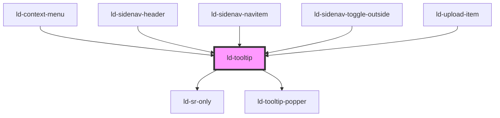

---
eleventyNavigation:
  key: Tooltip
  parent: Components
layout: layout.njk
title: Tooltip
permalink: components/ld-tooltip/
---

<link rel="stylesheet" href="{{ env.base }}/{{ buildstamp }}css_components/ld-button.css">

# ld-tooltip

Tooltips provide additional information, mostly short paragraphs, and can be placed beside all sorts of interface elements.

<ld-notice headline="Note" mode="warning">
  If your application is mounted to a different element than the <code>body</code> element, or you have <em>z-order</em> related issues, you may need to configure the <code>bodyElement</code> option using the <code>tetherOptions</code> property. For more details check out the <a href="guides/troubleshooting/#popped-out-element-is-rendered-in-wrong-container">related troubleshooting section</a>.
</ld-notice>

## Default


<ld-tooltip>
  <ld-typo variant="h4" style="margin-bottom: 0.625rem">Headline</ld-typo>
  <ld-typo>
    Lorem ipsum dolor sit amet, consectetur adipiscing elit, sed do eiusmod tempor incididunt ut labore et dolore magna aliqua.
  </ld-typo>
</ld-tooltip>

<!-- React component -->

<LdTooltip>
  <LdTypo variant="h4" style={ { marginBottom: '0.625rem'} }>Headline</LdTypo>
  <LdTypo>
    Lorem ipsum dolor sit amet, consectetur adipiscing elit, sed do eiusmod tempor incididunt ut labore et dolore magna aliqua.
  </LdTypo>
</LdTooltip>



## With arrow


<ld-tooltip arrow>
  <ld-typo variant="h4" style="margin-bottom: 0.625rem">Headline</ld-typo>
  <ld-typo>
    Lorem ipsum dolor sit amet, consectetur adipiscing elit, sed do eiusmod tempor incididunt ut labore et dolore magna aliqua.
  </ld-typo>
</ld-tooltip>

<!-- React component -->

<LdTooltip arrow>
  <LdTypo variant="h4" style={ { marginBottom: '0.625rem'} }>Headline</LdTypo>
  <LdTypo>
    Lorem ipsum dolor sit amet, consectetur adipiscing elit, sed do eiusmod tempor incididunt ut labore et dolore magna aliqua.
  </LdTypo>
</LdTooltip>



## Size


<ld-tooltip arrow>
  <ld-typo>I'm the default size tooltip.</ld-typo>
</ld-tooltip>
<ld-tooltip arrow size="sm">
  <ld-typo>I'm the small size tooltip.</ld-typo>
</ld-tooltip>

<!-- React component -->

<LdTooltip arrow>
  <LdTypo>I'm the default size tooltip.</LdTypo>
</LdTooltip>
<LdTooltip arrow size="sm">
  <LdTypo>I'm the small size tooltip.</LdTypo>
</LdTooltip>



## With custom trigger



  I am an
  <ld-tooltip arrow>
    inline
    <ld-typo variant="h4" style="margin-bottom: 0.625rem">Headline</ld-typo>
    <ld-typo>
      Lorem ipsum dolor sit amet, consectetur adipiscing elit, sed do eiusmod tempor incididunt ut labore et dolore magna aliqua.
    </ld-typo>
  </ld-tooltip>
  trigger!

<!-- React component -->

  I am an{' '}
  <LdTooltip arrow>
    inline
    <LdTypo variant="h4" style={ { marginBottom: '0.625rem' } }>Headline</LdTypo>
    <LdTypo>
      Lorem ipsum dolor sit amet, consectetur adipiscing elit, sed do eiusmod tempor incididunt ut labore et dolore magna aliqua.
    </LdTypo>
  </LdTooltip>{' '}
  trigger!



## Open on click


<ld-tooltip trigger-type="click">
  <ld-button slot="trigger">click me</ld-button>
  <ld-typo variant="h4" style="margin-bottom: 0.625rem">Headline</ld-typo>
  <ld-typo>
    Lorem ipsum dolor sit amet, consectetur adipiscing elit, sed do eiusmod tempor incididunt ut labore et dolore magna aliqua.
  </ld-typo>
</ld-tooltip>

<!-- React component -->

<LdTooltip triggerType="click">
  <LdButton slot="trigger">click me</LdButton>
  <LdTypo variant="h4" style={ { marginBottom: '0.625rem' } }>Headline</LdTypo>
  <LdTypo>
    Lorem ipsum dolor sit amet, consectetur adipiscing elit, sed do eiusmod tempor incididunt ut labore et dolore magna aliqua.
  </LdTypo>
</LdTooltip>


## Positioning



  <ld-tooltip arrow position="top left" style="text-align: end">
    <ld-button slot="trigger" style="width: 9.375rem">top left</ld-button>
    <ld-typo variant="h4" style="margin-bottom: 0.625rem">Headline</ld-typo>
    <ld-typo>
      Lorem ipsum dolor sit amet, consectetur adipiscing elit, sed do eiusmod tempor incididunt ut labore et dolore magna aliqua.
    </ld-typo>
  </ld-tooltip>

  <ld-tooltip arrow position="top center" style="text-align: center">
    <ld-button slot="trigger" style="width: 9.375rem">top center</ld-button>
    <ld-typo variant="h4" style="margin-bottom: 0.625rem">Headline</ld-typo>
    <ld-typo>
      Lorem ipsum dolor sit amet, consectetur adipiscing elit, sed do eiusmod tempor incididunt ut labore et dolore magna aliqua.
    </ld-typo>
  </ld-tooltip>

  <ld-tooltip arrow position="top right">
    <ld-button slot="trigger" style="width: 9.375rem">top right</ld-button>
    <ld-typo variant="h4" style="margin-bottom: 0.625rem">Headline</ld-typo>
    <ld-typo>
      Lorem ipsum dolor sit amet, consectetur adipiscing elit, sed do eiusmod tempor incididunt ut labore et dolore magna aliqua.
    </ld-typo>
  </ld-tooltip>

  <ld-tooltip arrow position="left top" style="text-align: end">
    <ld-button slot="trigger" style="width: 9.375rem">left top</ld-button>
    <ld-typo variant="h4" style="margin-bottom: 0.625rem">Headline</ld-typo>
    <ld-typo>
      Lorem ipsum dolor sit amet, consectetur adipiscing elit, sed do eiusmod tempor incididunt ut labore et dolore magna aliqua.
    </ld-typo>
  </ld-tooltip>

  

  <ld-tooltip arrow position="right top">
    <ld-button slot="trigger" style="width: 9.375rem">right top</ld-button>
    <ld-typo variant="h4" style="margin-bottom: 0.625rem">Headline</ld-typo>
    <ld-typo>
      Lorem ipsum dolor sit amet, consectetur adipiscing elit, sed do eiusmod tempor incididunt ut labore et dolore magna aliqua.
    </ld-typo>
  </ld-tooltip>

  <ld-tooltip arrow position="left middle" style="text-align: end">
    <ld-button slot="trigger" style="width: 9.375rem">left middle</ld-button>
    <ld-typo variant="h4" style="margin-bottom: 0.625rem">Headline</ld-typo>
    <ld-typo>
      Lorem ipsum dolor sit amet, consectetur adipiscing elit, sed do eiusmod tempor incididunt ut labore et dolore magna aliqua.
    </ld-typo>
  </ld-tooltip>

  

  <ld-tooltip arrow position="right middle">
    <ld-button slot="trigger" style="width: 9.375rem">right middle</ld-button>
    <ld-typo variant="h4" style="margin-bottom: 0.625rem">Headline</ld-typo>
    <ld-typo>
      Lorem ipsum dolor sit amet, consectetur adipiscing elit, sed do eiusmod tempor incididunt ut labore et dolore magna aliqua.
    </ld-typo>
  </ld-tooltip>

  <ld-tooltip arrow position="left bottom" style="text-align: end">
    <ld-button slot="trigger" style="width: 9.375rem">left bottom</ld-button>
    <ld-typo variant="h4" style="margin-bottom: 0.625rem">Headline</ld-typo>
    <ld-typo>
      Lorem ipsum dolor sit amet, consectetur adipiscing elit, sed do eiusmod tempor incididunt ut labore et dolore magna aliqua.
    </ld-typo>
  </ld-tooltip>

  

  <ld-tooltip arrow position="right bottom">
    <ld-button slot="trigger" style="width: 9.375rem">right bottom</ld-button>
    <ld-typo variant="h4" style="margin-bottom: 0.625rem">Headline</ld-typo>
    <ld-typo>
      Lorem ipsum dolor sit amet, consectetur adipiscing elit, sed do eiusmod tempor incididunt ut labore et dolore magna aliqua.
    </ld-typo>
  </ld-tooltip>

  <ld-tooltip arrow position="bottom left" style="text-align: end">
    <ld-button slot="trigger" style="width: 9.375rem">bottom left</ld-button>
    <ld-typo variant="h4" style="margin-bottom: 0.625rem">Headline</ld-typo>
    <ld-typo>
      Lorem ipsum dolor sit amet, consectetur adipiscing elit, sed do eiusmod tempor incididunt ut labore et dolore magna aliqua.
    </ld-typo>
  </ld-tooltip>

  <ld-tooltip arrow position="bottom center" style="text-align: center">
    <ld-button slot="trigger" style="width: 9.375rem">bottom center</ld-button>
    <ld-typo variant="h4" style="margin-bottom: 0.625rem">Headline</ld-typo>
    <ld-typo>
      Lorem ipsum dolor sit amet, consectetur adipiscing elit, sed do eiusmod tempor incididunt ut labore et dolore magna aliqua.
    </ld-typo>
  </ld-tooltip>

  <ld-tooltip arrow position="bottom right">
    <ld-button slot="trigger" style="width: 9.375rem">bottom right</ld-button>
    <ld-typo variant="h4" style="margin-bottom: 0.625rem">Headline</ld-typo>
    <ld-typo>
      Lorem ipsum dolor sit amet, consectetur adipiscing elit, sed do eiusmod tempor incididunt ut labore et dolore magna aliqua.
    </ld-typo>
  </ld-tooltip>

<!-- React component -->

  <LdTooltip arrow position="top left" style={ { textAlign: 'end' } }>
    <LdButton slot="trigger" style={ { width: '9.375rem' } }>top left</LdButton>
    <LdTypo variant="h4" style={ { marginBottom: '0.625rem' } }>Headline</LdTypo>
    <LdTypo>
      Lorem ipsum dolor sit amet, consectetur adipiscing elit, sed do eiusmod tempor incididunt ut labore et dolore magna aliqua.
    </LdTypo>
  </LdTooltip>

  <LdTooltip arrow position="top center" style={ { textAlign: 'center' } }>
    <LdButton slot="trigger" style={ { width: '9.375rem' } }>top center</LdButton>
    <LdTypo variant="h4" style={ { marginBottom: '0.625rem' } }>Headline</LdTypo>
    <LdTypo>
      Lorem ipsum dolor sit amet, consectetur adipiscing elit, sed do eiusmod tempor incididunt ut labore et dolore magna aliqua.
    </LdTypo>
  </LdTooltip>

  <LdTooltip arrow position="top right">
    <LdButton slot="trigger" style={ { width: '9.375rem' } }>top right</LdButton>
    <LdTypo variant="h4" style={ { marginBottom: '0.625rem' } }>Headline</LdTypo>
    <LdTypo>
      Lorem ipsum dolor sit amet, consectetur adipiscing elit, sed do eiusmod tempor incididunt ut labore et dolore magna aliqua.
    </LdTypo>
  </LdTooltip>

  <LdTooltip arrow position="left top" style={ { textAlign: 'end' } }>
    <LdButton slot="trigger" style={ { width: '9.375rem' } }>left top</LdButton>
    <LdTypo variant="h4" style={ { marginBottom: '0.625rem' } }>Headline</LdTypo>
    <LdTypo>
      Lorem ipsum dolor sit amet, consectetur adipiscing elit, sed do eiusmod tempor incididunt ut labore et dolore magna aliqua.
    </LdTypo>
  </LdTooltip>

  

  <LdTooltip arrow position="right top">
    <LdButton slot="trigger" style={ { width: '9.375rem' } }>right top</LdButton>
    <LdTypo variant="h4" style={ { marginBottom: '0.625rem' } }>Headline</LdTypo>
    <LdTypo>
      Lorem ipsum dolor sit amet, consectetur adipiscing elit, sed do eiusmod tempor incididunt ut labore et dolore magna aliqua.
    </LdTypo>
  </LdTooltip>

  <LdTooltip arrow position="left middle" style={ { textAlign: 'end' } }>
    <LdButton slot="trigger" style={ { width: '9.375rem' } }>left middle</LdButton>
    <LdTypo variant="h4" style={ { marginBottom: '0.625rem' } }>Headline</LdTypo>
    <LdTypo>
      Lorem ipsum dolor sit amet, consectetur adipiscing elit, sed do eiusmod tempor incididunt ut labore et dolore magna aliqua.
    </LdTypo>
  </LdTooltip>

  

  <LdTooltip arrow position="right middle">
    <LdButton slot="trigger" style={ { width: '9.375rem' } }>right middle</LdButton>
    <LdTypo variant="h4" style={ { marginBottom: '0.625rem' } }>Headline</LdTypo>
    <LdTypo>
      Lorem ipsum dolor sit amet, consectetur adipiscing elit, sed do eiusmod tempor incididunt ut labore et dolore magna aliqua.
    </LdTypo>
  </LdTooltip>

  <LdTooltip arrow position="left bottom" style={ { textAlign: 'end' } }>
    <LdButton slot="trigger" style={ { width: '9.375rem' } }>left bottom</LdButton>
    <LdTypo variant="h4" style={ { marginBottom: '0.625rem' } }>Headline</LdTypo>
    <LdTypo>
      Lorem ipsum dolor sit amet, consectetur adipiscing elit, sed do eiusmod tempor incididunt ut labore et dolore magna aliqua.
    </LdTypo>
  </LdTooltip>

  

  <LdTooltip arrow position="right bottom">
    <LdButton slot="trigger" style={ { width: '9.375rem' } }>right bottom</LdButton>
    <LdTypo variant="h4" style={ { marginBottom: '0.625rem' } }>Headline</LdTypo>
    <LdTypo>
      Lorem ipsum dolor sit amet, consectetur adipiscing elit, sed do eiusmod tempor incididunt ut labore et dolore magna aliqua.
    </LdTypo>
  </LdTooltip>

  <LdTooltip arrow position="bottom left" style={ { textAlign: 'end' } }>
    <LdButton slot="trigger" style={ { width: '9.375rem' } }>bottom left</LdButton>
    <LdTypo variant="h4" style={ { marginBottom: '0.625rem' } }>Headline</LdTypo>
    <LdTypo>
      Lorem ipsum dolor sit amet, consectetur adipiscing elit, sed do eiusmod tempor incididunt ut labore et dolore magna aliqua.
    </LdTypo>
  </LdTooltip>

  <LdTooltip arrow position="bottom center" style={ { textAlign: 'center' } }>
    <LdButton slot="trigger" style={ { width: '9.375rem' } }>bottom center</LdButton>
    <LdTypo variant="h4" style={ { marginBottom: '0.625rem' } }>Headline</LdTypo>
    <LdTypo>
      Lorem ipsum dolor sit amet, consectetur adipiscing elit, sed do eiusmod tempor incididunt ut labore et dolore magna aliqua.
    </LdTypo>
  </LdTooltip>

  <LdTooltip arrow position="bottom right">
    <LdButton slot="trigger" style={ { width: '9.375rem' } }>bottom right</LdButton>
    <LdTypo variant="h4" style={ { marginBottom: '0.625rem' } }>Headline</LdTypo>
    <LdTypo>
      Lorem ipsum dolor sit amet, consectetur adipiscing elit, sed do eiusmod tempor incididunt ut labore et dolore magna aliqua.
    </LdTypo>
  </LdTooltip>



## Show/hide delay


<ld-tooltip hide-delay="1000" show-delay="1000">
  <ld-button slot="trigger">show/hide 1s</ld-button>
  <ld-typo>
    I show and hide after 1s
  </ld-typo>
</ld-tooltip>

<ld-tooltip show-delay="1000">
  <ld-button slot="trigger">show 1s</ld-button>
  <ld-typo>
    I show after 1s, but hide immediately
  </ld-typo>
</ld-tooltip>

<ld-tooltip hide-delay="1000">
  <ld-button slot="trigger">hide 1s</ld-button>
  <ld-typo>
    I show immediately, but hide after 1s
  </ld-typo>
</ld-tooltip>

<ld-tooltip show-delay="500" hide-delay="1000">
  <ld-button slot="trigger">show 500ms / hide 1s</ld-button>
  <ld-typo>
    I show after 500ms and hide after 1s
  </ld-typo>
</ld-tooltip>

<!-- React component -->

<LdTooltip hideDelay={1000} showDelay={1000}>
  <LdButton slot="trigger">show/hide 1s</LdButton>
  <LdTypo>I show and hide after 1s</LdTypo>
</LdTooltip>

<LdTooltip showDelay={1000}>
  <LdButton slot="trigger">show 1s</LdButton>
  <LdTypo>I show after 1s, but hide immediately</LdTypo>
</LdTooltip>

<LdTooltip hideDelay={1000}>
  <LdButton slot="trigger">hide 1s</LdButton>
  <LdTypo>I show immediately, but hide after 1s</LdTypo>
</LdTooltip>

<LdTooltip showDelay={500} hideDelay={1000}>
  <LdButton slot="trigger">show 500ms / hide 1s</LdButton>
  <LdTypo>I show after 500ms and hide after 1s</LdTypo>
</LdTooltip>


## CSS Variables

| Variable                             | Description                                                                            | Default                |
| ------------------------------------ | -------------------------------------------------------------------------------------- | ---------------------- |
| `--ld-tooltip-animation-duration`    | Duration of the tooltip show/hide animation                                            | `var(--ld-ad-default)` |
| `--ld-tooltip-arrow-offset`          | Offset of the arrow from the tooltip border, if arrow is aligned left/right/top/bottom | `var(--ld-sp-16)`      |
| `--ld-tooltip-arrow-size`            | Size of the arrow                                                                      | `0.5rem` (8px)         |
| `--ld-tooltip-distance-from-trigger` | Space between the trigger and the tooltip (including the arrow)                        | `var(--ld-sp-8)`       |
| `--ld-tooltip-max-width`             | Max width of the tooltip                                                               | `20rem` (320px)        |
| `--ld-tooltip-offset-x`              | Offset of the tooltip on the x-axis (If the tooltip is aligned to the right/left border of the trigger, a positive value always means increasing the space between trigger and tooltip.) | `0px`                  |
| `--ld-tooltip-offset-y`              | Offset of the tooltip on the y-axis (If the tooltip is aligned to the top/bottom border of the trigger, a positive value always means increasing the space between trigger and tooltip.) | `0px`                  |

<!-- Auto Generated Below -->

## Properties

| Property        | Attribute        | Description                                                                               | Type                                                                                                                                                                                                                                                                                                                                             | Default        |
| --------------- | ---------------- | ----------------------------------------------------------------------------------------- | ------------------------------------------------------------------------------------------------------------------------------------------------------------------------------------------------------------------------------------------------------------------------------------------------------------------------------------------------ | -------------- |
| `arrow`         | `arrow`          | Show arrow                                                                                | `boolean`                                                                                                                                                                                                                                                                                                                                        | `undefined`    |
| `disabled`      | `disabled`       | Disable tooltip trigger                                                                   | `boolean`                                                                                                                                                                                                                                                                                                                                        | `undefined`    |
| `hideDelay`     | `hide-delay`     | Delay in ms until tooltip hides (only when trigger type is 'hover')                       | `number`                                                                                                                                                                                                                                                                                                                                         | `0`            |
| `key`           | `key`            | for tracking the node's identity when working with lists                                  | `string \| number`                                                                                                                                                                                                                                                                                                                               | `undefined`    |
| `position`      | `position`       | Position of the tooltip relative to the trigger element (also affects the arrow position) | `"bottom center" \| "bottom left" \| "bottom right" \| "left bottom" \| "left middle" \| "left top" \| "right bottom" \| "right middle" \| "right top" \| "top center" \| "top left" \| "top right"`                                                                                                                                             | `'top center'` |
| `ref`           | `ref`            | reference to component                                                                    | `any`                                                                                                                                                                                                                                                                                                                                            | `undefined`    |
| `showDelay`     | `show-delay`     | Delay in ms until tooltip shows (only when trigger type is 'hover')                       | `number`                                                                                                                                                                                                                                                                                                                                         | `0`            |
| `size`          | `size`           | The tooltip size (effects tooltip padding only)                                           | `"sm"`                                                                                                                                                                                                                                                                                                                                           | `undefined`    |
| `tag`           | `tag`            | The rendered HTML tag for the tooltip trigger.                                            | `string`                                                                                                                                                                                                                                                                                                                                         | `'button'`     |
| `tetherOptions` | `tether-options` | Tether options object to be merged with the default options (optionally stringified).     | `string \| { attachment?: string; bodyElement?: HTMLElement; classes?: { [className: string]: string \| boolean; }; classPrefix?: string; constraints?: ITetherConstraint[]; element?: any; enabled?: boolean; offset?: string; optimizations?: any; target?: any; targetAttachment?: string; targetOffset?: string; targetModifier?: string; }` | `undefined`    |
| `triggerType`   | `trigger-type`   | Event type that triggers the tooltip                                                      | `"click" \| "hover"`                                                                                                                                                                                                                                                                                                                             | `'hover'`      |

## Events

| Event            | Description                         | Type               |
| ---------------- | ----------------------------------- | ------------------ |
| `ldtooltipclose` | Emitted when the tooltip is closed. | `CustomEvent<any>` |
| `ldtooltipopen`  | Emitted when the tooltip is opened. | `CustomEvent<any>` |

## Methods

### `getTooltip() => Promise<HTMLElement>`

Get the `ld-tooltip-popper` element.

#### Returns

Type: `Promise<HTMLElement>`

### `hideTooltip() => Promise<void>`

Hide tooltip

#### Returns

Type: `Promise<void>`

### `showTooltip() => Promise<void>`

Show tooltip

#### Returns

Type: `Promise<void>`

## Shadow Parts

| Part          | Description                                                               |
| ------------- | ------------------------------------------------------------------------- |
| `"content"`   | `span` element wrapping the default slot                                  |
| `"focusable"` |                                                                           |
| `"icon"`      | Default icon when no trigger is supplied                                  |
| `"popper"`    | Popper element (can only be styled as long as tooltip is not initialized) |
| `"trigger"`   | Trigger button                                                            |

## Dependencies

### Used by

 - [ld-context-menu](../ld-context-menu)
 - [ld-sidenav-header](../ld-sidenav/ld-sidenav-header)
 - [ld-sidenav-navitem](../ld-sidenav/ld-sidenav-navitem)
 - [ld-sidenav-toggle-outside](../ld-sidenav/ld-sidenav-toggle-outside)
 - [ld-upload-item](../ld-file-upload/ld-upload-item)

### Depends on

- [ld-sr-only](../ld-sr-only)
- ld-tooltip-popper

### Graph

----------------------------------------------

*Built with [StencilJS](https://stenciljs.com/)*
