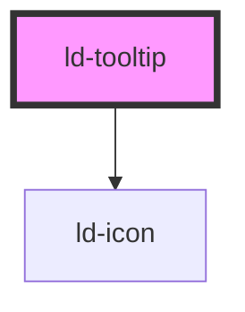

---
eleventyNavigation:
  key: Tooltip
  parent: Components
layout: layout.njk
title: Tooltip
permalink: components/ld-tooltip/
---

# ld-tooltip

Tooltips provide additional information, mostly short paragraphs, and can be placed besides all sorts of interface elements.

---

## Default


<ld-tooltip>
  <ld-heading level="4" style="margin-bottom: 10px">Headline</ld-heading>
  <ld-paragraph>
    Lorem ipsum dolor sit amet, consectetur adipiscing elit, sed do eiusmod tempor incididunt ut labore et dolore magna aliqua.
  </ld-paragraph>
</ld-tooltip>


## With arrow


<ld-tooltip arrow>
  <ld-heading level="4" style="margin-bottom: 10px">Headline</ld-heading>
  <ld-paragraph>
    Lorem ipsum dolor sit amet, consectetur adipiscing elit, sed do eiusmod tempor incididunt ut labore et dolore magna aliqua.
  </ld-paragraph>
</ld-tooltip>


## Positioning



<ld-tooltip arrow position="top left" style="text-align: end">
  <ld-button slot="trigger">top left</ld-button>
  <ld-heading level="4" style="margin-bottom: 10px">Headline</ld-heading>
  <ld-paragraph>
    Lorem ipsum dolor sit amet, consectetur adipiscing elit, sed do eiusmod tempor incididunt ut labore et dolore magna aliqua.
  </ld-paragraph>
</ld-tooltip>

<ld-tooltip arrow position="top center" style="text-align: center">
  <ld-button slot="trigger">top center</ld-button>
  <ld-heading level="4" style="margin-bottom: 10px">Headline</ld-heading>
  <ld-paragraph>
    Lorem ipsum dolor sit amet, consectetur adipiscing elit, sed do eiusmod tempor incididunt ut labore et dolore magna aliqua.
  </ld-paragraph>
</ld-tooltip>

<ld-tooltip arrow position="top right">
  <ld-button slot="trigger">top right</ld-button>
  <ld-heading level="4" style="margin-bottom: 10px">Headline</ld-heading>
  <ld-paragraph>
    Lorem ipsum dolor sit amet, consectetur adipiscing elit, sed do eiusmod tempor incididunt ut labore et dolore magna aliqua.
  </ld-paragraph>
</ld-tooltip>

<ld-tooltip arrow position="middle left" style="text-align: end">
  <ld-button slot="trigger">middle left</ld-button>
  <ld-heading level="4" style="margin-bottom: 10px">Headline</ld-heading>
  <ld-paragraph>
    Lorem ipsum dolor sit amet, consectetur adipiscing elit, sed do eiusmod tempor incididunt ut labore et dolore magna aliqua.
  </ld-paragraph>
</ld-tooltip>

<ld-tooltip arrow position="middle right">
  <ld-button slot="trigger">middle right</ld-button>
  <ld-heading level="4" style="margin-bottom: 10px">Headline</ld-heading>
  <ld-paragraph>
    Lorem ipsum dolor sit amet, consectetur adipiscing elit, sed do eiusmod tempor incididunt ut labore et dolore magna aliqua.
  </ld-paragraph>
</ld-tooltip>

<ld-tooltip arrow position="bottom left" style="text-align: end">
  <ld-button slot="trigger">bottom left</ld-button>
  <ld-heading level="4" style="margin-bottom: 10px">Headline</ld-heading>
  <ld-paragraph>
    Lorem ipsum dolor sit amet, consectetur adipiscing elit, sed do eiusmod tempor incididunt ut labore et dolore magna aliqua.
  </ld-paragraph>
</ld-tooltip>

<ld-tooltip arrow position="bottom center" style="text-align: center">
  <ld-button slot="trigger">bottom center</ld-button>
  <ld-heading level="4" style="margin-bottom: 10px">Headline</ld-heading>
  <ld-paragraph>
    Lorem ipsum dolor sit amet, consectetur adipiscing elit, sed do eiusmod tempor incididunt ut labore et dolore magna aliqua.
  </ld-paragraph>
</ld-tooltip>

<ld-tooltip arrow position="bottom right">
  <ld-button slot="trigger">bottom right</ld-button>
  <ld-heading level="4" style="margin-bottom: 10px">Headline</ld-heading>
  <ld-paragraph>
    Lorem ipsum dolor sit amet, consectetur adipiscing elit, sed do eiusmod tempor incididunt ut labore et dolore magna aliqua.
  </ld-paragraph>
</ld-tooltip>



<!-- Auto Generated Below -->

## Properties

| Property   | Attribute  | Description                                                                                | Type                                                                                                                                 | Default        |
| ---------- | ---------- | ------------------------------------------------------------------------------------------ | ------------------------------------------------------------------------------------------------------------------------------------ | -------------- |
| `arrow`    | `arrow`    | Visibility of the arrow                                                                    | `boolean`                                                                                                                            | `false`        |
| `disabled` | `disabled` | Disables tooltip onClick handler                                                           | `boolean`                                                                                                                            | `false`        |
| `key`      | `key`      | for tracking the node's identity when working with lists                                   | `string \| number`                                                                                                                   | `undefined`    |
| `position` | `position` | Position of the tooltip relative to the trigger element (also affects the arrow position). | `"bottom center" \| "bottom left" \| "bottom right" \| "middle left" \| "middle right" \| "top center" \| "top left" \| "top right"` | `'top center'` |
| `ref`      | `ref`      | reference to component                                                                     | `any`                                                                                                                                | `undefined`    |

## Dependencies

### Depends on

- [ld-icon](../ld-icon)

### Graph

----------------------------------------------

*Built with [StencilJS](https://stenciljs.com/)*
