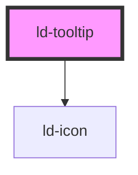

---
eleventyNavigation:
  key: Tooltip
  parent: Components
layout: layout.njk
title: Tooltip
permalink: components/ld-tooltip/
---

# ld-tooltip

Tooltips provide additional information, mostly short paragraphs, and can be placed besides all sorts of interface elements.

---

## Default


<ld-tooltip>
  <ld-heading level="4" style="margin-bottom: 10px">Headline</ld-heading>
  <ld-paragraph>
    Lorem ipsum dolor sit amet, consectetur adipiscing elit, sed do eiusmod tempor incididunt ut labore et dolore magna aliqua.
  </ld-paragraph>
</ld-tooltip>


## With arrow


<ld-tooltip arrow>
  <ld-heading level="4" style="margin-bottom: 10px">Headline</ld-heading>
  <ld-paragraph>
    Lorem ipsum dolor sit amet, consectetur adipiscing elit, sed do eiusmod tempor incididunt ut labore et dolore magna aliqua.
  </ld-paragraph>
</ld-tooltip>


## Open on click


<ld-tooltip trigger-type="click">
  <ld-button slot="trigger">click me</ld-button>
  <ld-heading level="4" style="margin-bottom: 10px">Headline</ld-heading>
  <ld-paragraph>
    Lorem ipsum dolor sit amet, consectetur adipiscing elit, sed do eiusmod tempor incididunt ut labore et dolore magna aliqua.
  </ld-paragraph>
</ld-tooltip>


## Positioning



  <ld-tooltip arrow position="top left" style="text-align: end">
    <ld-button slot="trigger" style="width: 150px">top left</ld-button>
    <ld-heading level="4" style="margin-bottom: 10px">Headline</ld-heading>
    <ld-paragraph>
      Lorem ipsum dolor sit amet, consectetur adipiscing elit, sed do eiusmod tempor incididunt ut labore et dolore magna aliqua.
    </ld-paragraph>
  </ld-tooltip>

  <ld-tooltip arrow position="top center" style="text-align: center">
    <ld-button slot="trigger" style="width: 150px">top center</ld-button>
    <ld-heading level="4" style="margin-bottom: 10px">Headline</ld-heading>
    <ld-paragraph>
      Lorem ipsum dolor sit amet, consectetur adipiscing elit, sed do eiusmod tempor incididunt ut labore et dolore magna aliqua.
    </ld-paragraph>
  </ld-tooltip>

  <ld-tooltip arrow position="top right">
    <ld-button slot="trigger" style="width: 150px">top right</ld-button>
    <ld-heading level="4" style="margin-bottom: 10px">Headline</ld-heading>
    <ld-paragraph>
      Lorem ipsum dolor sit amet, consectetur adipiscing elit, sed do eiusmod tempor incididunt ut labore et dolore magna aliqua.
    </ld-paragraph>
  </ld-tooltip>

  <ld-tooltip arrow position="left top" style="text-align: end">
    <ld-button slot="trigger" style="width: 150px">left top</ld-button>
    <ld-heading level="4" style="margin-bottom: 10px">Headline</ld-heading>
    <ld-paragraph>
      Lorem ipsum dolor sit amet, consectetur adipiscing elit, sed do eiusmod tempor incididunt ut labore et dolore magna aliqua.
    </ld-paragraph>
  </ld-tooltip>

  

  <ld-tooltip arrow position="right top">
    <ld-button slot="trigger" style="width: 150px">right top</ld-button>
    <ld-heading level="4" style="margin-bottom: 10px">Headline</ld-heading>
    <ld-paragraph>
      Lorem ipsum dolor sit amet, consectetur adipiscing elit, sed do eiusmod tempor incididunt ut labore et dolore magna aliqua.
    </ld-paragraph>
  </ld-tooltip>

  <ld-tooltip arrow position="left middle" style="text-align: end">
    <ld-button slot="trigger" style="width: 150px">left middle</ld-button>
    <ld-heading level="4" style="margin-bottom: 10px">Headline</ld-heading>
    <ld-paragraph>
      Lorem ipsum dolor sit amet, consectetur adipiscing elit, sed do eiusmod tempor incididunt ut labore et dolore magna aliqua.
    </ld-paragraph>
  </ld-tooltip>

  

  <ld-tooltip arrow position="right middle">
    <ld-button slot="trigger" style="width: 150px">right middle</ld-button>
    <ld-heading level="4" style="margin-bottom: 10px">Headline</ld-heading>
    <ld-paragraph>
      Lorem ipsum dolor sit amet, consectetur adipiscing elit, sed do eiusmod tempor incididunt ut labore et dolore magna aliqua.
    </ld-paragraph>
  </ld-tooltip>

  <ld-tooltip arrow position="left bottom" style="text-align: end">
    <ld-button slot="trigger" style="width: 150px">left bottom</ld-button>
    <ld-heading level="4" style="margin-bottom: 10px">Headline</ld-heading>
    <ld-paragraph>
      Lorem ipsum dolor sit amet, consectetur adipiscing elit, sed do eiusmod tempor incididunt ut labore et dolore magna aliqua.
    </ld-paragraph>
  </ld-tooltip>

  

  <ld-tooltip arrow position="right bottom">
    <ld-button slot="trigger" style="width: 150px">right bottom</ld-button>
    <ld-heading level="4" style="margin-bottom: 10px">Headline</ld-heading>
    <ld-paragraph>
      Lorem ipsum dolor sit amet, consectetur adipiscing elit, sed do eiusmod tempor incididunt ut labore et dolore magna aliqua.
    </ld-paragraph>
  </ld-tooltip>

  <ld-tooltip arrow position="bottom left" style="text-align: end">
    <ld-button slot="trigger" style="width: 150px">bottom left</ld-button>
    <ld-heading level="4" style="margin-bottom: 10px">Headline</ld-heading>
    <ld-paragraph>
      Lorem ipsum dolor sit amet, consectetur adipiscing elit, sed do eiusmod tempor incididunt ut labore et dolore magna aliqua.
    </ld-paragraph>
  </ld-tooltip>

  <ld-tooltip arrow position="bottom center" style="text-align: center">
    <ld-button slot="trigger" style="width: 150px">bottom center</ld-button>
    <ld-heading level="4" style="margin-bottom: 10px">Headline</ld-heading>
    <ld-paragraph>
      Lorem ipsum dolor sit amet, consectetur adipiscing elit, sed do eiusmod tempor incididunt ut labore et dolore magna aliqua.
    </ld-paragraph>
  </ld-tooltip>

  <ld-tooltip arrow position="bottom right">
    <ld-button slot="trigger" style="width: 150px">bottom right</ld-button>
    <ld-heading level="4" style="margin-bottom: 10px">Headline</ld-heading>
    <ld-paragraph>
      Lorem ipsum dolor sit amet, consectetur adipiscing elit, sed do eiusmod tempor incididunt ut labore et dolore magna aliqua.
    </ld-paragraph>
  </ld-tooltip>



## Show/hide delay


<ld-tooltip hide-delay="1000" show-delay="1000">
  <ld-button slot="trigger">show/hide 1s</ld-button>
  <ld-paragraph>
    I show and hide after 1s
  </ld-paragraph>
</ld-tooltip>

<ld-tooltip show-delay="1000">
  <ld-button slot="trigger">show 1s</ld-button>
  <ld-paragraph>
    I show after 1s, but hide immediately
  </ld-paragraph>
</ld-tooltip>

<ld-tooltip hide-delay="1000">
  <ld-button slot="trigger">hide 1s</ld-button>
  <ld-paragraph>
    I show immediately, but hide after 1s
  </ld-paragraph>
</ld-tooltip>

<ld-tooltip show-delay="500" hide-delay="1000">
  <ld-button slot="trigger">show 500ms / hide 1s</ld-button>
  <ld-paragraph>
    I show after 500ms and hide after 1s
  </ld-paragraph>
</ld-tooltip>


<!-- Auto Generated Below -->

## Properties

| Property      | Attribute      | Description                                                                               | Type                                                                                                                                                                                                 | Default        |
| ------------- | -------------- | ----------------------------------------------------------------------------------------- | ---------------------------------------------------------------------------------------------------------------------------------------------------------------------------------------------------- | -------------- |
| `arrow`       | `arrow`        | Show arrow                                                                                | `boolean`                                                                                                                                                                                            | `false`        |
| `disabled`    | `disabled`     | Disable tooltip trigger                                                                   | `boolean`                                                                                                                                                                                            | `false`        |
| `hideDelay`   | `hide-delay`   | Delay in ms until tooltip hides (only when trigger type is 'hover')                       | `number`                                                                                                                                                                                             | `0`            |
| `key`         | `key`          | for tracking the node's identity when working with lists                                  | `string \| number`                                                                                                                                                                                   | `undefined`    |
| `position`    | `position`     | Position of the tooltip relative to the trigger element (also affects the arrow position) | `"bottom center" \| "bottom left" \| "bottom right" \| "left bottom" \| "left middle" \| "left top" \| "right bottom" \| "right middle" \| "right top" \| "top center" \| "top left" \| "top right"` | `'top center'` |
| `ref`         | `ref`          | reference to component                                                                    | `any`                                                                                                                                                                                                | `undefined`    |
| `showDelay`   | `show-delay`   | Delay in ms until tooltip shows (only when trigger type is 'hover')                       | `number`                                                                                                                                                                                             | `0`            |
| `triggerType` | `trigger-type` | Event type that triggers the tooltip                                                      | `"click" \| "hover"`                                                                                                                                                                                 | `'hover'`      |

## Dependencies

### Depends on

- [ld-icon](../ld-icon)

### Graph

----------------------------------------------

*Built with [StencilJS](https://stenciljs.com/)*
