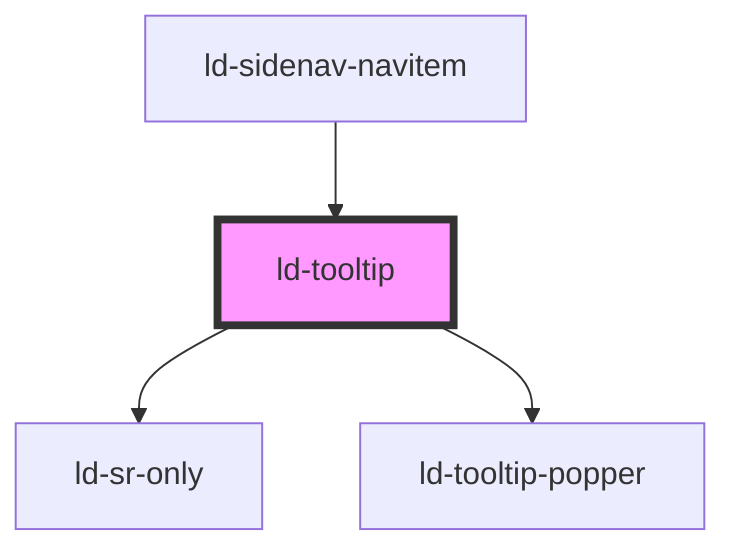

---
eleventyNavigation:
  key: Tooltip
  parent: Components
layout: layout.njk
title: Tooltip
permalink: components/ld-tooltip/
---

<link rel="stylesheet" href="css_components/ld-button.css">

# ld-tooltip

Tooltips provide additional information, mostly short paragraphs, and can be placed beside all sorts of interface elements.

---

## Default


<ld-tooltip>
  <ld-typo variant="h4" style="margin-bottom: 0.625rem">Headline</ld-typo>
  <ld-typo>
    Lorem ipsum dolor sit amet, consectetur adipiscing elit, sed do eiusmod tempor incididunt ut labore et dolore magna aliqua.
  </ld-typo>
</ld-tooltip>


## With arrow


<ld-tooltip arrow>
  <ld-typo variant="h4" style="margin-bottom: 0.625rem">Headline</ld-typo>
  <ld-typo>
    Lorem ipsum dolor sit amet, consectetur adipiscing elit, sed do eiusmod tempor incididunt ut labore et dolore magna aliqua.
  </ld-typo>
</ld-tooltip>


## Size


<ld-tooltip arrow>
  <ld-typo>I'm the default size tooltip.</ld-typo>
</ld-tooltip>
<ld-tooltip arrow size="sm">
  <ld-typo>I'm the small size tooltip.</ld-typo>
</ld-tooltip>


## With custom trigger



  I am an
  <ld-tooltip arrow>
    inline
    <ld-typo variant="h4" style="margin-bottom: 0.625rem">Headline</ld-typo>
    <ld-typo>
      Lorem ipsum dolor sit amet, consectetur adipiscing elit, sed do eiusmod tempor incididunt ut labore et dolore magna aliqua.
    </ld-typo>
  </ld-tooltip>
  trigger!



## Open on click


<ld-tooltip trigger-type="click">
  
click me

  <ld-typo variant="h4" style="margin-bottom: 0.625rem">Headline</ld-typo>
  <ld-typo>
    Lorem ipsum dolor sit amet, consectetur adipiscing elit, sed do eiusmod tempor incididunt ut labore et dolore magna aliqua.
  </ld-typo>
</ld-tooltip>


## Positioning



  <ld-tooltip arrow position="top left" style="text-align: end">
    
top left

    <ld-typo variant="h4" style="margin-bottom: 0.625rem">Headline</ld-typo>
    <ld-typo>
      Lorem ipsum dolor sit amet, consectetur adipiscing elit, sed do eiusmod tempor incididunt ut labore et dolore magna aliqua.
    </ld-typo>
  </ld-tooltip>

  <ld-tooltip arrow position="top center" style="text-align: center">
    
top center

    <ld-typo variant="h4" style="margin-bottom: 0.625rem">Headline</ld-typo>
    <ld-typo>
      Lorem ipsum dolor sit amet, consectetur adipiscing elit, sed do eiusmod tempor incididunt ut labore et dolore magna aliqua.
    </ld-typo>
  </ld-tooltip>

  <ld-tooltip arrow position="top right">
    
top right

    <ld-typo variant="h4" style="margin-bottom: 0.625rem">Headline</ld-typo>
    <ld-typo>
      Lorem ipsum dolor sit amet, consectetur adipiscing elit, sed do eiusmod tempor incididunt ut labore et dolore magna aliqua.
    </ld-typo>
  </ld-tooltip>

  <ld-tooltip arrow position="left top" style="text-align: end">
    
left top

    <ld-typo variant="h4" style="margin-bottom: 0.625rem">Headline</ld-typo>
    <ld-typo>
      Lorem ipsum dolor sit amet, consectetur adipiscing elit, sed do eiusmod tempor incididunt ut labore et dolore magna aliqua.
    </ld-typo>
  </ld-tooltip>

  

  <ld-tooltip arrow position="right top">
    
right top

    <ld-typo variant="h4" style="margin-bottom: 0.625rem">Headline</ld-typo>
    <ld-typo>
      Lorem ipsum dolor sit amet, consectetur adipiscing elit, sed do eiusmod tempor incididunt ut labore et dolore magna aliqua.
    </ld-typo>
  </ld-tooltip>

  <ld-tooltip arrow position="left middle" style="text-align: end">
    
left middle

    <ld-typo variant="h4" style="margin-bottom: 0.625rem">Headline</ld-typo>
    <ld-typo>
      Lorem ipsum dolor sit amet, consectetur adipiscing elit, sed do eiusmod tempor incididunt ut labore et dolore magna aliqua.
    </ld-typo>
  </ld-tooltip>

  

  <ld-tooltip arrow position="right middle">
    
right middle

    <ld-typo variant="h4" style="margin-bottom: 0.625rem">Headline</ld-typo>
    <ld-typo>
      Lorem ipsum dolor sit amet, consectetur adipiscing elit, sed do eiusmod tempor incididunt ut labore et dolore magna aliqua.
    </ld-typo>
  </ld-tooltip>

  <ld-tooltip arrow position="left bottom" style="text-align: end">
    
left bottom

    <ld-typo variant="h4" style="margin-bottom: 0.625rem">Headline</ld-typo>
    <ld-typo>
      Lorem ipsum dolor sit amet, consectetur adipiscing elit, sed do eiusmod tempor incididunt ut labore et dolore magna aliqua.
    </ld-typo>
  </ld-tooltip>

  

  <ld-tooltip arrow position="right bottom">
    
right bottom

    <ld-typo variant="h4" style="margin-bottom: 0.625rem">Headline</ld-typo>
    <ld-typo>
      Lorem ipsum dolor sit amet, consectetur adipiscing elit, sed do eiusmod tempor incididunt ut labore et dolore magna aliqua.
    </ld-typo>
  </ld-tooltip>

  <ld-tooltip arrow position="bottom left" style="text-align: end">
    
bottom left

    <ld-typo variant="h4" style="margin-bottom: 0.625rem">Headline</ld-typo>
    <ld-typo>
      Lorem ipsum dolor sit amet, consectetur adipiscing elit, sed do eiusmod tempor incididunt ut labore et dolore magna aliqua.
    </ld-typo>
  </ld-tooltip>

  <ld-tooltip arrow position="bottom center" style="text-align: center">
    
bottom center

    <ld-typo variant="h4" style="margin-bottom: 0.625rem">Headline</ld-typo>
    <ld-typo>
      Lorem ipsum dolor sit amet, consectetur adipiscing elit, sed do eiusmod tempor incididunt ut labore et dolore magna aliqua.
    </ld-typo>
  </ld-tooltip>

  <ld-tooltip arrow position="bottom right">
    
bottom right

    <ld-typo variant="h4" style="margin-bottom: 0.625rem">Headline</ld-typo>
    <ld-typo>
      Lorem ipsum dolor sit amet, consectetur adipiscing elit, sed do eiusmod tempor incididunt ut labore et dolore magna aliqua.
    </ld-typo>
  </ld-tooltip>



## Show/hide delay


<ld-tooltip hide-delay="1000" show-delay="1000">
  
show/hide 1s

  <ld-typo>
    I show and hide after 1s
  </ld-typo>
</ld-tooltip>

<ld-tooltip show-delay="1000">
  
show 1s

  <ld-typo>
    I show after 1s, but hide immediately
  </ld-typo>
</ld-tooltip>

<ld-tooltip hide-delay="1000">
  
hide 1s

  <ld-typo>
    I show immediately, but hide after 1s
  </ld-typo>
</ld-tooltip>

<ld-tooltip show-delay="500" hide-delay="1000">
  
show 500ms / hide 1s

  <ld-typo>
    I show after 500ms and hide after 1s
  </ld-typo>
</ld-tooltip>


## CSS Variables

| Variable                             | Description                                                                            | Default                |
| ------------------------------------ | -------------------------------------------------------------------------------------- | ---------------------- |
| `--ld-tooltip-animation-duration`    | Duration of the tooltip show/hide animation                                            | `var(--ld-ad-default)` |
| `--ld-tooltip-arrow-offset`          | Offset of the arrow from the tooltip border, if arrow is aligned left/right/top/bottom | `var(--ld-sp-16)`      |
| `--ld-tooltip-arrow-size`            | Size of the arrow                                                                      | `0.5rem` (8px)         |
| `--ld-tooltip-distance-from-trigger` | Space between the trigger and the tooltip (including the arrow)                        | `var(--ld-sp-8)`       |
| `--ld-tooltip-max-width`             | Max width of the tooltip                                                               | `20rem` (320px)        |
| `--ld-tooltip-offset-x`              | Offset of the tooltip on the x-axis (If the tooltip is aligned to the right/left border of the trigger, a positive value always means increasing the space between trigger and tooltip.) | `0px`                  |
| `--ld-tooltip-offset-y`              | Offset of the tooltip on the y-axis (If the tooltip is aligned to the top/bottom border of the trigger, a positive value always means increasing the space between trigger and tooltip.) | `0px`                  |

<!-- Auto Generated Below -->

## Properties

| Property      | Attribute      | Description                                                                               | Type                                                                                                                                                                                                 | Default        |
| ------------- | -------------- | ----------------------------------------------------------------------------------------- | ---------------------------------------------------------------------------------------------------------------------------------------------------------------------------------------------------- | -------------- |
| `arrow`       | `arrow`        | Show arrow                                                                                | `boolean`                                                                                                                                                                                            | `undefined`    |
| `disabled`    | `disabled`     | Disable tooltip trigger                                                                   | `boolean`                                                                                                                                                                                            | `undefined`    |
| `hideDelay`   | `hide-delay`   | Delay in ms until tooltip hides (only when trigger type is 'hover')                       | `number`                                                                                                                                                                                             | `0`            |
| `key`         | `key`          | for tracking the node's identity when working with lists                                  | `string \| number`                                                                                                                                                                                   | `undefined`    |
| `position`    | `position`     | Position of the tooltip relative to the trigger element (also affects the arrow position) | `"bottom center" \| "bottom left" \| "bottom right" \| "left bottom" \| "left middle" \| "left top" \| "right bottom" \| "right middle" \| "right top" \| "top center" \| "top left" \| "top right"` | `'top center'` |
| `ref`         | `ref`          | reference to component                                                                    | `any`                                                                                                                                                                                                | `undefined`    |
| `showDelay`   | `show-delay`   | Delay in ms until tooltip shows (only when trigger type is 'hover')                       | `number`                                                                                                                                                                                             | `0`            |
| `size`        | `size`         | The tooltip size (effects tooltip padding only)                                           | `"sm"`                                                                                                                                                                                               | `undefined`    |
| `tag`         | `tag`          | The rendered HTML tag for the tooltip trigger.                                            | `string`                                                                                                                                                                                             | `'button'`     |
| `triggerType` | `trigger-type` | Event type that triggers the tooltip                                                      | `"click" \| "hover"`                                                                                                                                                                                 | `'hover'`      |

## Methods

### `hideTooltip() => Promise<void>`

Hide tooltip

#### Returns

Type: `Promise<void>`

### `showTooltip() => Promise<void>`

Show tooltip

#### Returns

Type: `Promise<void>`

## Shadow Parts

| Part          | Description                                                               |
| ------------- | ------------------------------------------------------------------------- |
| `"focusable"` |                                                                           |
| `"icon"`      | Default icon when no trigger is supplied                                  |
| `"popper"`    | Popper element (can only be styled as long as tooltip is not initialized) |
| `"trigger"`   | Trigger button                                                            |

## Dependencies

### Used by

 - [ld-sidenav-navitem](../ld-sidenav/ld-sidenav-navitem)

### Depends on

- [ld-sr-only](../ld-sr-only)
- ld-tooltip-popper

### Graph

----------------------------------------------

 
