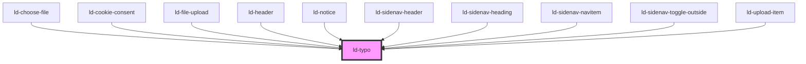

---
eleventyNavigation:
  key: Typography
  parent: Components
layout: layout.njk
title: Typography
permalink: components/ld-typo/
---

<link rel="stylesheet" href="{{ env.base }}/{{ buildstamp }}css_components/ld-typo.css">

# ld-typo

To give text a certain style of typography, you can use the `ld-typo` component. Every variant has its own semantic HTML tag that it gets rendered with. Heading styles render with their respective heading tag (`h1`, `h2`, etc). You can use the `tag` attribute, to render the variant with a different HTML tag, while keeping the visual variant style.

<ld-notice mode="warning">
  Please be aware of our brand guidelines regarding typography.
   
  For more information visit <a href="https://brand-hub.merckgroup.com/en/design-basics/typography.html" rel="noreferrer noopener" target="_blank">Brand Hub: Typography</a>.
</ld-notice>

---

## Examples

### Default


<ld-typo>
  Almost before we knew it, we had left the ground.
</ld-typo>

<!-- React component -->

<LdTypo>
  Almost before we knew it, we had left the ground.
</LdTypo>

<!-- CSS component -->

  Almost before we knew it, we had left the ground.



### Paragraphs


<ld-typo variant="body-xs">
  <b>XS</b>: Lorem ipsum dolor sit amet, consectetur adipiscing elit, sed do eiusmod tempor incididunt ut labore et dolore magna aliqua. Ut enim ad minim veniam, quis nostrud exercitation ullamco laboris nisi ut aliquip ex ea commodo consequat. Duis aute irure dolor in reprehenderit in voluptate velit esse cillum dolore eu fugiat nulla pariatur. Excepteur sint occaecat cupidatat non proident, sunt in culpa qui officia deserunt mollit anim id est laborum.
</ld-typo>

<ld-typo variant="body-s">
  <b>S</b>: Lorem ipsum dolor sit amet, consectetur adipiscing elit, sed do eiusmod tempor incididunt ut labore et dolore magna aliqua. Ut enim ad minim veniam, quis nostrud exercitation ullamco laboris nisi ut aliquip ex ea commodo consequat. Duis aute irure dolor in reprehenderit in voluptate velit esse cillum dolore eu fugiat nulla pariatur. Excepteur sint occaecat cupidatat non proident, sunt in culpa qui officia deserunt mollit anim id est laborum.
</ld-typo>

<ld-typo variant="body-m">
  <b>M</b>: Lorem ipsum dolor sit amet, consectetur adipiscing elit, sed do eiusmod tempor incididunt ut labore et dolore magna aliqua. Ut enim ad minim veniam, quis nostrud exercitation ullamco laboris nisi ut aliquip ex ea commodo consequat. Duis aute irure dolor in reprehenderit in voluptate velit esse cillum dolore eu fugiat nulla pariatur. Excepteur sint occaecat cupidatat non proident, sunt in culpa qui officia deserunt mollit anim id est laborum.
</ld-typo>

<ld-typo variant="body-l">
  <b>L</b>: Lorem ipsum dolor sit amet, consectetur adipiscing elit, sed do eiusmod tempor incididunt ut labore et dolore magna aliqua. Ut enim ad minim veniam, quis nostrud exercitation ullamco laboris nisi ut aliquip ex ea commodo consequat. Duis aute irure dolor in reprehenderit in voluptate velit esse cillum dolore eu fugiat nulla pariatur. Excepteur sint occaecat cupidatat non proident, sunt in culpa qui officia deserunt mollit anim id est laborum.
</ld-typo>

<ld-typo variant="body-xl">
  <b>XL</b>: Lorem ipsum dolor sit amet, consectetur adipiscing elit, sed do eiusmod tempor incididunt ut labore et dolore magna aliqua. Ut enim ad minim veniam, quis nostrud exercitation ullamco laboris nisi ut aliquip ex ea commodo consequat. Duis aute irure dolor in reprehenderit in voluptate velit esse cillum dolore eu fugiat nulla pariatur. Excepteur sint occaecat cupidatat non proident, sunt in culpa qui officia deserunt mollit anim id est laborum.
</ld-typo>

<!-- React component -->

<LdTypo variant="body-xs">
  <b>XS</b>: Lorem ipsum dolor sit amet, consectetur adipiscing elit, sed do eiusmod tempor incididunt ut labore et dolore magna aliqua. Ut enim ad minim veniam, quis nostrud exercitation ullamco laboris nisi ut aliquip ex ea commodo consequat. Duis aute irure dolor in reprehenderit in voluptate velit esse cillum dolore eu fugiat nulla pariatur. Excepteur sint occaecat cupidatat non proident, sunt in culpa qui officia deserunt mollit anim id est laborum.
</LdTypo>

<LdTypo variant="body-s">
  <b>S</b>: Lorem ipsum dolor sit amet, consectetur adipiscing elit, sed do eiusmod tempor incididunt ut labore et dolore magna aliqua. Ut enim ad minim veniam, quis nostrud exercitation ullamco laboris nisi ut aliquip ex ea commodo consequat. Duis aute irure dolor in reprehenderit in voluptate velit esse cillum dolore eu fugiat nulla pariatur. Excepteur sint occaecat cupidatat non proident, sunt in culpa qui officia deserunt mollit anim id est laborum.
</LdTypo>

<LdTypo variant="body-m">
  <b>M</b>: Lorem ipsum dolor sit amet, consectetur adipiscing elit, sed do eiusmod tempor incididunt ut labore et dolore magna aliqua. Ut enim ad minim veniam, quis nostrud exercitation ullamco laboris nisi ut aliquip ex ea commodo consequat. Duis aute irure dolor in reprehenderit in voluptate velit esse cillum dolore eu fugiat nulla pariatur. Excepteur sint occaecat cupidatat non proident, sunt in culpa qui officia deserunt mollit anim id est laborum.
</LdTypo>

<LdTypo variant="body-l">
  <b>L</b>: Lorem ipsum dolor sit amet, consectetur adipiscing elit, sed do eiusmod tempor incididunt ut labore et dolore magna aliqua. Ut enim ad minim veniam, quis nostrud exercitation ullamco laboris nisi ut aliquip ex ea commodo consequat. Duis aute irure dolor in reprehenderit in voluptate velit esse cillum dolore eu fugiat nulla pariatur. Excepteur sint occaecat cupidatat non proident, sunt in culpa qui officia deserunt mollit anim id est laborum.
</LdTypo>

<LdTypo variant="body-xl">
  <b>XL</b>: Lorem ipsum dolor sit amet, consectetur adipiscing elit, sed do eiusmod tempor incididunt ut labore et dolore magna aliqua. Ut enim ad minim veniam, quis nostrud exercitation ullamco laboris nisi ut aliquip ex ea commodo consequat. Duis aute irure dolor in reprehenderit in voluptate velit esse cillum dolore eu fugiat nulla pariatur. Excepteur sint occaecat cupidatat non proident, sunt in culpa qui officia deserunt mollit anim id est laborum.
</LdTypo>

<!-- CSS component -->

  <b>XS</b>: Lorem ipsum dolor sit amet, consectetur adipiscing elit, sed do eiusmod tempor incididunt ut labore et dolore magna aliqua. Ut enim ad minim veniam, quis nostrud exercitation ullamco laboris nisi ut aliquip ex ea commodo consequat. Duis aute irure dolor in reprehenderit in voluptate velit esse cillum dolore eu fugiat nulla pariatur. Excepteur sint occaecat cupidatat non proident, sunt in culpa qui officia deserunt mollit anim id est laborum.

  <b>S</b>: Lorem ipsum dolor sit amet, consectetur adipiscing elit, sed do eiusmod tempor incididunt ut labore et dolore magna aliqua. Ut enim ad minim veniam, quis nostrud exercitation ullamco laboris nisi ut aliquip ex ea commodo consequat. Duis aute irure dolor in reprehenderit in voluptate velit esse cillum dolore eu fugiat nulla pariatur. Excepteur sint occaecat cupidatat non proident, sunt in culpa qui officia deserunt mollit anim id est laborum.

  <b>M</b>: Lorem ipsum dolor sit amet, consectetur adipiscing elit, sed do eiusmod tempor incididunt ut labore et dolore magna aliqua. Ut enim ad minim veniam, quis nostrud exercitation ullamco laboris nisi ut aliquip ex ea commodo consequat. Duis aute irure dolor in reprehenderit in voluptate velit esse cillum dolore eu fugiat nulla pariatur. Excepteur sint occaecat cupidatat non proident, sunt in culpa qui officia deserunt mollit anim id est laborum.

  <b>L</b>: Lorem ipsum dolor sit amet, consectetur adipiscing elit, sed do eiusmod tempor incididunt ut labore et dolore magna aliqua. Ut enim ad minim veniam, quis nostrud exercitation ullamco laboris nisi ut aliquip ex ea commodo consequat. Duis aute irure dolor in reprehenderit in voluptate velit esse cillum dolore eu fugiat nulla pariatur. Excepteur sint occaecat cupidatat non proident, sunt in culpa qui officia deserunt mollit anim id est laborum.

  <b>XL</b>: Lorem ipsum dolor sit amet, consectetur adipiscing elit, sed do eiusmod tempor incididunt ut labore et dolore magna aliqua. Ut enim ad minim veniam, quis nostrud exercitation ullamco laboris nisi ut aliquip ex ea commodo consequat. Duis aute irure dolor in reprehenderit in voluptate velit esse cillum dolore eu fugiat nulla pariatur. Excepteur sint occaecat cupidatat non proident, sunt in culpa qui officia deserunt mollit anim id est laborum.



### Labels


<ld-typo variant="label-s">
  Almost before we knew it, we had left the ground.
</ld-typo>

<ld-typo variant="label-m">
  Almost before we knew it, we had left the ground.
</ld-typo>

<!-- React component -->

<LdTypo variant="label-s">
  Almost before we knew it, we had left the ground.
</LdTypo>

<LdTypo variant="label-m">
  Almost before we knew it, we had left the ground.
</LdTypo>

<!-- CSS component -->

  Almost before we knew it, we had left the ground.

  Almost before we knew it, we had left the ground.



### Captions


<ld-typo variant="cap-m">
  Almost before we knew it, we had left the ground.
</ld-typo>

<ld-typo variant="cap-l">
  Almost before we knew it, we had left the ground.
</ld-typo>

<!-- React component -->

<LdTypo variant="cap-m">
  Almost before we knew it, we had left the ground.
</LdTypo>

<LdTypo variant="cap-l">
  Almost before we knew it, we had left the ground.
</LdTypo>

<!-- CSS component -->

  Almost before we knew it, we had left the ground.

  Almost before we knew it, we had left the ground.



### Headings

Headings are used as an introduction into a topic or a content section and for visual and semantic differentiation between content blocks.

<ld-notice headline="Note" mode="warning">
  A common navigation technique for users of screen reading software is jumping from heading to heading to quickly determine the content of the page. Because of this, it is important to not skip one or more heading levels. Doing so may create confusion, as the person navigating this way may be left wondering where the missing heading is.
   
  If you really must place headings in a way that they are visually not following a semantic hirarchicy, use the <code>variant</code> property for visually styling the heading according to the design given, while still applying correct semantical heading levels using the <code>level</code> prop. 
</ld-notice>


<ld-typo variant="h1">
  Almost before we knew it, we had left the ground.
</ld-typo>

<ld-typo variant="h2">
  Almost before we knew it, we had left the ground.
</ld-typo>

<ld-typo variant="h3">
  Almost before we knew it, we had left the ground.
</ld-typo>

<ld-typo variant="h4">
  Almost before we knew it, we had left the ground.
</ld-typo>

<ld-typo variant="h5">
  Almost before we knew it, we had left the ground.
</ld-typo>

<ld-typo variant="h6">
  Almost before we knew it, we had left the ground.
</ld-typo>

<!-- React component -->

<LdTypo variant="h1">
  Almost before we knew it, we had left the ground.
</LdTypo>

<LdTypo variant="h2">
  Almost before we knew it, we had left the ground.
</LdTypo>

<LdTypo variant="h3">
  Almost before we knew it, we had left the ground.
</LdTypo>

<LdTypo variant="h4">
  Almost before we knew it, we had left the ground.
</LdTypo>

<LdTypo variant="h5">
  Almost before we knew it, we had left the ground.
</LdTypo>

<LdTypo variant="h6">
  Almost before we knew it, we had left the ground.
</LdTypo>

<!-- CSS component -->

<h1 class="ld-typo--h1">
  Almost before we knew it, we had left the ground.
</h1>

<h2 class="ld-typo--h2">
  Almost before we knew it, we had left the ground.
</h2>

<h3 class="ld-typo--h3">
  Almost before we knew it, we had left the ground.
</h3>

<h4 class="ld-typo--h4">
  Almost before we knew it, we had left the ground.
</h4>

<h5 class="ld-typo--h5">
  Almost before we knew it, we had left the ground.
</h5>

<h6 class="ld-typo--h6">
  Almost before we knew it, we had left the ground.
</h6>


### Branding variants `b*`

`b*` headings should be only a couple of words long.


<ld-typo variant="b1">
  Lorem ipsum
</ld-typo>

<ld-typo variant="b2">
  Lorem ipsum
</ld-typo>

<ld-typo variant="b3">
  Lorem ipsum
</ld-typo>

<ld-typo variant="b4">
  Lorem ipsum
</ld-typo>

<ld-typo variant="b5">
  Lorem ipsum
</ld-typo>

<ld-typo variant="b6">
  Lorem ipsum
</ld-typo>

<!-- React component -->

<LdTypo variant="b1">
  Lorem ipsum
</LdTypo>

<LdTypo variant="b2">
  Lorem ipsum
</LdTypo>

<LdTypo variant="b3">
  Lorem ipsum
</LdTypo>

<LdTypo variant="b4">
  Lorem ipsum
</LdTypo>

<LdTypo variant="b5">
  Lorem ipsum
</LdTypo>

<LdTypo variant="b6">
  Lorem ipsum
</LdTypo>

<!-- CSS component -->

<h1 class="ld-typo ld-typo--b1" aria-label="Lorem ipsum">
  Lorem ipsum
</h1>

<h2 class="ld-typo ld-typo--b2" aria-label="Lorem ipsum">
  Lorem ipsum
</h2>

<h3 class="ld-typo ld-typo--b3" aria-label="Lorem ipsum">
  Lorem ipsum
</h3>

<h4 class="ld-typo ld-typo--b4" aria-label="Lorem ipsum">
  Lorem ipsum
</h4>

<h5 class="ld-typo ld-typo--b5" aria-label="Lorem ipsum">
  Lorem ipsum
</h5>

<h6 class="ld-typo ld-typo--b6" aria-label="Lorem ipsum">
  Lorem ipsum
</h6>


### Large heading variants `xh*`


<ld-typo variant="xh1">
  Almost before we knew it, we had left the ground.
</ld-typo>

<ld-typo variant="xh2">
  Almost before we knew it, we had left the ground.
</ld-typo>

<ld-typo variant="xh3">
  Almost before we knew it, we had left the ground.
</ld-typo>

<ld-typo variant="xh4">
  Almost before we knew it, we had left the ground.
</ld-typo>

<ld-typo variant="xh5">
  Almost before we knew it, we had left the ground.
</ld-typo>

<ld-typo variant="xh6">
  Almost before we knew it, we had left the ground.
</ld-typo>

<!-- React component -->

<LdTypo variant="xh1">
  Almost before we knew it, we had left the ground.
</LdTypo>

<LdTypo variant="xh2">
  Almost before we knew it, we had left the ground.
</LdTypo>

<LdTypo variant="xh3">
  Almost before we knew it, we had left the ground.
</LdTypo>

<LdTypo variant="xh4">
  Almost before we knew it, we had left the ground.
</LdTypo>

<LdTypo variant="xh5">
  Almost before we knew it, we had left the ground.
</LdTypo>

<LdTypo variant="xh6">
  Almost before we knew it, we had left the ground.
</LdTypo>

<!-- CSS component -->

<h1 class="ld-typo--xh1">
  Almost before we knew it, we had left the ground.
</h1>

<h2 class="ld-typo--xh2">
  Almost before we knew it, we had left the ground.
</h2>

<h3 class="ld-typo--xh3">
  Almost before we knew it, we had left the ground.
</h3>

<h3 class="ld-typo--xh4">
  Almost before we knew it, we had left the ground.
</h3>

<h3 class="ld-typo--xh5">
  Almost before we knew it, we had left the ground.
</h3>

<h3 class="ld-typo--xh6">
  Almost before we knew it, we had left the ground.
</h3>


### Large branding variants `xb*`

`xb*` headings should be only a couple of words long.


<ld-typo variant="xb1">
  Lipsum
</ld-typo>

<ld-typo variant="xb2">
  Lipsum
</ld-typo>

<ld-typo variant="xb3">
  Lipsum
</ld-typo>

<!-- React component -->

<LdTypo variant="xb1">
  Lipsum
</LdTypo>

<LdTypo variant="xb2">
  Lipsum
</LdTypo>

<LdTypo variant="xb3">
  Lipsum
</LdTypo>

<!-- CSS component -->

<h1 class="ld-typo ld-typo--xb1" aria-label="Lorem ipsum">
  Lipsum
</h1>

<h2 class="ld-typo ld-typo--xb2" aria-label="Lorem ipsum">
  Lipsum
</h2>

<h3 class="ld-typo ld-typo--xb3" aria-label="Lorem ipsum">
  Lipsum
</h3>


### Custom tag

You can use any text variant for visual purposes without sacrificing semantics by using the `tag` prop.


<ld-typo variant="body-m" tag="h1">
  I'm actually a level 1 heading
</ld-typo>

<ld-typo variant="b5" tag="p">
  I'm actually a paragraph
</ld-typo>

<!-- React component -->

<LdTypo variant="body-m" tag="h1">
  I'm actually a level 1 heading
</LdTypo>

<LdTypo variant="b5" tag="p">
  I'm actually a paragraph
</LdTypo>

<!-- CSS component -->

<h1 class="ld-typo--body-m">
  I'm actually a level 1 heading
</h1>

  I'm actually a paragraph



## Colors

You may have noticed that all `b*` and `xb*` variants use a color given by the current theme, while all other variants inherit their color. While this is the default behaviour, you can still apply a different color on both types of headings. This may be usefull, if, for instance, you need to display a `b1` heading in "vibrant yellow" on top of a background using a "rich color".

<ld-notice headline="Note" mode="warning">
  With great power comes great responsibility. Make sure you follow the brand guidelines. Especially make sure that the text remains readable at all times. Check the text for accessibility issues, such as <a href="https://www.w3.org/TR/WCAG21/#contrast-minimum" rel="noreferrer noopener" target="_blank">insufficiant contrast</a>.
</ld-notice>

Here are some examples on how you can apply different colors on headings:



<ld-typo variant="b1" class="custom-color">
  Lorem ipsum
</ld-typo>

<ld-typo variant="h1" style="color: var(--ld-col-vc-600)">
  Almost before we knew it, we had left the ground.
</ld-typo>

<!-- React component -->

<LdTypo variant="b1" style={ { 
  color: 'var(--ld-col-vm)'
} }>
  Lorem ipsum
</LdTypo>

<LdTypo variant="h1" style={ { 
  color: 'var(--ld-col-vc-600)'
} }>
  Almost before we knew it, we had left the ground.
</LdTypo>

<!-- CSS component -->

<h1 class="ld-typo ld-typo--b1 custom-color" aria-label="Lorem ipsum">
  Lorem ipsum
</h1>

<h1 class="ld-typo--h1" style="color: var(--ld-col-vc-600)">
  Almost before we knew it, we had left the ground.
</h1>



<!-- Auto Generated Below -->

## Properties

| Property    | Attribute    | Description                                                                                                                                                                                                                                                                                                                                                                                                                                                                      | Type                                                                                                                                                                                                                                                                                          | Default     |
| ----------- | ------------ | -------------------------------------------------------------------------------------------------------------------------------------------------------------------------------------------------------------------------------------------------------------------------------------------------------------------------------------------------------------------------------------------------------------------------------------------------------------------------------- | --------------------------------------------------------------------------------------------------------------------------------------------------------------------------------------------------------------------------------------------------------------------------------------------- | ----------- |
| `ariaLabel` | `aria-label` | Since b* and xb* variants are uppercase, screen readers need to be served a (non-uppercase) aria-label (otherwise they will read out the heading letter by letter). If you're using a b* or xb* variant, an aria-label will be set automatically on the element. The component will use the inner HTML for the label implicitly. If you want to set an aria-label explicitly (such as when you have inner HTML that should not be part of the label), you can use this property. | `string`                                                                                                                                                                                                                                                                                      | `undefined` |
| `key`       | `key`        | for tracking the node's identity when working with lists                                                                                                                                                                                                                                                                                                                                                                                                                         | `string \| number`                                                                                                                                                                                                                                                                            | `undefined` |
| `ref`       | `ref`        | reference to component                                                                                                                                                                                                                                                                                                                                                                                                                                                           | `any`                                                                                                                                                                                                                                                                                         | `undefined` |
| `tag`       | `tag`        | The rendered HTML tag. Overrides tag inferred from the variant.                                                                                                                                                                                                                                                                                                                                                                                                                  | `string`                                                                                                                                                                                                                                                                                      | `undefined` |
| `variant`   | `variant`    | The font style. Every variant has a default tag that it renders with.                                                                                                                                                                                                                                                                                                                                                                                                            | `"h1" \| "h2" \| "h3" \| "h4" \| "h5" \| "h6" \| "body-xs" \| "body-s" \| "body-m" \| "body-l" \| "body-xl" \| "cap-m" \| "cap-l" \| "label-s" \| "label-m" \| "b1" \| "b2" \| "b3" \| "b4" \| "b5" \| "b6" \| "xb1" \| "xb2" \| "xb3" \| "xh1" \| "xh2" \| "xh3" \| "xh4" \| "xh5" \| "xh6"` | `'body-m'`  |

## Shadow Parts

| Part    | Description |
| ------- | ----------- |
| `"tag"` | Actual tag  |

## Dependencies

### Used by

 - [ld-choose-file](../ld-file-upload/ld-choose-file)
 - [ld-cookie-consent](../ld-cookie-consent)
 - [ld-file-upload](../ld-file-upload)
 - [ld-header](../ld-header)
 - [ld-notice](../ld-notice)
 - [ld-sidenav-header](../ld-sidenav/ld-sidenav-header)
 - [ld-sidenav-heading](../ld-sidenav/ld-sidenav-heading)
 - [ld-sidenav-navitem](../ld-sidenav/ld-sidenav-navitem)
 - [ld-sidenav-toggle-outside](../ld-sidenav/ld-sidenav-toggle-outside)
 - [ld-upload-item](../ld-file-upload/ld-upload-item)

### Graph

----------------------------------------------

*Built with [StencilJS](https://stenciljs.com/)*
